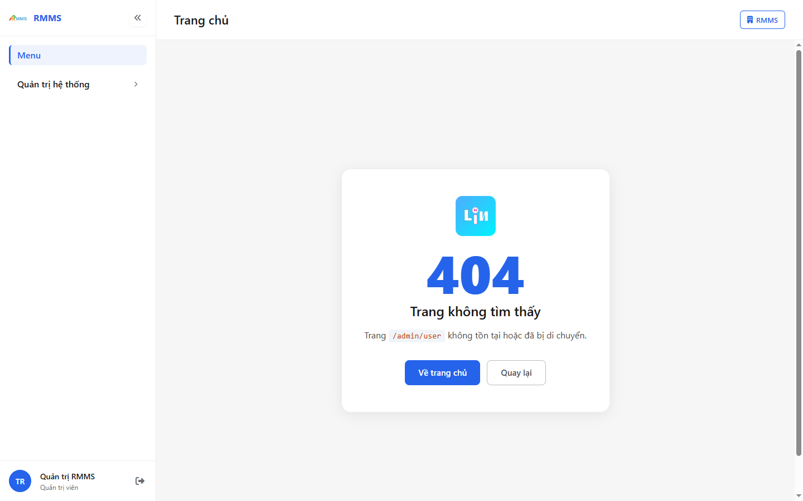
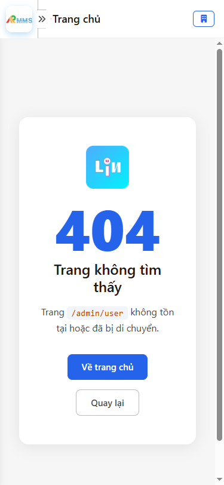

# Hướng dẫn sử dụng — Quản lý người dùng

## Phạm vi

Tài khoản được cấp quyền menu 18. Open API & tích hợp thao tác Quản lý người dùng.

Đăng nhập: [Hướng dẫn đăng nhập](../../dang-nhap/huong-dan-su-dung.md).

## 404

**Mục đích:** mở và tra cứu Quản lý người dùng.

**Cách thực hiện:**

1. Vào menu **Quản lý người dùng**.
2. Điền điều kiện lọc nếu cần.
3. Nhấn **Tạo mới** / **Thêm** khi cần lập bản ghi, hoặc kích dòng để xem.

Hình 2. View trên mobile device(<= 375px)

