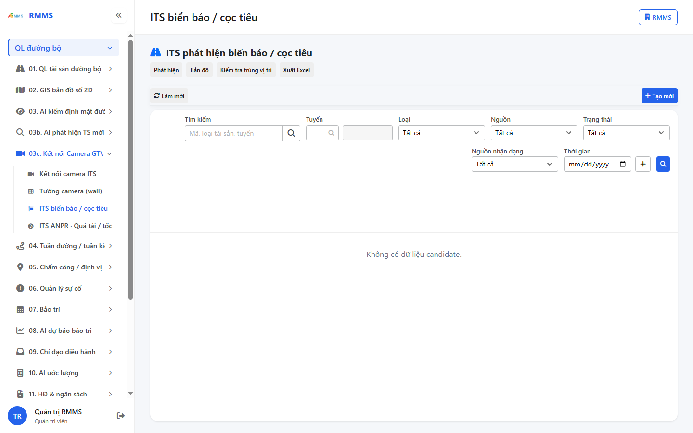
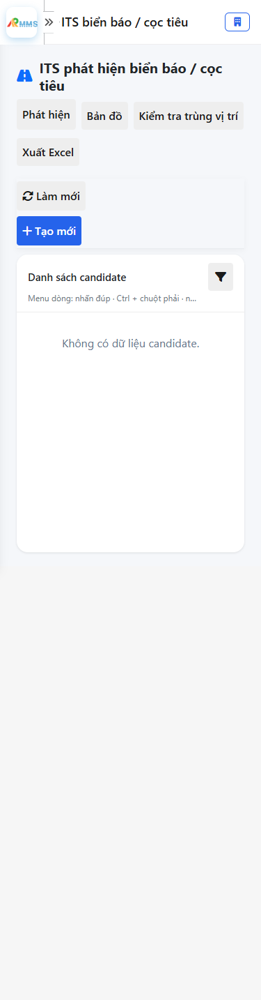
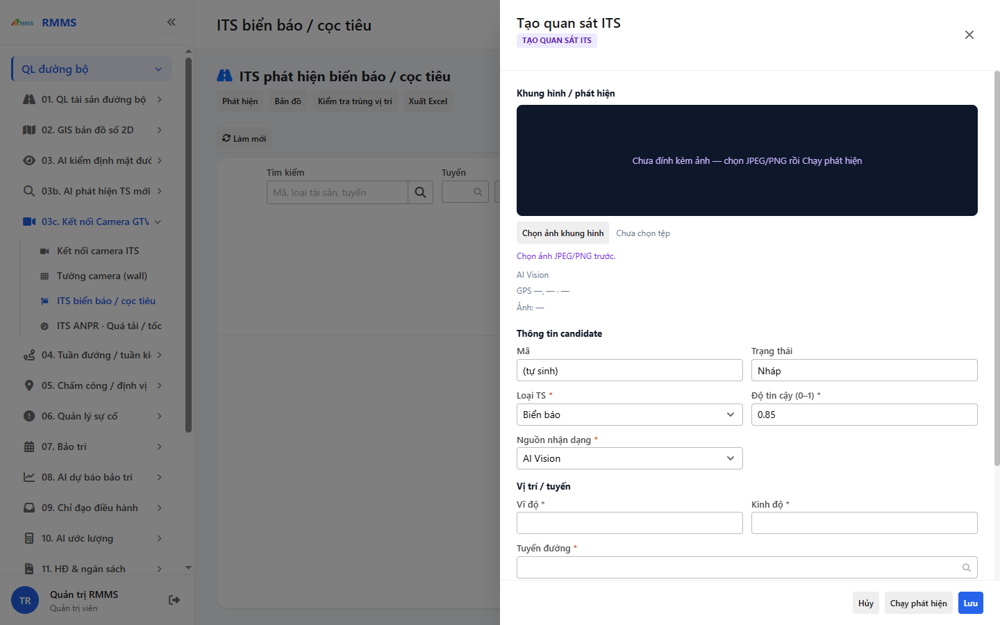
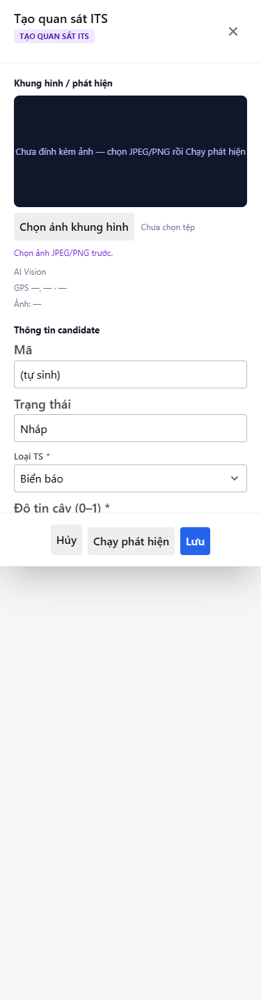

# Hướng dẫn sử dụng — ITS biển báo / cọc tiêu

## Phạm vi

Tài khoản được cấp quyền menu 03c. Kết nối Camera GTVT thao tác ITS biển báo / cọc tiêu.

Đăng nhập: [Hướng dẫn đăng nhập](../../dang-nhap/huong-dan-su-dung.md).

## ITS phát hiện biển báo / cọc tiêu

**Mục đích:** mở và tra cứu ITS biển báo / cọc tiêu.

**Cách thực hiện:**

1. Vào menu **ITS biển báo / cọc tiêu**.
2. Điền điều kiện lọc nếu cần.
3. Nhấn **Tạo mới** / **Thêm** khi cần lập bản ghi, hoặc kích dòng để xem.

Hình 2. View trên mobile device(<= 375px)

`*` = bắt buộc khi Lưu / Gửi. Ô trống = không bắt buộc.

| Nhãn trên màn | * | Cách điền |
|---------------|---|-----------|
| Tìm kiếm |  | Được để trống |
| Tuyến |  | Được để trống |
| Loại |  | Được để trống |
| Nguồn |  | Được để trống |
| Trạng thái |  | Được để trống |
| Nguồn nhận dạng |  | Được để trống |

## Tạo mới

**Mục đích:** lập bản ghi ITS biển báo / cọc tiêu.

**Cách thực hiện:**

1. Nhấn **Tạo mới** hoặc **Thêm**.
2. Điền các ô `*`.
3. Nhấn **Lưu** / **Gửi** / **Tạo mới** khi hoàn tất.

Hình 4. View trên mobile device(<= 375px)

`*` = bắt buộc khi Lưu / Gửi. Ô trống = không bắt buộc.

| Nhãn trên màn | * | Cách điền |
|---------------|---|-----------|
| Tìm kiếm |  | Được để trống |
| Tuyến |  | Được để trống |
| Loại |  | Được để trống |
| Nguồn |  | Được để trống |
| Trạng thái |  | Được để trống |
| Nguồn nhận dạng |  | Được để trống |
| Mã |  | Được để trống |
| Trạng thái |  | Được để trống |
| Loại TS | * | Điền / chọn trước khi Lưu |
| Độ tin cậy (0–1) | * | Điền / chọn trước khi Lưu |
| Nguồn nhận dạng | * | Điền / chọn trước khi Lưu |
| Vĩ độ | * | Điền / chọn trước khi Lưu |
| Kinh độ | * | Điền / chọn trước khi Lưu |
| Tuyến đường | * | Điền / chọn trước khi Lưu |
| Nguồn | * | Điền / chọn trước khi Lưu |
| Chuyến tuần đường |  | Được để trống |
| Bbox [x1, y1, x2, y2] |  | Được để trống |
| Ghi chú |  | Được để trống |

