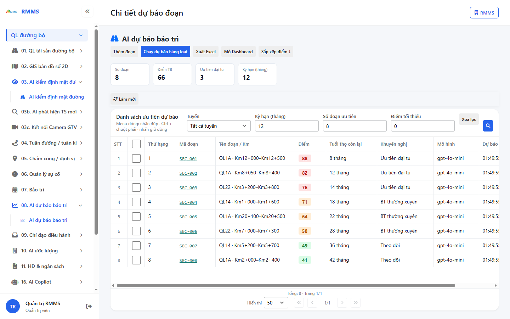
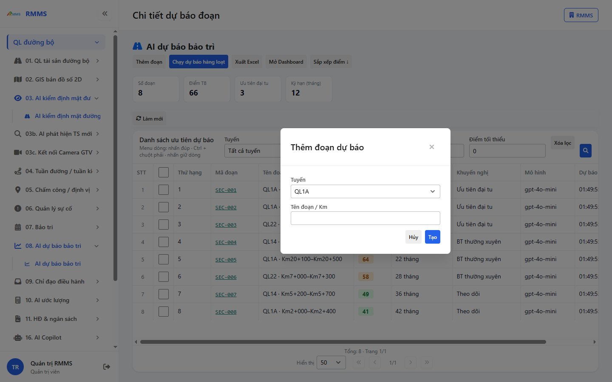
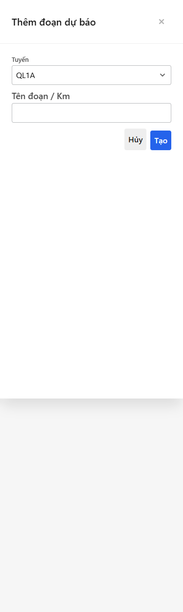

# Hướng dẫn sử dụng — AI dự báo bảo trì

## Phạm vi

Tài khoản được cấp quyền menu 08. AI dự báo bảo trì thao tác AI dự báo bảo trì.

Đăng nhập: [Hướng dẫn đăng nhập](../../dang-nhap/huong-dan-su-dung.md).

## AI dự báo bảo trì

**Mục đích:** mở và tra cứu AI dự báo bảo trì.

**Cách thực hiện:**

1. Vào menu **AI dự báo bảo trì**.
2. Điền điều kiện lọc nếu cần.
3. Nhấn **Tạo mới** / **Thêm** khi cần lập bản ghi, hoặc kích dòng để xem.

Hình 2. View trên mobile device(<= 375px)

`*` = bắt buộc khi Lưu / Gửi. Ô trống = không bắt buộc.

| Nhãn trên màn | * | Cách điền |
|---------------|---|-----------|
| Tuyến |  | Được để trống |
| Kỳ hạn (tháng) |  | Được để trống |
| Số đoạn ưu tiên |  | Được để trống |
| Điểm tối thiểu |  | Được để trống |

## Tạo mới

**Mục đích:** lập bản ghi AI dự báo bảo trì.

**Cách thực hiện:**

1. Nhấn **Tạo mới** hoặc **Thêm**.
2. Điền các ô `*`.
3. Nhấn **Lưu** / **Gửi** / **Tạo mới** khi hoàn tất.

Hình 4. View trên mobile device(<= 375px)

`*` = bắt buộc khi Lưu / Gửi. Ô trống = không bắt buộc.

| Nhãn trên màn | * | Cách điền |
|---------------|---|-----------|
| Tuyến |  | Được để trống |
| Kỳ hạn (tháng) |  | Được để trống |
| Số đoạn ưu tiên |  | Được để trống |
| Điểm tối thiểu |  | Được để trống |
| Tuyến |  | Được để trống |
| Tên đoạn / Km |  | Được để trống |

