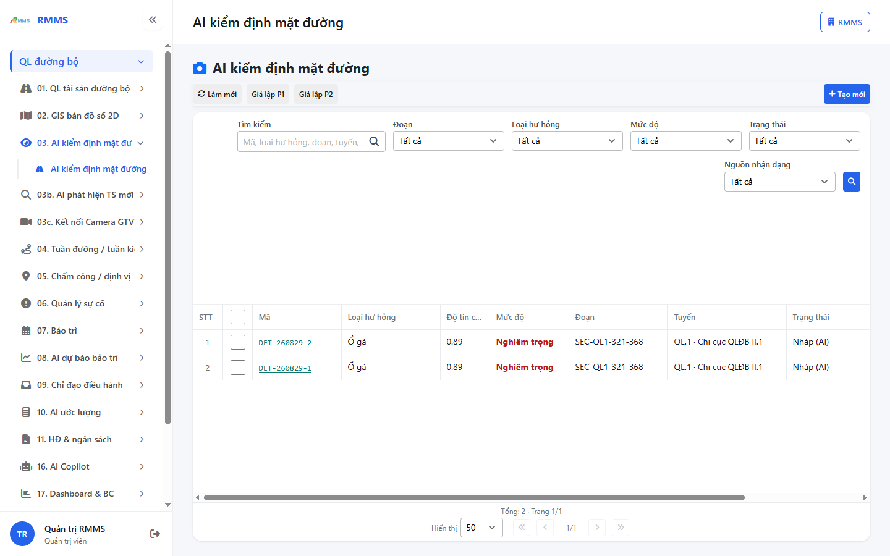
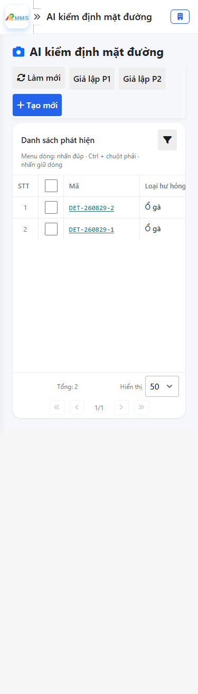
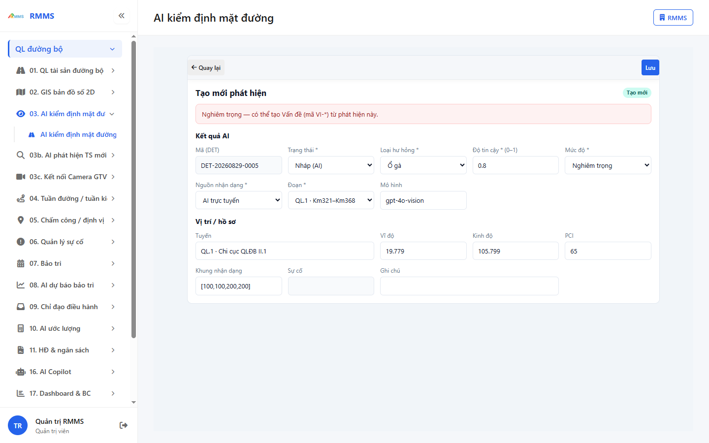
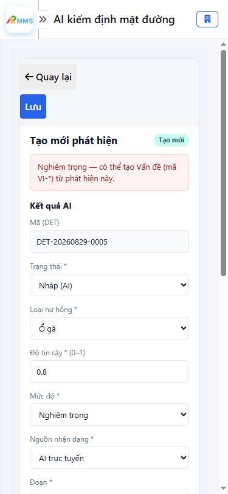

# Hướng dẫn sử dụng — AI kiểm định mặt đường

## Phạm vi

Tài khoản được cấp quyền menu 03. AI kiểm định mặt đường thao tác AI kiểm định mặt đường.

Đăng nhập: [Hướng dẫn đăng nhập](../dang-nhap/huong-dan-su-dung.md).

## AI kiểm định mặt đường

**Mục đích:** mở và tra cứu AI kiểm định mặt đường.

**Cách thực hiện:**

1. Vào menu **AI kiểm định mặt đường**.
2. Điền điều kiện lọc nếu cần.
3. Nhấn **Tạo mới** / **Thêm** khi cần lập bản ghi, hoặc kích dòng để xem.

Hình 2. View trên mobile device(<= 375px)

`*` = bắt buộc khi Lưu / Gửi. Ô trống = không bắt buộc.

| Nhãn trên màn | * | Cách điền |
|---------------|---|-----------|
| Tìm kiếm |  | Được để trống |
| Đoạn |  | Được để trống |
| Loại hư hỏng |  | Được để trống |
| Mức độ |  | Được để trống |
| Trạng thái |  | Được để trống |
| Nguồn nhận dạng |  | Được để trống |

## Tạo mới

**Mục đích:** lập bản ghi AI kiểm định mặt đường.

**Cách thực hiện:**

1. Nhấn **Tạo mới** hoặc **Thêm**.
2. Điền các ô `*`.
3. Nhấn **Lưu** / **Gửi** / **Tạo mới** khi hoàn tất.

Hình 4. View trên mobile device(<= 375px)

`*` = bắt buộc khi Lưu / Gửi. Ô trống = không bắt buộc.

| Nhãn trên màn | * | Cách điền |
|---------------|---|-----------|
| Mã (DET) |  | Được để trống |
| Trạng thái | * | Điền / chọn trước khi Lưu |
| Loại hư hỏng | * | Điền / chọn trước khi Lưu |
| Độ tin cậy * (0–1) | * | Điền / chọn trước khi Lưu |
| Mức độ | * | Điền / chọn trước khi Lưu |
| Nguồn nhận dạng | * | Điền / chọn trước khi Lưu |
| Đoạn | * | Điền / chọn trước khi Lưu |
| Mô hình |  | Được để trống |
| Tuyến |  | Được để trống |
| Vĩ độ |  | Được để trống |
| Kinh độ |  | Được để trống |
| PCI |  | Được để trống |
| Khung nhận dạng |  | Được để trống |
| Sự cố |  | Được để trống |
| Ghi chú |  | Được để trống |

