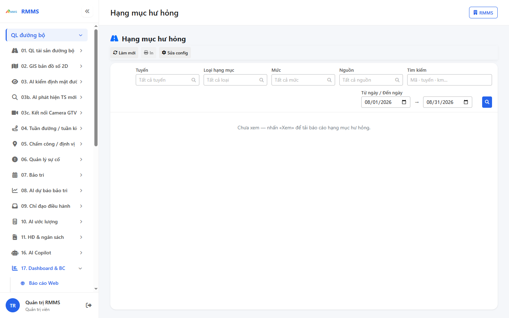

# Hướng dẫn sử dụng — Hạng mục hư hỏng

## Phạm vi

Tài khoản được cấp quyền menu 17. Dashboard & BC thao tác Hạng mục hư hỏng.

Đăng nhập: [Hướng dẫn đăng nhập](../../dang-nhap/huong-dan-su-dung.md).

## Hạng mục hư hỏng

**Mục đích:** mở và tra cứu Hạng mục hư hỏng.

**Cách thực hiện:**

1. Vào menu **Hạng mục hư hỏng**.
2. Điền điều kiện lọc nếu cần.
3. Nhấn **Tạo mới** / **Thêm** khi cần lập bản ghi, hoặc kích dòng để xem.

Hình 2. View trên mobile device(<= 375px)

`*` = bắt buộc khi Lưu / Gửi. Ô trống = không bắt buộc.

| Nhãn trên màn | * | Cách điền |
|---------------|---|-----------|
| Tuyến |  | Được để trống |
| Loại hạng mục |  | Được để trống |
| Mức |  | Được để trống |
| Nguồn |  | Được để trống |
| Tìm kiếm |  | Được để trống |

