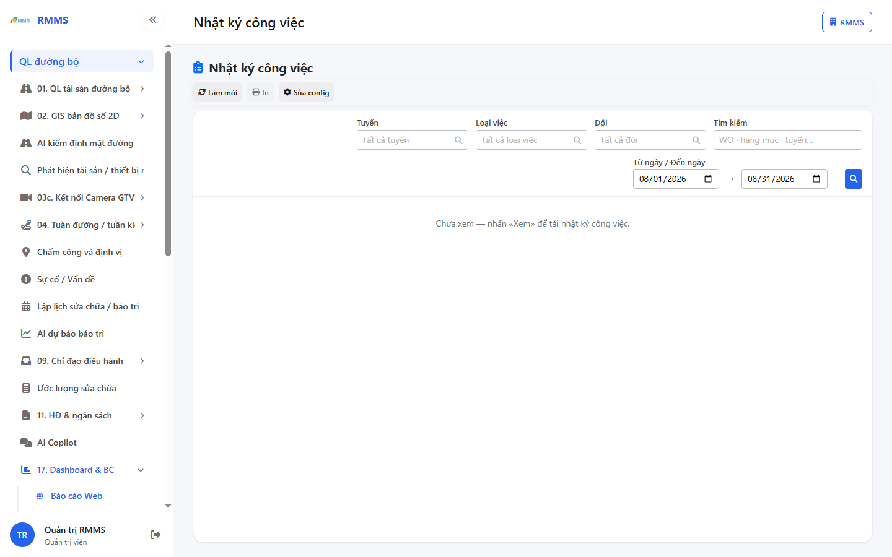

# Hướng dẫn sử dụng — Nhật ký công việc

## Phạm vi

Tài khoản được cấp quyền menu 17. Dashboard & BC thao tác Nhật ký công việc.

Đăng nhập: [Hướng dẫn đăng nhập](../../../dang-nhap/huong-dan-su-dung.md).

## Nhật ký công việc

**Mục đích:** mở và tra cứu Nhật ký công việc.

**Cách thực hiện:**

1. Vào menu **Nhật ký công việc**.
2. Điền điều kiện lọc nếu cần.
3. Nhấn **Tạo mới** / **Thêm** khi cần lập bản ghi, hoặc kích dòng để xem.

Hình 2. View trên mobile device(<= 375px)

`*` = bắt buộc khi Lưu / Gửi. Ô trống = không bắt buộc.

| Nhãn trên màn | * | Cách điền |
|---------------|---|-----------|
| Tuyến |  | Được để trống |
| Loại việc |  | Được để trống |
| Đội |  | Được để trống |
| Tìm kiếm |  | Được để trống |

