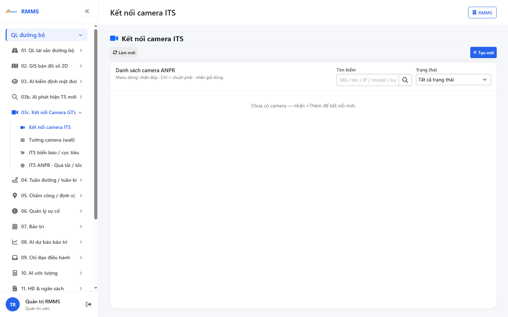
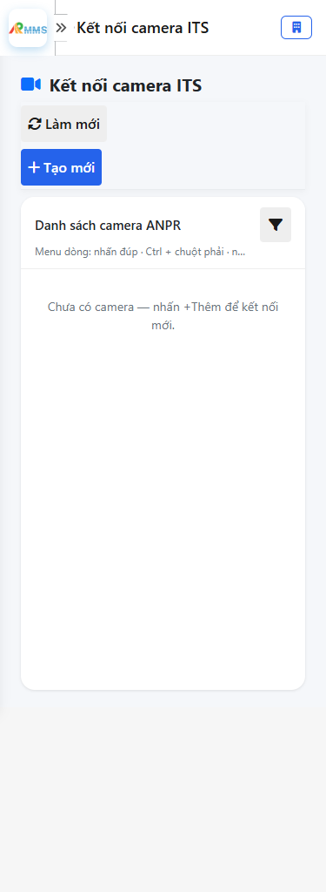
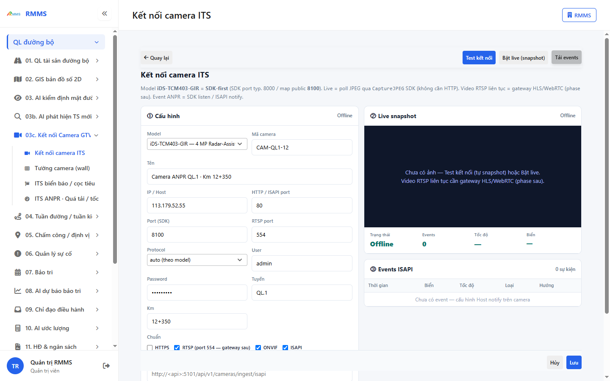
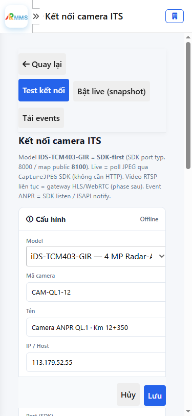

# Hướng dẫn sử dụng — Kết nối camera ITS

## Phạm vi

Tài khoản được cấp quyền menu 03c. Kết nối Camera GTVT thao tác Kết nối camera ITS.

Đăng nhập: [Hướng dẫn đăng nhập](../dang-nhap/huong-dan-su-dung.md).

## Kết nối camera ITS

**Mục đích:** mở và tra cứu Kết nối camera ITS.

**Cách thực hiện:**

1. Vào menu **Kết nối camera ITS**.
2. Điền điều kiện lọc nếu cần.
3. Nhấn **Tạo mới** / **Thêm** khi cần lập bản ghi, hoặc kích dòng để xem.

Hình 2. View trên mobile device(<= 375px)

`*` = bắt buộc khi Lưu / Gửi. Ô trống = không bắt buộc.

| Nhãn trên màn | * | Cách điền |
|---------------|---|-----------|
| Tìm kiếm |  | Được để trống |
| Trạng thái |  | Được để trống |

## Tạo mới

**Mục đích:** lập bản ghi Kết nối camera ITS.

**Cách thực hiện:**

1. Nhấn **Tạo mới** hoặc **Thêm**.
2. Điền các ô `*`.
3. Nhấn **Lưu** / **Gửi** / **Tạo mới** khi hoàn tất.

Hình 4. View trên mobile device(<= 375px)

`*` = bắt buộc khi Lưu / Gửi. Ô trống = không bắt buộc.

| Nhãn trên màn | * | Cách điền |
|---------------|---|-----------|
| Model |  | Được để trống |
| Mã camera |  | Được để trống |
| Tên |  | Được để trống |
| IP / Host |  | Được để trống |
| HTTP / ISAPI port |  | Được để trống |
| Port (SDK) |  | Được để trống |
| RTSP port |  | Được để trống |
| Protocol |  | Được để trống |
| User |  | Được để trống |
| Password |  | Được để trống |
| Tuyến |  | Được để trống |
| Km |  | Được để trống |
| Chuẩn |  | Được để trống |
| HTTPS |  | Được để trống |
| RTSP (port 554 — gateway sau) |  | Được để trống |
| ONVIF |  | Được để trống |
| ISAPI |  | Được để trống |
| ISAPI Host notify URL |  | Được để trống |

