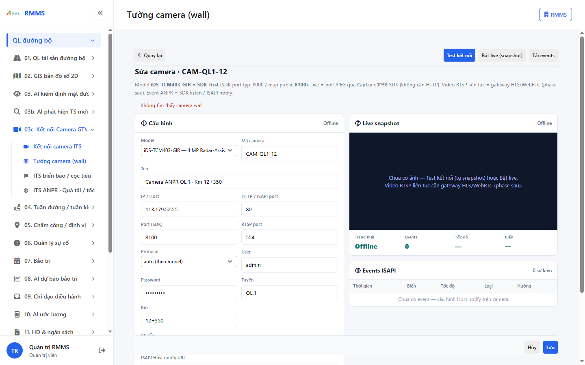
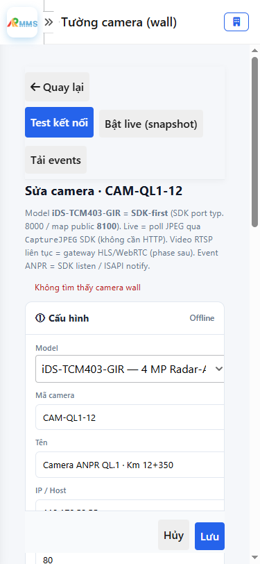

# Hướng dẫn sử dụng — Tường camera (wall)

## Phạm vi

Tài khoản được cấp quyền menu 03c. Kết nối Camera GTVT thao tác Tường camera (wall).

Đăng nhập: [Hướng dẫn đăng nhập](../../dang-nhap/huong-dan-su-dung.md).

## Tường camera (wall)

**Mục đích:** mở và tra cứu Tường camera (wall).

**Cách thực hiện:**

1. Vào menu **Tường camera (wall)**.
2. Điền điều kiện lọc nếu cần.
3. Nhấn **Tạo mới** / **Thêm** khi cần lập bản ghi, hoặc kích dòng để xem.

Hình 2. View trên mobile device(<= 375px)

`*` = bắt buộc khi Lưu / Gửi. Ô trống = không bắt buộc.

| Nhãn trên màn | * | Cách điền |
|---------------|---|-----------|
| Model |  | Được để trống |
| Mã camera |  | Được để trống |
| Tên |  | Được để trống |
| IP / Host |  | Được để trống |
| HTTP / ISAPI port |  | Được để trống |
| Port (SDK) |  | Được để trống |
| RTSP port |  | Được để trống |
| Protocol |  | Được để trống |
| User |  | Được để trống |
| Password |  | Được để trống |
| Tuyến |  | Được để trống |
| Km |  | Được để trống |
| Chuẩn |  | Được để trống |
| HTTPS |  | Được để trống |
| RTSP (port 554 — gateway sau) |  | Được để trống |
| ONVIF |  | Được để trống |
| ISAPI |  | Được để trống |
| ISAPI Host notify URL |  | Được để trống |

