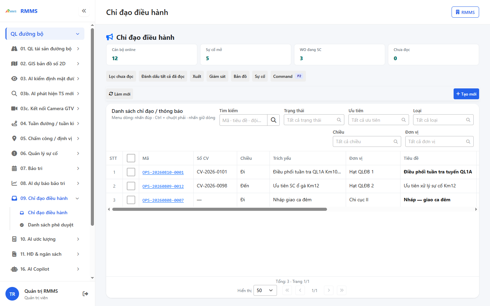
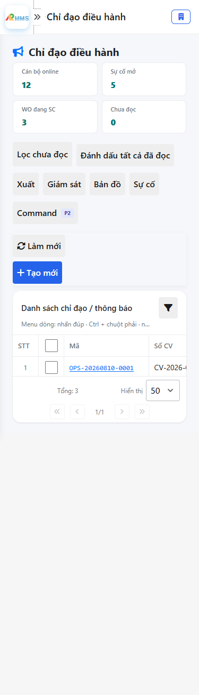
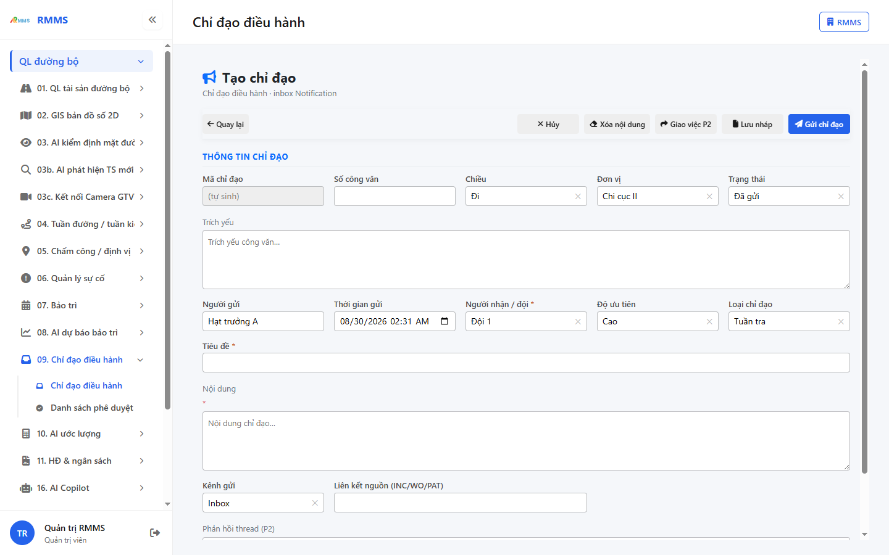
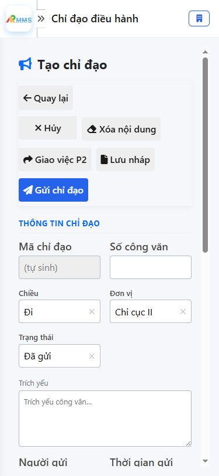

# Hướng dẫn sử dụng — Chỉ đạo điều hành

## Phạm vi

Tài khoản được cấp quyền menu 09. Chỉ đạo điều hành thao tác Chỉ đạo điều hành.

Đăng nhập: [Hướng dẫn đăng nhập](../dang-nhap/huong-dan-su-dung.md).

## Chỉ đạo điều hành

**Mục đích:** mở và tra cứu Chỉ đạo điều hành.

**Cách thực hiện:**

1. Vào menu **Chỉ đạo điều hành**.
2. Điền điều kiện lọc nếu cần.
3. Nhấn **Tạo mới** / **Thêm** khi cần lập bản ghi, hoặc kích dòng để xem.

Hình 2. View trên mobile device(<= 375px)

`*` = bắt buộc khi Lưu / Gửi. Ô trống = không bắt buộc.

| Nhãn trên màn | * | Cách điền |
|---------------|---|-----------|
| Tìm kiếm |  | Được để trống |
| Trạng thái |  | Được để trống |
| Ưu tiên |  | Được để trống |
| Loại |  | Được để trống |
| Chiều |  | Được để trống |
| Đơn vị |  | Được để trống |

## Tạo mới

**Mục đích:** lập bản ghi Chỉ đạo điều hành.

**Cách thực hiện:**

1. Nhấn **Tạo mới** hoặc **Thêm**.
2. Điền các ô `*`.
3. Nhấn **Lưu** / **Gửi** / **Tạo mới** khi hoàn tất.

Hình 4. View trên mobile device(<= 375px)

`*` = bắt buộc khi Lưu / Gửi. Ô trống = không bắt buộc.

| Nhãn trên màn | * | Cách điền |
|---------------|---|-----------|
| Mã chỉ đạo |  | Được để trống |
| Số công văn |  | Được để trống |
| Chiều |  | Được để trống |
| Đơn vị |  | Được để trống |
| Trạng thái |  | Được để trống |
| Trích yếu |  | Được để trống |
| Người gửi |  | Được để trống |
| Thời gian gửi |  | Được để trống |
| Người nhận / đội | * | Điền / chọn trước khi Lưu |
| Độ ưu tiên |  | Được để trống |
| Loại chỉ đạo |  | Được để trống |
| Tiêu đề | * | Điền / chọn trước khi Lưu |
| Nội dung | * | Điền / chọn trước khi Lưu |
| Kênh gửi |  | Được để trống |
| Liên kết nguồn (INC/WO/PAT) |  | Được để trống |
| Phản hồi thread (P2) |  | Được để trống |

