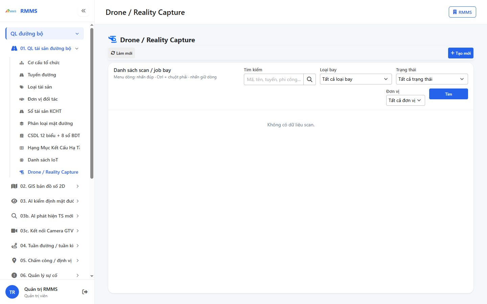
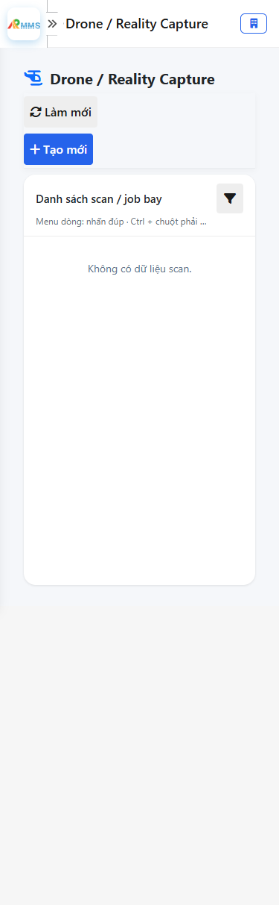
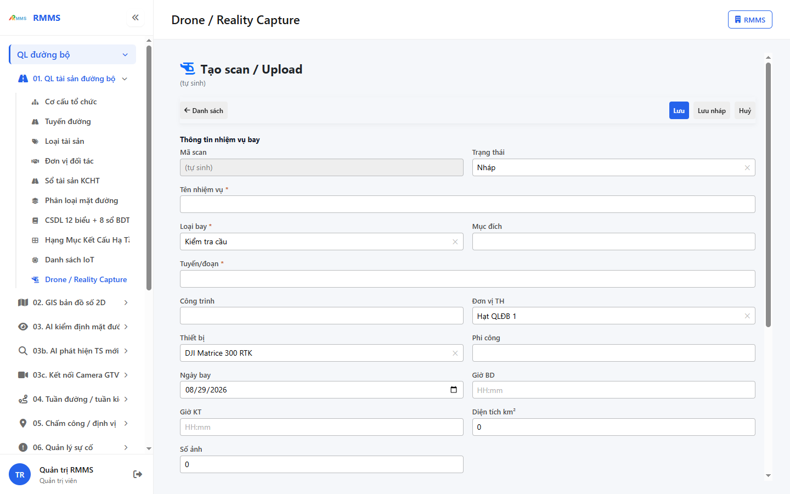
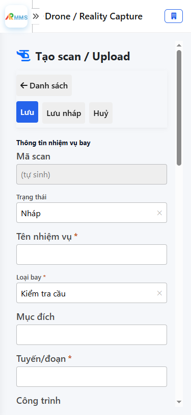

# Hướng dẫn sử dụng — Drone / Reality Capture

## Phạm vi

Tài khoản được cấp quyền menu 01. QL tài sản đường bộ thao tác Drone / Reality Capture.

Đăng nhập: [Hướng dẫn đăng nhập](../dang-nhap/huong-dan-su-dung.md).

## Drone / Reality Capture

**Mục đích:** mở và tra cứu Drone / Reality Capture.

**Cách thực hiện:**

1. Vào menu **Drone / Reality Capture**.
2. Điền điều kiện lọc nếu cần.
3. Nhấn **Tạo mới** / **Thêm** khi cần lập bản ghi, hoặc kích dòng để xem.

Hình 2. View trên mobile device(<= 375px)

`*` = bắt buộc khi Lưu / Gửi. Ô trống = không bắt buộc.

| Nhãn trên màn | * | Cách điền |
|---------------|---|-----------|
| Tìm kiếm |  | Được để trống |
| Loại bay |  | Được để trống |
| Trạng thái |  | Được để trống |
| Đơn vị |  | Được để trống |

## Tạo mới

**Mục đích:** lập bản ghi Drone / Reality Capture.

**Cách thực hiện:**

1. Nhấn **Tạo mới** hoặc **Thêm**.
2. Điền các ô `*`.
3. Nhấn **Lưu** / **Gửi** / **Tạo mới** khi hoàn tất.

Hình 4. View trên mobile device(<= 375px)

`*` = bắt buộc khi Lưu / Gửi. Ô trống = không bắt buộc.

| Nhãn trên màn | * | Cách điền |
|---------------|---|-----------|
| Mã scan |  | Được để trống |
| Trạng thái |  | Được để trống |
| Tên nhiệm vụ | * | Điền / chọn trước khi Lưu |
| Loại bay | * | Điền / chọn trước khi Lưu |
| Mục đích |  | Được để trống |
| Tuyến/đoạn | * | Điền / chọn trước khi Lưu |
| Công trình |  | Được để trống |
| Đơn vị TH |  | Được để trống |
| Thiết bị |  | Được để trống |
| Phi công |  | Được để trống |
| Ngày bay |  | Được để trống |
| Giờ BD |  | Được để trống |
| Giờ KT |  | Được để trống |
| Diện tích km² |  | Được để trống |
| Số ảnh |  | Được để trống |
| Point cloud key |  | Được để trống |
| Orthophoto key |  | Được để trống |
| 3D Tiles |  | Được để trống |
| GIS ref |  | Được để trống |
| Incident ref |  | Được để trống |
| AiVision job |  | Được để trống |
| Ghi chú |  | Được để trống |

