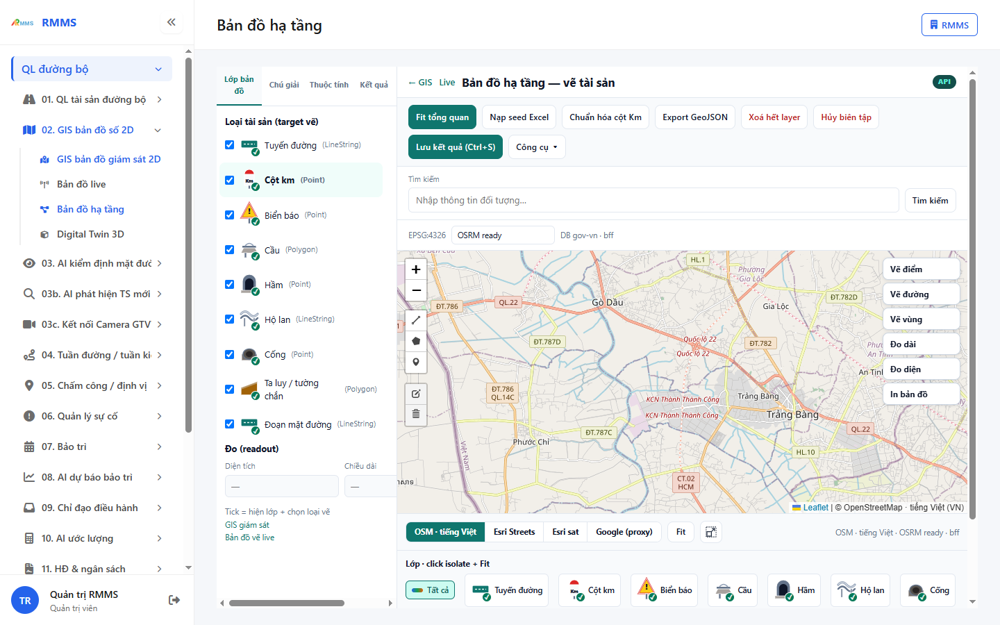

# Hướng dẫn sử dụng — Bản đồ hạ tầng

## Phạm vi

Tài khoản được cấp quyền menu 02. GIS bản đồ số 2D thao tác Bản đồ hạ tầng.

Đăng nhập: [Hướng dẫn đăng nhập](../../dang-nhap/huong-dan-su-dung.md).

## Bản đồ hạ tầng — vẽ tài sản

**Mục đích:** mở và tra cứu Bản đồ hạ tầng.

**Cách thực hiện:**

1. Vào menu **Bản đồ hạ tầng**.
2. Điền điều kiện lọc nếu cần.
3. Nhấn **Tạo mới** / **Thêm** khi cần lập bản ghi, hoặc kích dòng để xem.

Hình 2. View trên mobile device(<= 375px)

`*` = bắt buộc khi Lưu / Gửi. Ô trống = không bắt buộc.

| Nhãn trên màn | * | Cách điền |
|---------------|---|-----------|
| ✓ Tuyến đường (LineString) |  | Được để trống |
| Km ✓ Cột km (Point) |  | Được để trống |
| ! ✓ Biển báo (Point) |  | Được để trống |
| ✓ Cầu (Polygon) |  | Được để trống |
| ✓ Hầm (Point) |  | Được để trống |
| ✓ Hộ lan (LineString) |  | Được để trống |
| ✓ Cống (Point) |  | Được để trống |
| ✓ Ta luy / tường chắn (Polygon) |  | Được để trống |
| ✓ Đoạn mặt đường (LineString) |  | Được để trống |
| Diện tích |  | Được để trống |
| Chiều dài |  | Được để trống |
| Tìm kiếm |  | Được để trống |

