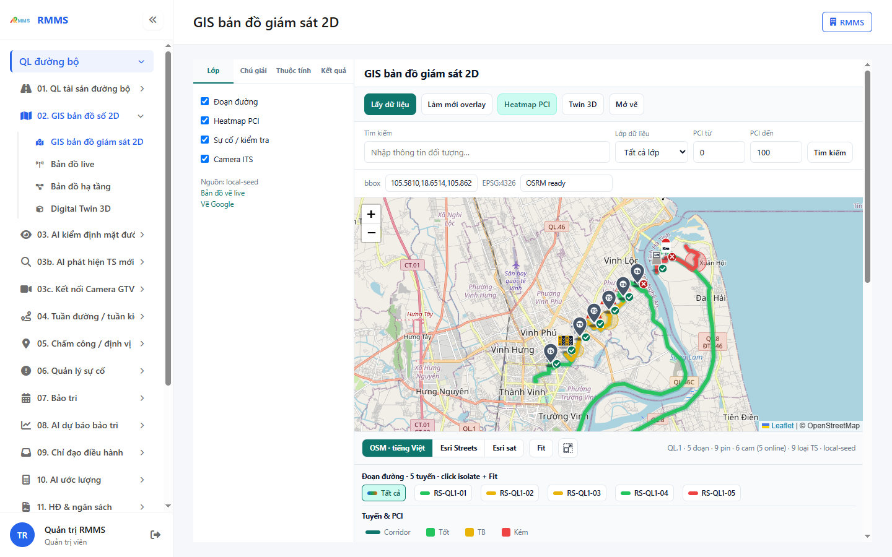
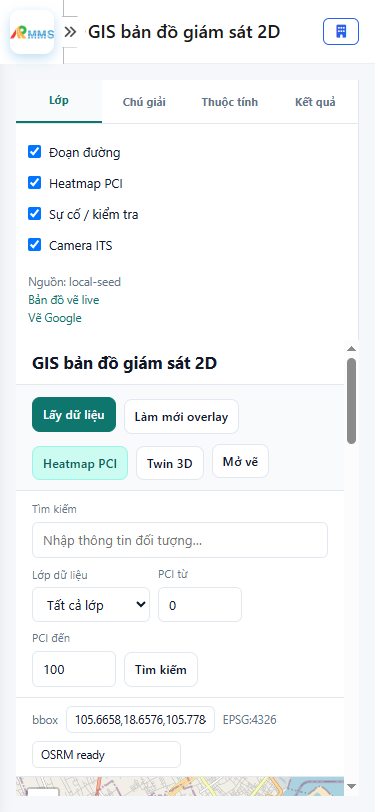

# Hướng dẫn sử dụng — GIS bản đồ giám sát 2D

## Phạm vi

Tài khoản được cấp quyền menu 02. GIS bản đồ số 2D thao tác GIS bản đồ giám sát 2D.

Đăng nhập: [Hướng dẫn đăng nhập](../dang-nhap/huong-dan-su-dung.md).

## GIS bản đồ giám sát 2D

**Mục đích:** mở và tra cứu GIS bản đồ giám sát 2D.

**Cách thực hiện:**

1. Vào menu **GIS bản đồ giám sát 2D**.
2. Điền điều kiện lọc nếu cần.
3. Nhấn **Tạo mới** / **Thêm** khi cần lập bản ghi, hoặc kích dòng để xem.

Hình 2. View trên mobile device(<= 375px)

`*` = bắt buộc khi Lưu / Gửi. Ô trống = không bắt buộc.

| Nhãn trên màn | * | Cách điền |
|---------------|---|-----------|
| Đoạn đường |  | Được để trống |
| Heatmap PCI |  | Được để trống |
| Sự cố / kiểm tra |  | Được để trống |
| Camera ITS |  | Được để trống |
| Tìm kiếm |  | Được để trống |
| Lớp dữ liệu Tất cả lớp Đoạn đường Heatmap PCI Sự cố Camera ITS |  | Được để trống |
| PCI từ |  | Được để trống |
| PCI đến |  | Được để trống |

