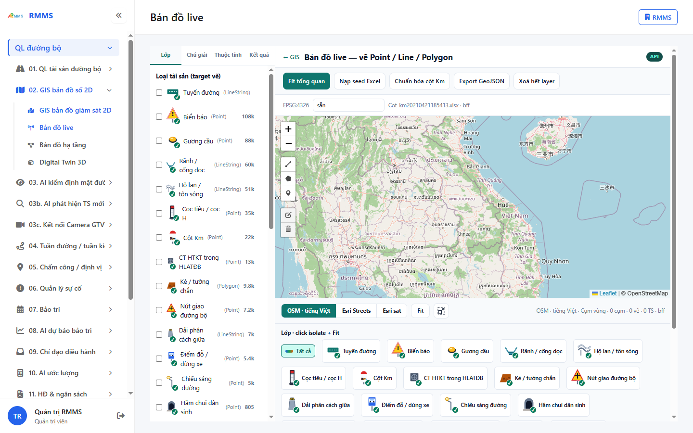
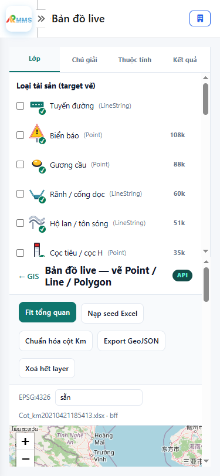

# Hướng dẫn sử dụng — Bản đồ live

## Phạm vi

Tài khoản được cấp quyền menu 02. GIS bản đồ số 2D thao tác Bản đồ live.

Đăng nhập: [Hướng dẫn đăng nhập](../../dang-nhap/huong-dan-su-dung.md).

## Bản đồ live — vẽ Point / Line / Polygon

**Mục đích:** mở và tra cứu Bản đồ live.

**Cách thực hiện:**

1. Vào menu **Bản đồ live**.
2. Điền điều kiện lọc nếu cần.
3. Nhấn **Tạo mới** / **Thêm** khi cần lập bản ghi, hoặc kích dòng để xem.

Hình 2. View trên mobile device(<= 375px)

`*` = bắt buộc khi Lưu / Gửi. Ô trống = không bắt buộc.

| Nhãn trên màn | * | Cách điền |
|---------------|---|-----------|
| ✓ Tuyến đường (LineString) |  | Được để trống |
| ! ✓ Biển báo (Point) 108k |  | Được để trống |
| ✓ Gương cầu (Point) 88k |  | Được để trống |
| ✓ Rãnh / cống dọc (LineString) 60k |  | Được để trống |
| ✓ Hộ lan / tôn sóng (LineString) 51k |  | Được để trống |
| ✓ Cọc tiêu / cọc H (Point) 35k |  | Được để trống |
| Km ✓ Cột Km (Point) 22k |  | Được để trống |
| ✓ CT HTKT trong HLATĐB (Point) 13k |  | Được để trống |
| ✓ Kè / tường chắn (Polygon) 9.8k |  | Được để trống |
| ✓ Nút giao đường bộ (Point) 7.2k |  | Được để trống |
| ✓ Dải phân cách giữa (LineString) 7k |  | Được để trống |
| ✓ Điểm đỗ / dừng xe (Point) 5.4k |  | Được để trống |
| ✓ Chiếu sáng đường (Point) 5k |  | Được để trống |
| ✓ Hầm chui dân sinh (Point) 805 |  | Được để trống |
| ✓ Bến xe buýt / khách (Polygon) 385 |  | Được để trống |
| ✓ Nhà hạt QLĐB (Polygon) 362 |  | Được để trống |
| TS ✓ Trạm trực cấp cứu (Point) 228 |  | Được để trống |
| ✓ Tràn (Point) 127 |  | Được để trống |
| ✓ Trạm thu phí (Point) 94 |  | Được để trống |
| ✓ Giao bằng đường sắt (Point) 67 |  | Được để trống |
| ✓ Trạm dừng nghỉ (Polygon) 53 |  | Được để trống |
| ✓ Trạm cân (Point) 30 |  | Được để trống |
| ✓ Tường chống ồn (Polygon) 23 |  | Được để trống |
| ✓ Bãi đỗ xe (Polygon) 23 |  | Được để trống |
| TS ✓ Trạm cứu nạn (Point) 16 |  | Được để trống |
| ✓ Bến phà (Point) 14 |  | Được để trống |
| ✓ Đất thuộc TS hạ tầng (Point) 11 |  | Được để trống |
| TS ✓ Camera ITS (Point) 10 |  | Được để trống |
| TS ✓ Xe cứu hộ (Point) 7 |  | Được để trống |
| ✓ Cầu phao (Polygon) 2 |  | Được để trống |

