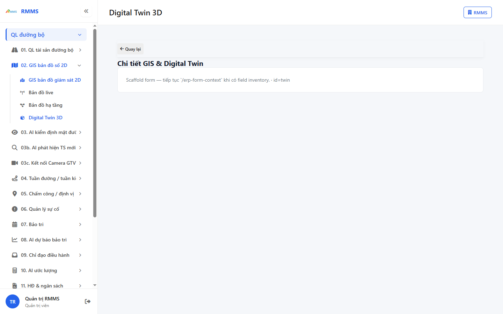
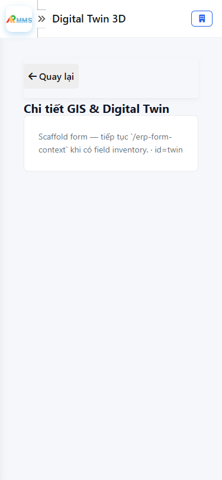

# Hướng dẫn sử dụng — Digital Twin 3D

## Phạm vi

Tài khoản được cấp quyền menu 02. GIS bản đồ số 2D thao tác Digital Twin 3D.

Đăng nhập: [Hướng dẫn đăng nhập](../../dang-nhap/huong-dan-su-dung.md).

## Chi tiết GIS & Digital Twin

**Mục đích:** mở và tra cứu Digital Twin 3D.

**Cách thực hiện:**

1. Vào menu **Digital Twin 3D**.
2. Điền điều kiện lọc nếu cần.
3. Nhấn **Tạo mới** / **Thêm** khi cần lập bản ghi, hoặc kích dòng để xem.

Hình 2. View trên mobile device(<= 375px)

