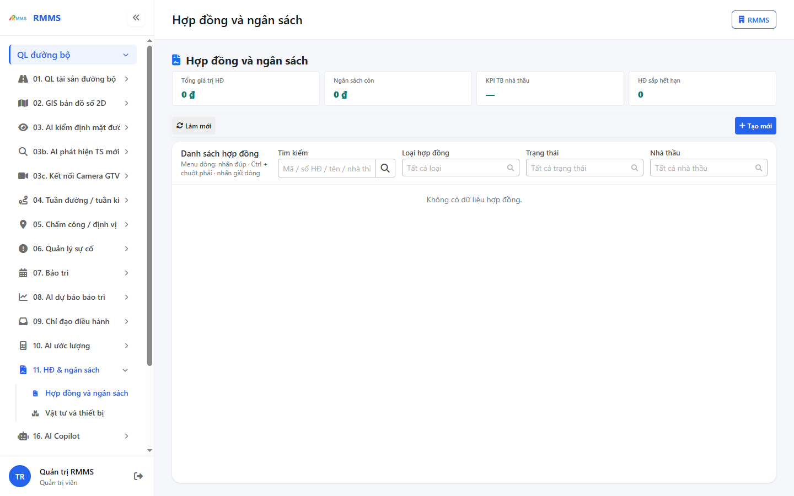
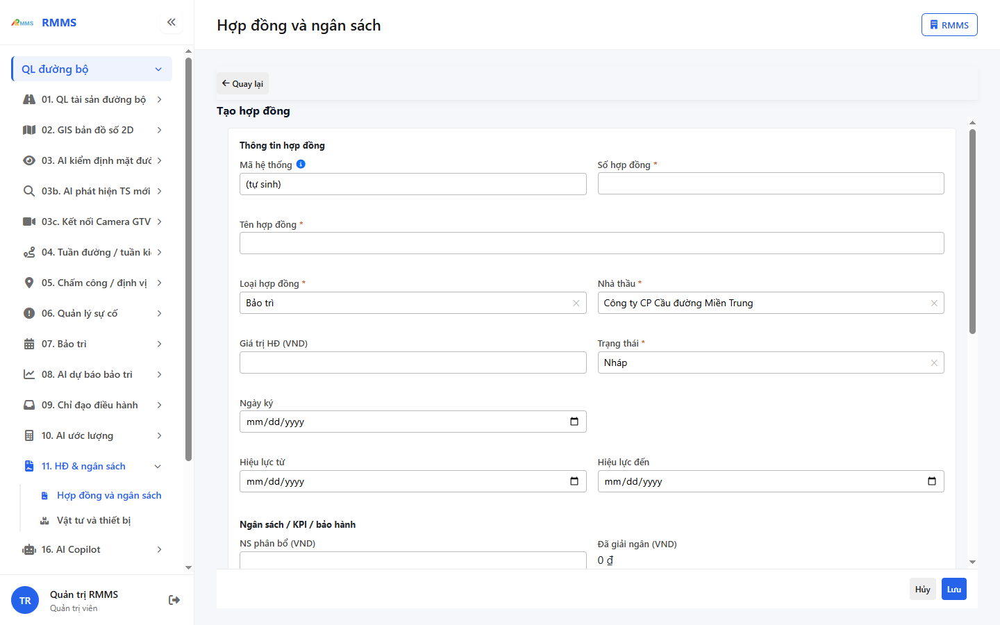
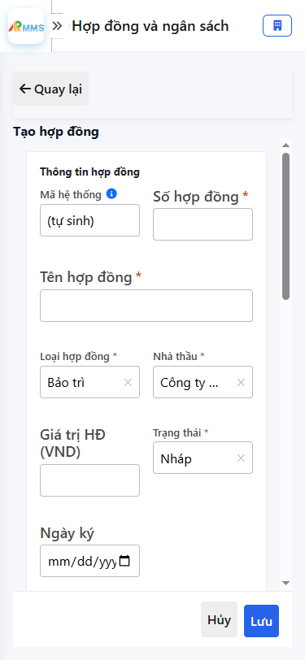

# Hướng dẫn sử dụng — Hợp đồng và ngân sách

## Phạm vi

Tài khoản được cấp quyền menu 11. HĐ & ngân sách thao tác Hợp đồng và ngân sách.

Đăng nhập: [Hướng dẫn đăng nhập](../dang-nhap/huong-dan-su-dung.md).

## Hợp đồng và ngân sách

**Mục đích:** mở và tra cứu Hợp đồng và ngân sách.

**Cách thực hiện:**

1. Vào menu **Hợp đồng và ngân sách**.
2. Điền điều kiện lọc nếu cần.
3. Nhấn **Tạo mới** / **Thêm** khi cần lập bản ghi, hoặc kích dòng để xem.

Hình 2. View trên mobile device(<= 375px)

`*` = bắt buộc khi Lưu / Gửi. Ô trống = không bắt buộc.

| Nhãn trên màn | * | Cách điền |
|---------------|---|-----------|
| Tìm kiếm |  | Được để trống |
| Loại hợp đồng |  | Được để trống |
| Trạng thái |  | Được để trống |
| Nhà thầu |  | Được để trống |

## Tạo mới

**Mục đích:** lập bản ghi Hợp đồng và ngân sách.

**Cách thực hiện:**

1. Nhấn **Tạo mới** hoặc **Thêm**.
2. Điền các ô `*`.
3. Nhấn **Lưu** / **Gửi** / **Tạo mới** khi hoàn tất.

Hình 4. View trên mobile device(<= 375px)

`*` = bắt buộc khi Lưu / Gửi. Ô trống = không bắt buộc.

| Nhãn trên màn | * | Cách điền |
|---------------|---|-----------|
| Số hợp đồng | * | Điền / chọn trước khi Lưu |
| Tên hợp đồng | * | Điền / chọn trước khi Lưu |
| Loại hợp đồng | * | Điền / chọn trước khi Lưu |
| Nhà thầu | * | Điền / chọn trước khi Lưu |
| Giá trị HĐ (VND) |  | Được để trống |
| Trạng thái | * | Điền / chọn trước khi Lưu |
| Ngày ký |  | Được để trống |
| Hiệu lực từ |  | Được để trống |
| Hiệu lực đến |  | Được để trống |
| NS phân bổ (VND) |  | Được để trống |
| Năm ngân sách |  | Được để trống |
| KPI nhà thầu |  | Được để trống |
| SLA % |  | Được để trống |
| BH (tháng) |  | Được để trống |
| BH hết hạn |  | Được để trống |
| Đơn vị |  | Được để trống |
| Đoạn tuyến |  | Được để trống |
| Liên kết WorkOrder |  | Được để trống |
| Ghi chú |  | Được để trống |

