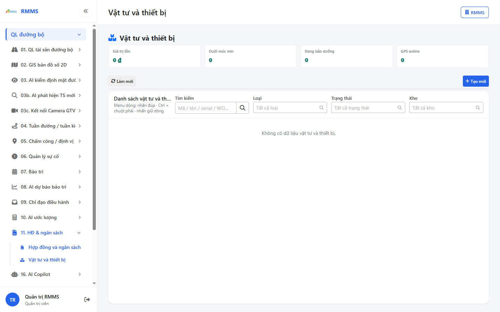
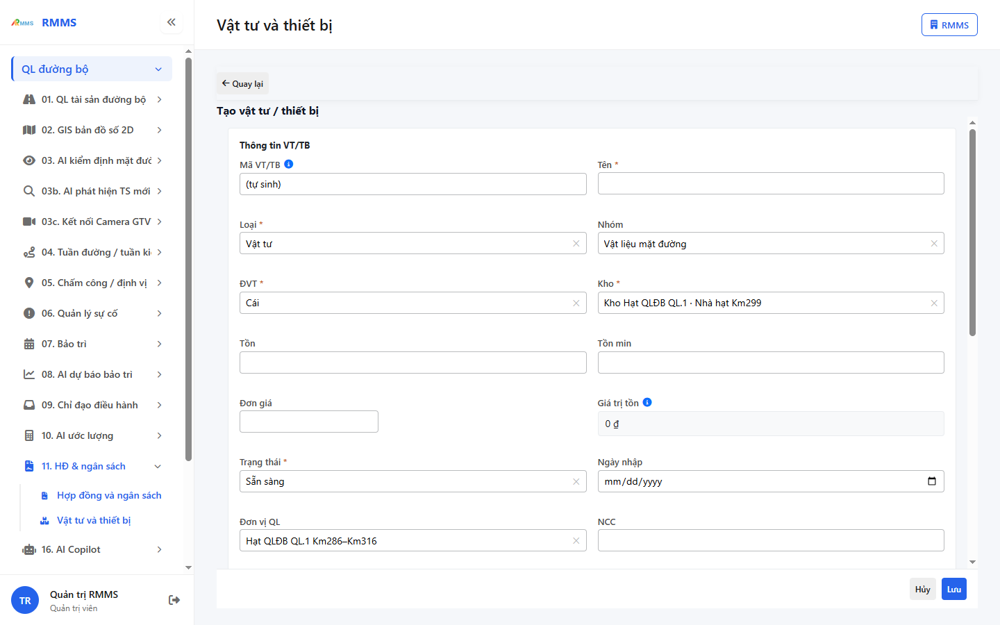
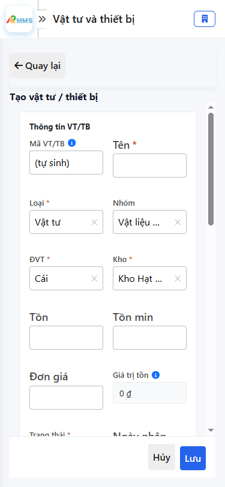

# Hướng dẫn sử dụng — Vật tư và thiết bị

## Phạm vi

Tài khoản được cấp quyền menu 11. HĐ & ngân sách thao tác Vật tư và thiết bị.

Đăng nhập: [Hướng dẫn đăng nhập](../../dang-nhap/huong-dan-su-dung.md).

## Vật tư và thiết bị

**Mục đích:** mở và tra cứu Vật tư và thiết bị.

**Cách thực hiện:**

1. Vào menu **Vật tư và thiết bị**.
2. Điền điều kiện lọc nếu cần.
3. Nhấn **Tạo mới** / **Thêm** khi cần lập bản ghi, hoặc kích dòng để xem.

Hình 2. View trên mobile device(<= 375px)

`*` = bắt buộc khi Lưu / Gửi. Ô trống = không bắt buộc.

| Nhãn trên màn | * | Cách điền |
|---------------|---|-----------|
| Tìm kiếm |  | Được để trống |
| Loại |  | Được để trống |
| Trạng thái |  | Được để trống |
| Kho |  | Được để trống |

## Tạo mới

**Mục đích:** lập bản ghi Vật tư và thiết bị.

**Cách thực hiện:**

1. Nhấn **Tạo mới** hoặc **Thêm**.
2. Điền các ô `*`.
3. Nhấn **Lưu** / **Gửi** / **Tạo mới** khi hoàn tất.

Hình 4. View trên mobile device(<= 375px)

`*` = bắt buộc khi Lưu / Gửi. Ô trống = không bắt buộc.

| Nhãn trên màn | * | Cách điền |
|---------------|---|-----------|
| Tên | * | Điền / chọn trước khi Lưu |
| Loại | * | Điền / chọn trước khi Lưu |
| Nhóm |  | Được để trống |
| ĐVT | * | Điền / chọn trước khi Lưu |
| Kho | * | Điền / chọn trước khi Lưu |
| Tồn |  | Được để trống |
| Tồn min |  | Được để trống |
| Đơn giá |  | Được để trống |
| Trạng thái | * | Điền / chọn trước khi Lưu |
| Ngày nhập |  | Được để trống |
| Đơn vị QL |  | Được để trống |
| NCC |  | Được để trống |
| Serial/biển số |  | Được để trống |
| Model |  | Được để trống |
| GPS lat |  | Được để trống |
| GPS lng |  | Được để trống |
| GPS lúc |  | Được để trống |
| Liên kết WO |  | Được để trống |
| Hợp đồng |  | Được để trống |
| Nhiên liệu (lít) |  | Được để trống |
| Bảo dưỡng gần |  | Được để trống |
| Bảo dưỡng tới |  | Được để trống |
| Ghi chú |  | Được để trống |

