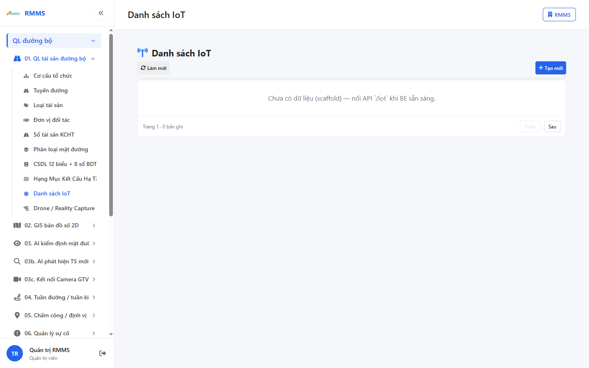
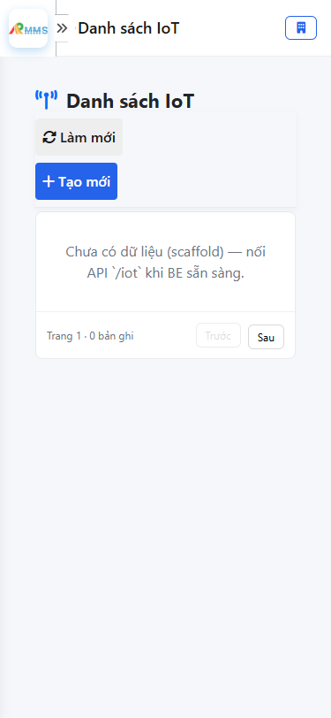
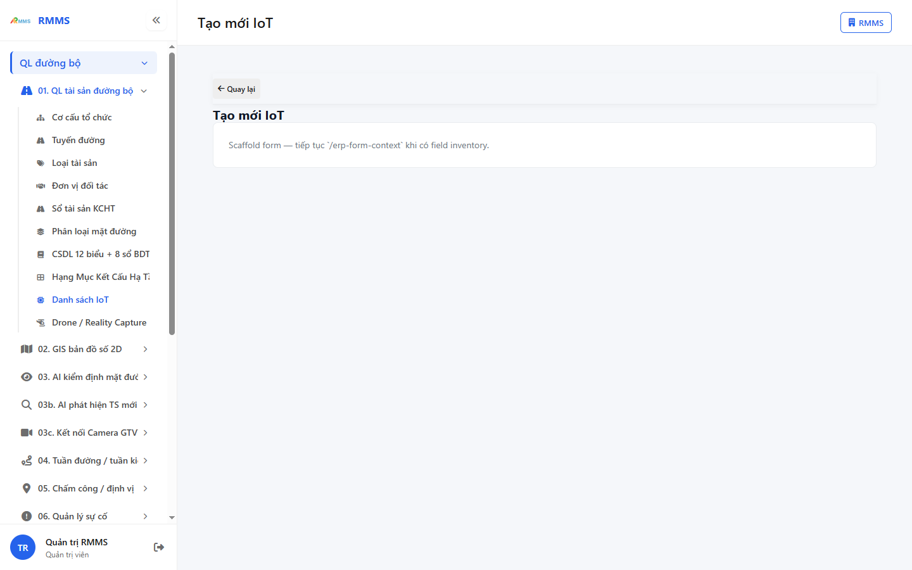
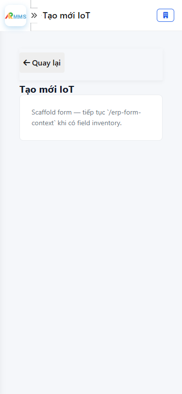

# Hướng dẫn sử dụng — Danh sách IoT

## Phạm vi

Tài khoản được cấp quyền menu 01. QL tài sản đường bộ thao tác Danh sách IoT.

Đăng nhập: [Hướng dẫn đăng nhập](../dang-nhap/huong-dan-su-dung.md).

## Danh sách IoT

**Mục đích:** mở và tra cứu Danh sách IoT.

**Cách thực hiện:**

1. Vào menu **Danh sách IoT**.
2. Điền điều kiện lọc nếu cần.
3. Nhấn **Tạo mới** / **Thêm** khi cần lập bản ghi, hoặc kích dòng để xem.

Hình 2. View trên mobile device(<= 375px)

## Tạo mới

**Mục đích:** lập bản ghi Danh sách IoT.

**Cách thực hiện:**

1. Nhấn **Tạo mới** hoặc **Thêm**.
2. Điền các ô `*`.
3. Nhấn **Lưu** / **Gửi** / **Tạo mới** khi hoàn tất.

Hình 4. View trên mobile device(<= 375px)

