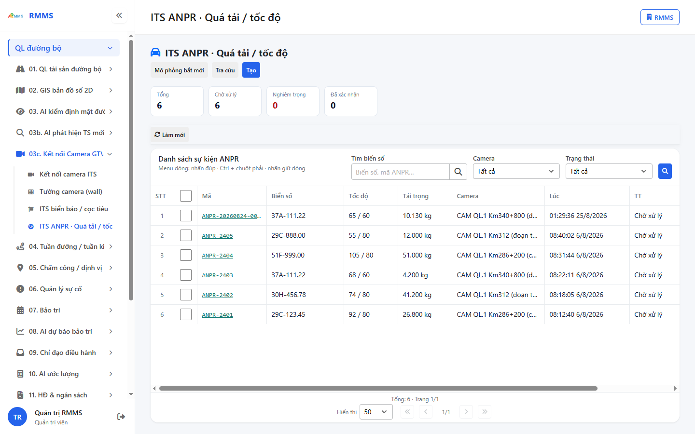
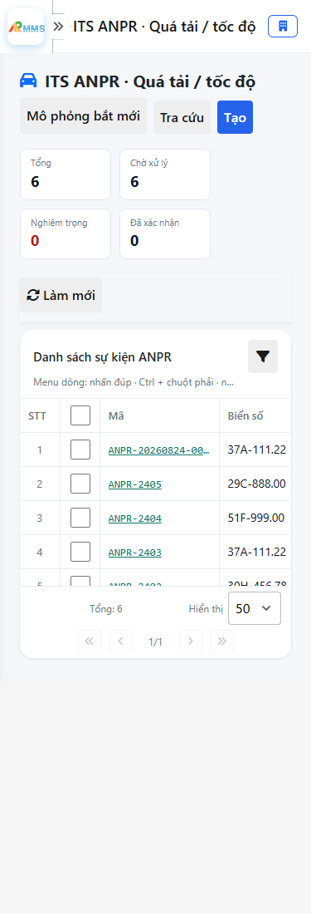

# Hướng dẫn sử dụng — ITS ANPR · Quá tải / tốc độ

## Phạm vi

Tài khoản được cấp quyền menu 03c. Kết nối Camera GTVT thao tác ITS ANPR · Quá tải / tốc độ.

Đăng nhập: [Hướng dẫn đăng nhập](../dang-nhap/huong-dan-su-dung.md).

## ITS ANPR · Quá tải / tốc độ

**Mục đích:** mở và tra cứu ITS ANPR · Quá tải / tốc độ.

**Cách thực hiện:**

1. Vào menu **ITS ANPR · Quá tải / tốc độ**.
2. Điền điều kiện lọc nếu cần.
3. Nhấn **Tạo mới** / **Thêm** khi cần lập bản ghi, hoặc kích dòng để xem.

Hình 2. View trên mobile device(<= 375px)

`*` = bắt buộc khi Lưu / Gửi. Ô trống = không bắt buộc.

| Nhãn trên màn | * | Cách điền |
|---------------|---|-----------|
| Tìm biển số |  | Được để trống |
| Camera |  | Được để trống |
| Trạng thái |  | Được để trống |

