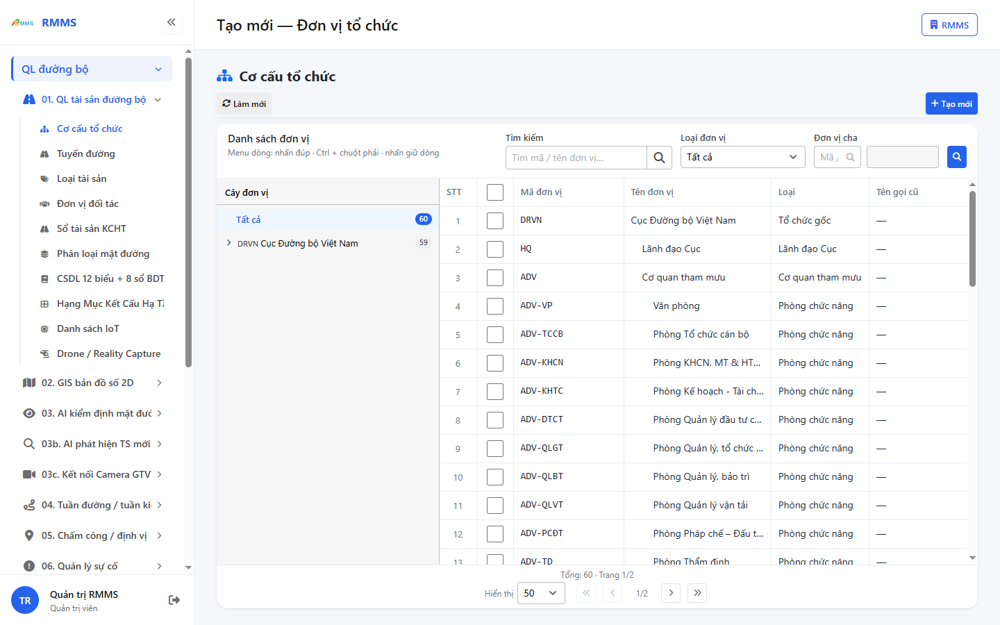
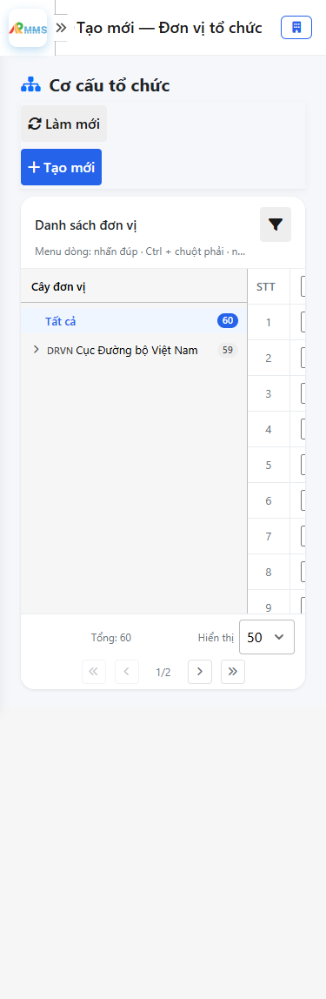
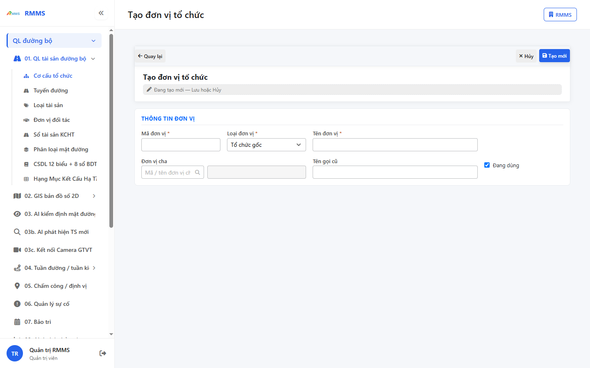
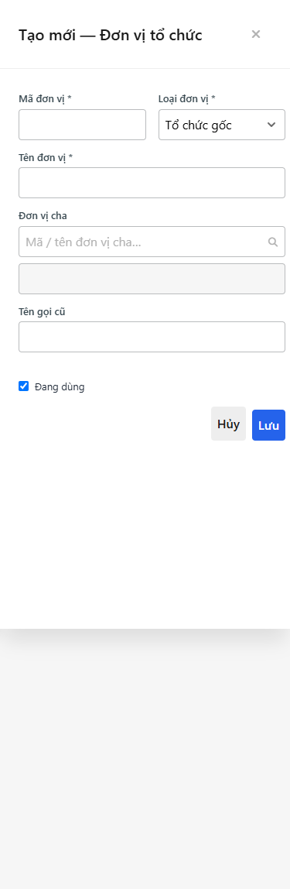

# Hướng dẫn sử dụng — Cơ cấu tổ chức

## Phạm vi

Tài khoản được cấp quyền menu 01. QL tài sản đường bộ thao tác Cơ cấu tổ chức.

Đăng nhập: [Hướng dẫn đăng nhập](../../dang-nhap/huong-dan-su-dung.md).

## Cơ cấu tổ chức

**Mục đích:** mở và tra cứu Cơ cấu tổ chức.

**Cách thực hiện:**

1. Vào menu **Cơ cấu tổ chức**.
2. Điền điều kiện lọc nếu cần.
3. Nhấn **Tạo mới** / **Thêm** khi cần lập bản ghi, hoặc kích dòng để xem.

Hình 2. View trên mobile device(<= 375px)

`*` = bắt buộc khi Lưu / Gửi. Ô trống = không bắt buộc.

| Nhãn trên màn | * | Cách điền |
|---------------|---|-----------|
| Tìm kiếm |  | Được để trống |
| Loại đơn vị |  | Được để trống |
| Đơn vị chủ quản |  | Được để trống |

## Tạo mới

**Mục đích:** lập bản ghi Cơ cấu tổ chức.

**Cách thực hiện:**

1. Nhấn **Tạo mới** hoặc **Thêm**.
2. Điền các ô `*`.
3. Nhấn **Lưu** / **Gửi** / **Tạo mới** khi hoàn tất.

Hình 4. View trên mobile device(<= 375px)

`*` = bắt buộc khi Lưu / Gửi. Ô trống = không bắt buộc.

| Nhãn trên màn | * | Cách điền |
|---------------|---|-----------|
| Tìm kiếm |  | Được để trống |
| Loại đơn vị |  | Được để trống |
| Đơn vị chủ quản |  | Được để trống |
| Mã đơn vị | * | Điền / chọn trước khi Lưu |
| Loại đơn vị | * | Điền / chọn trước khi Lưu |
| Tên đơn vị | * | Điền / chọn trước khi Lưu |
| Đơn vị chủ quản |  | Được để trống |
| Tên gọi cũ |  | Được để trống |
| Đang dùng |  | Được để trống |

