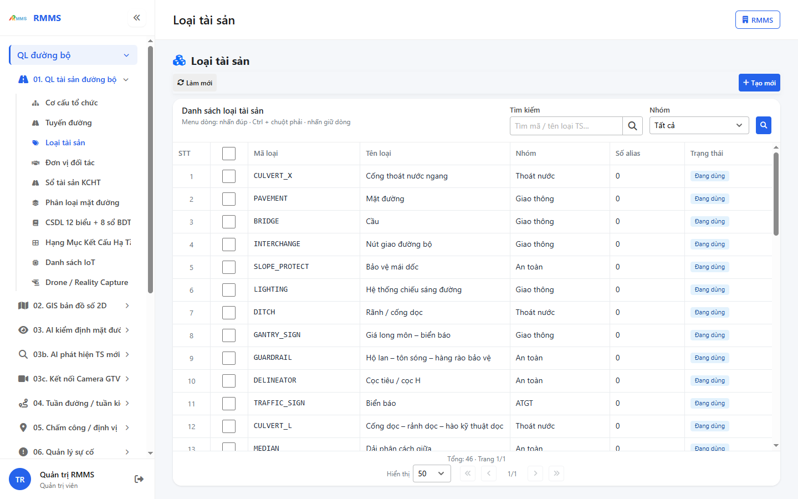
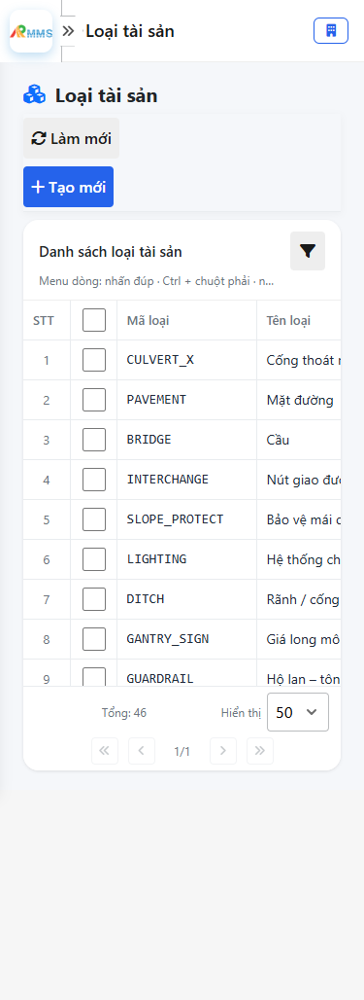
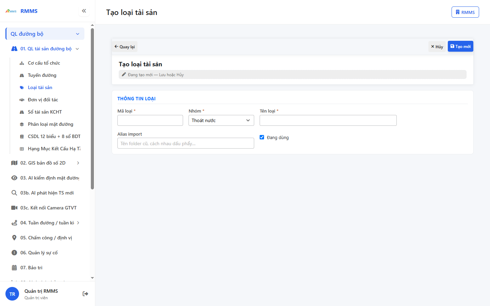
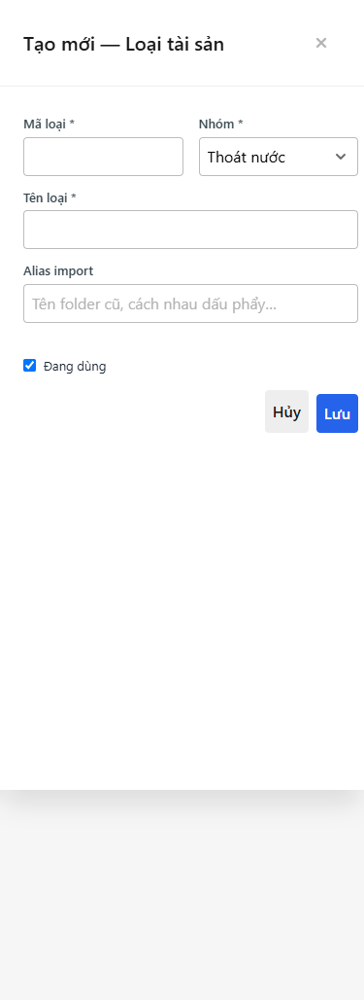

# Hướng dẫn sử dụng — Loại tài sản

## Phạm vi

Tài khoản được cấp quyền menu 01. QL tài sản đường bộ thao tác Loại tài sản.

Đăng nhập: [Hướng dẫn đăng nhập](../../dang-nhap/huong-dan-su-dung.md).

## Loại tài sản

**Mục đích:** mở và tra cứu Loại tài sản.

**Cách thực hiện:**

1. Vào menu **Loại tài sản**.
2. Điền điều kiện lọc nếu cần.
3. Nhấn **Tạo mới** / **Thêm** khi cần lập bản ghi, hoặc kích dòng để xem.

Hình 2. View trên mobile device(<= 375px)

`*` = bắt buộc khi Lưu / Gửi. Ô trống = không bắt buộc.

| Nhãn trên màn | * | Cách điền |
|---------------|---|-----------|
| Tìm kiếm |  | Được để trống |
| Nhóm |  | Được để trống |

## Tạo mới

**Mục đích:** lập bản ghi Loại tài sản.

**Cách thực hiện:**

1. Nhấn **Tạo mới** hoặc **Thêm**.
2. Điền các ô `*`.
3. Nhấn **Lưu** / **Gửi** / **Tạo mới** khi hoàn tất.

Hình 4. View trên mobile device(<= 375px)

`*` = bắt buộc khi Lưu / Gửi. Ô trống = không bắt buộc.

| Nhãn trên màn | * | Cách điền |
|---------------|---|-----------|
| Tìm kiếm |  | Được để trống |
| Nhóm |  | Được để trống |
| Mã loại | * | Điền / chọn trước khi Lưu |
| Nhóm | * | Điền / chọn trước khi Lưu |
| Tên loại | * | Điền / chọn trước khi Lưu |
| Alias import |  | Được để trống |
| Đang dùng |  | Được để trống |

