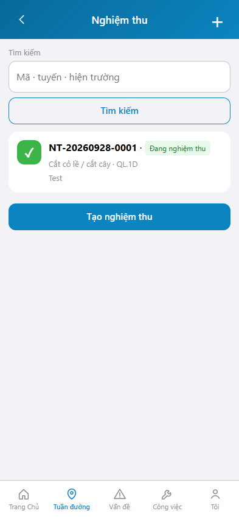
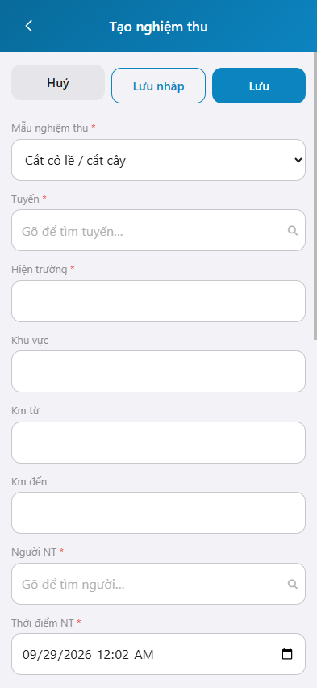

# Hướng dẫn sử dụng — Công tác nghiệm thu

## Phạm vi

Công tác nghiệm thu ghi nhận kết quả nghiệm thu bảo dưỡng thường xuyên theo mẫu công việc, tuyến, hiện trường và hạng mục kiểm tra. Nghiệm thu không thay tuần kiểm.

Đăng nhập: [Hướng dẫn đăng nhập](../dang-nhap/huong-dan-su-dung.md).

Ảnh chụp trên https://rmms.vn/m , khung iPhone 15 (393 x 852).

## Nghiệm thu

**Mục đích:** tìm và mở phiếu nghiệm thu đã lập.

**Cách thực hiện:**

1. Từ trang chủ hoặc từ **Thao tác nhanh** trên màn Tuần đường, chọn **Công tác nghiệm thu**.
2. Gõ **Tìm kiếm** theo mã, tuyến hoặc hiện trường, rồi nhấn **Tìm kiếm**.
3. Kích một phiếu để xem chi tiết. Dòng phiếu ghi mã, trạng thái, mẫu nghiệm thu và tuyến.
4. Nhấn **+** hoặc **Tạo nghiệm thu** để lập phiếu mới.

| Nhãn trên màn | * | Cách điền |
|---------------|---|-----------|
| Tìm kiếm | | Được để trống. Mã, tuyến hoặc hiện trường. |

## Tạo nghiệm thu

**Mục đích:** lập phiếu nghiệm thu cho một mẫu công việc trên tuyến.

**Cách thực hiện:**

1. Nhấn **Tạo nghiệm thu**.
2. Chọn **Mẫu nghiệm thu**, **Tuyến**, **Người NT** và **Thời điểm NT**.
3. Nhập **Hiện trường**, hoặc nhấn **Ghim vị trí hiện tại** để lấy định vị.
4. Với từng dòng **Hạng mục kiểm tra**, chọn **Đạt**, **Không đạt** hoặc **Không áp dụng**.
5. Chọn **Kết quả** của phiếu: Đạt, Không đạt hoặc Khấu trừ.
6. Nhấn **Lưu** để ghi phiếu. Nhấn **Lưu nháp** để giữ bản nháp. Nhấn **Huỷ** để thoát, không ghi.

Mẫu trên hệ thống gồm: Cắt cỏ lề / cắt cây, Vệ sinh / vá ổ gà mặt đường, Nạo vét rãnh, Sơn bổ sung báo hiệu, Khơi thông cống / rãnh, Sửa chữa lề đường, Hót sụt, Bảo dưỡng báo hiệu đường bộ, Hạng mục công trình khác, Bảo dưỡng thiết bị.

`*` = bắt buộc khi Lưu. Ô trống = không bắt buộc.

| Nhãn trên màn | * | Cách điền |
|---------------|---|-----------|
| Mẫu nghiệm thu | * | Chọn một mẫu công việc. |
| Tuyến | * | Chọn tuyến trong danh mục. |
| Hiện trường | * | Nhập mô tả hoặc ghim định vị. |
| Khu vực | | Được để trống. |
| Km từ | | Km đầu đoạn nghiệm thu. |
| Km đến | | Km cuối đoạn nghiệm thu. |
| Người NT | * | Chọn người nghiệm thu trong danh mục. |
| Thời điểm NT | * | Ngày giờ nghiệm thu. |
| Kết quả | | Đạt, Không đạt hoặc Khấu trừ. |
| Ghi chú kết quả | | Được để trống. |
| Hạng mục kiểm tra | | Từng dòng: Đạt, Không đạt hoặc Không áp dụng. |
| Ghi chú | | Được để trống. |
| Định vị | | Ghim vị trí hiện tại khi đang ở hiện trường. |
| Ảnh hiện trường | | Nhấn Chụp khi cần ảnh. |
