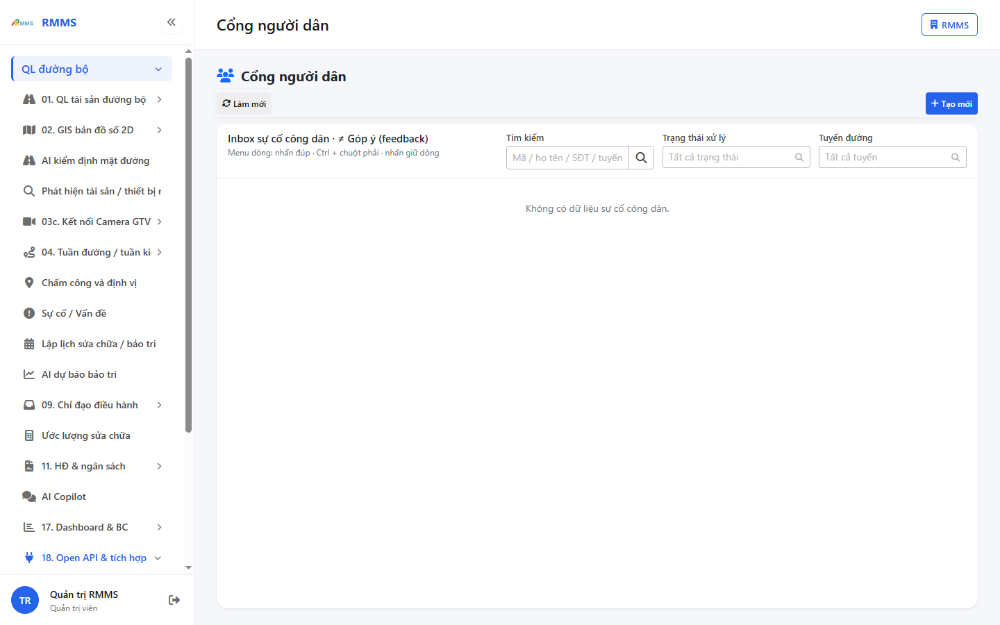
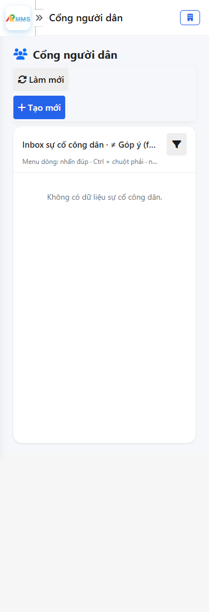
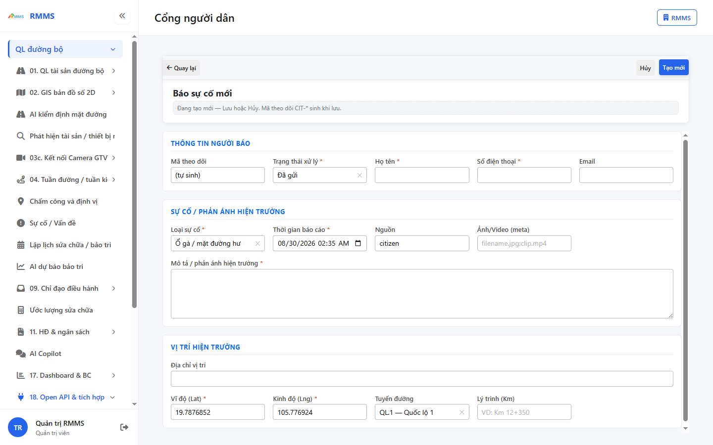
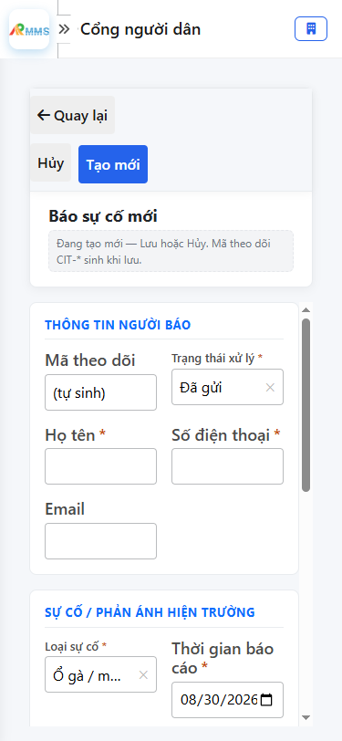

# Hướng dẫn sử dụng — Cổng người dân

## Phạm vi

Tài khoản được cấp quyền menu 18. Open API & tích hợp thao tác Cổng người dân.

Đăng nhập: [Hướng dẫn đăng nhập](../dang-nhap/huong-dan-su-dung.md).

## Cổng người dân

**Mục đích:** mở và tra cứu Cổng người dân.

**Cách thực hiện:**

1. Vào menu **Cổng người dân**.
2. Điền điều kiện lọc nếu cần.
3. Nhấn **Tạo mới** / **Thêm** khi cần lập bản ghi, hoặc kích dòng để xem.

Hình 2. View trên mobile device(<= 375px)

`*` = bắt buộc khi Lưu / Gửi. Ô trống = không bắt buộc.

| Nhãn trên màn | * | Cách điền |
|---------------|---|-----------|
| Tìm kiếm |  | Được để trống |
| Trạng thái xử lý |  | Được để trống |
| Tuyến đường |  | Được để trống |

## Tạo mới

**Mục đích:** lập bản ghi Cổng người dân.

**Cách thực hiện:**

1. Nhấn **Tạo mới** hoặc **Thêm**.
2. Điền các ô `*`.
3. Nhấn **Lưu** / **Gửi** / **Tạo mới** khi hoàn tất.

Hình 4. View trên mobile device(<= 375px)

`*` = bắt buộc khi Lưu / Gửi. Ô trống = không bắt buộc.

| Nhãn trên màn | * | Cách điền |
|---------------|---|-----------|
| Mã theo dõi |  | Được để trống |
| Trạng thái xử lý | * | Điền / chọn trước khi Lưu |
| Họ tên | * | Điền / chọn trước khi Lưu |
| Số điện thoại | * | Điền / chọn trước khi Lưu |
| Email |  | Được để trống |
| Loại sự cố | * | Điền / chọn trước khi Lưu |
| Thời gian báo cáo | * | Điền / chọn trước khi Lưu |
| Nguồn |  | Được để trống |
| Ảnh/Video (meta) |  | Được để trống |
| Mô tả / phản ánh hiện trường | * | Điền / chọn trước khi Lưu |
| Địa chỉ vị trí |  | Được để trống |
| Vĩ độ (Lat) | * | Điền / chọn trước khi Lưu |
| Kinh độ (Lng) | * | Điền / chọn trước khi Lưu |
| Tuyến đường |  | Được để trống |
| Lý trình (Km) |  | Được để trống |

