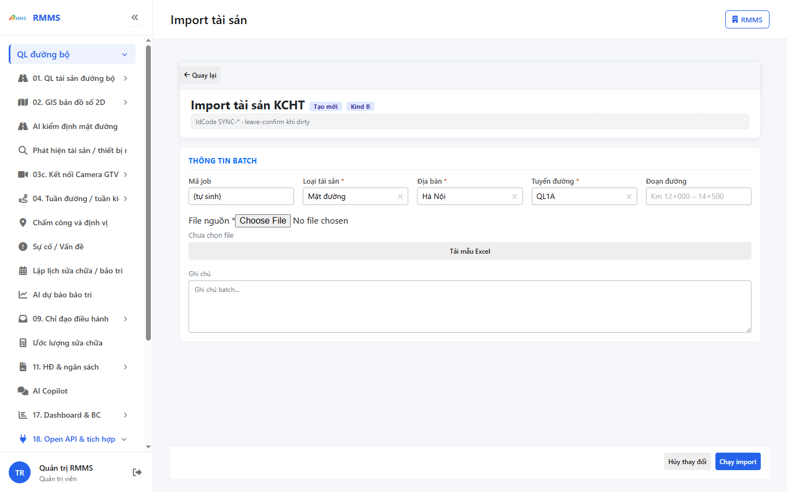
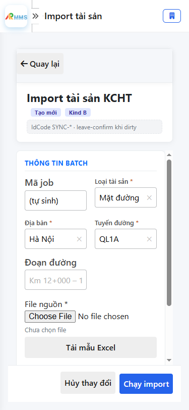

# Hướng dẫn sử dụng — Import tài sản

## Phạm vi

Tài khoản được cấp quyền menu 18. Open API & tích hợp thao tác Import tài sản.

Đăng nhập: [Hướng dẫn đăng nhập](../../dang-nhap/huong-dan-su-dung.md).

## Import tài sản KCHTTạo mớiKind B

**Mục đích:** mở và tra cứu Import tài sản.

**Cách thực hiện:**

1. Vào menu **Import tài sản**.
2. Điền điều kiện lọc nếu cần.
3. Nhấn **Tạo mới** / **Thêm** khi cần lập bản ghi, hoặc kích dòng để xem.

Hình 2. View trên mobile device(<= 375px)

`*` = bắt buộc khi Lưu / Gửi. Ô trống = không bắt buộc.

| Nhãn trên màn | * | Cách điền |
|---------------|---|-----------|
| Mã job |  | Được để trống |
| Loại tài sản | * | Điền / chọn trước khi Lưu |
| Địa bàn | * | Điền / chọn trước khi Lưu |
| Tuyến đường | * | Điền / chọn trước khi Lưu |
| Đoạn đường |  | Được để trống |
| File nguồn | * | Điền / chọn trước khi Lưu |
| Ghi chú |  | Được để trống |

