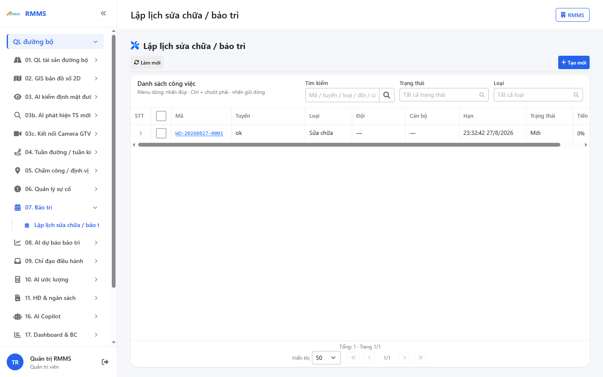
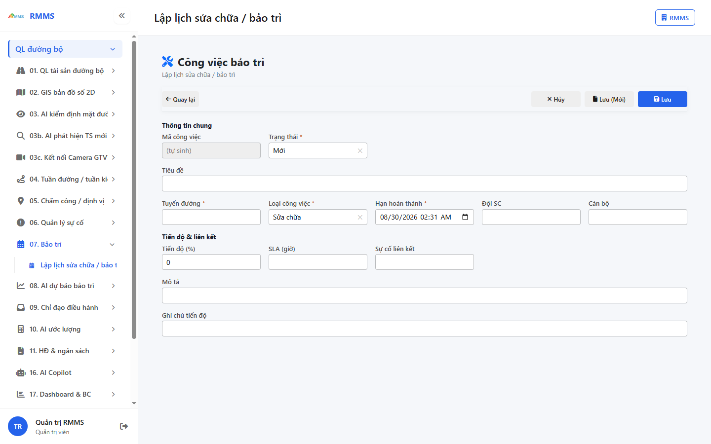
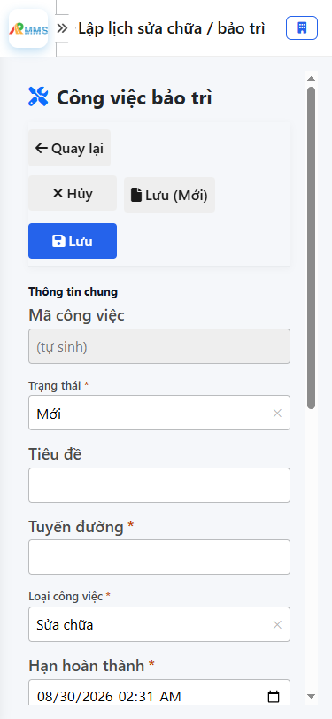

# Hướng dẫn sử dụng — Lập lịch sửa chữa / bảo trì

## Phạm vi

Tài khoản được cấp quyền menu 07. Bảo trì thao tác Lập lịch sửa chữa / bảo trì.

Đăng nhập: [Hướng dẫn đăng nhập](../dang-nhap/huong-dan-su-dung.md).

## Lập lịch sửa chữa / bảo trì

**Mục đích:** mở và tra cứu Lập lịch sửa chữa / bảo trì.

**Cách thực hiện:**

1. Vào menu **Lập lịch sửa chữa / bảo trì**.
2. Điền điều kiện lọc nếu cần.
3. Nhấn **Tạo mới** / **Thêm** khi cần lập bản ghi, hoặc kích dòng để xem.

Hình 2. View trên mobile device(<= 375px)

`*` = bắt buộc khi Lưu / Gửi. Ô trống = không bắt buộc.

| Nhãn trên màn | * | Cách điền |
|---------------|---|-----------|
| Tìm kiếm |  | Được để trống |
| Trạng thái |  | Được để trống |
| Loại |  | Được để trống |

## Tạo mới

**Mục đích:** lập bản ghi Lập lịch sửa chữa / bảo trì.

**Cách thực hiện:**

1. Nhấn **Tạo mới** hoặc **Thêm**.
2. Điền các ô `*`.
3. Nhấn **Lưu** / **Gửi** / **Tạo mới** khi hoàn tất.

Hình 4. View trên mobile device(<= 375px)

`*` = bắt buộc khi Lưu / Gửi. Ô trống = không bắt buộc.

| Nhãn trên màn | * | Cách điền |
|---------------|---|-----------|
| Mã công việc |  | Được để trống |
| Trạng thái | * | Điền / chọn trước khi Lưu |
| Tiêu đề |  | Được để trống |
| Tuyến đường | * | Điền / chọn trước khi Lưu |
| Loại công việc | * | Điền / chọn trước khi Lưu |
| Hạn hoàn thành | * | Điền / chọn trước khi Lưu |
| Đội SC |  | Được để trống |
| Cán bộ |  | Được để trống |
| Tiến độ (%) |  | Được để trống |
| SLA (giờ) |  | Được để trống |
| Sự cố liên kết |  | Được để trống |
| Mô tả |  | Được để trống |
| Ghi chú tiến độ |  | Được để trống |

