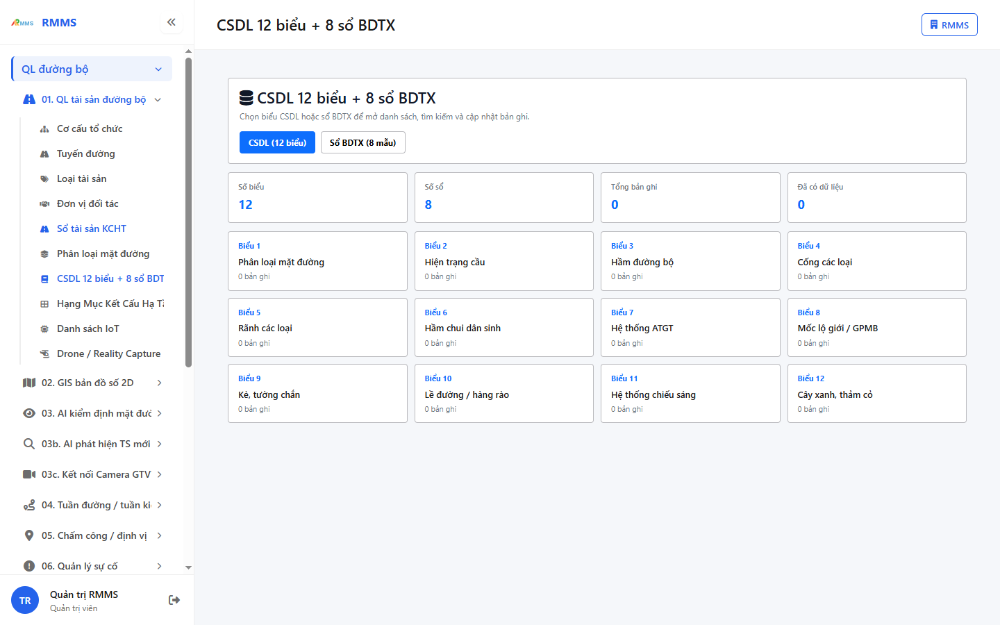
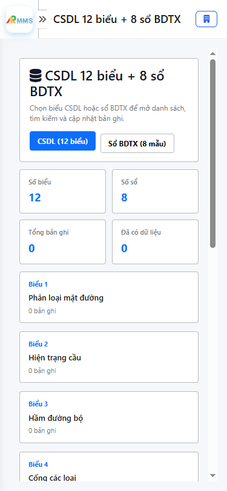

# Hướng dẫn sử dụng — CSDL 12 biểu + 8 sổ BDTX

## Phạm vi

Tài khoản được cấp quyền menu 01. QL tài sản đường bộ thao tác CSDL 12 biểu + 8 sổ BDTX.

Đăng nhập: [Hướng dẫn đăng nhập](../../dang-nhap/huong-dan-su-dung.md).

## CSDL 12 biểu + 8 sổ BDTX

**Mục đích:** mở và tra cứu CSDL 12 biểu + 8 sổ BDTX.

**Cách thực hiện:**

1. Vào menu **CSDL 12 biểu + 8 sổ BDTX**.
2. Điền điều kiện lọc nếu cần.
3. Nhấn **Tạo mới** / **Thêm** khi cần lập bản ghi, hoặc kích dòng để xem.

Hình 2. View trên mobile device(<= 375px)

