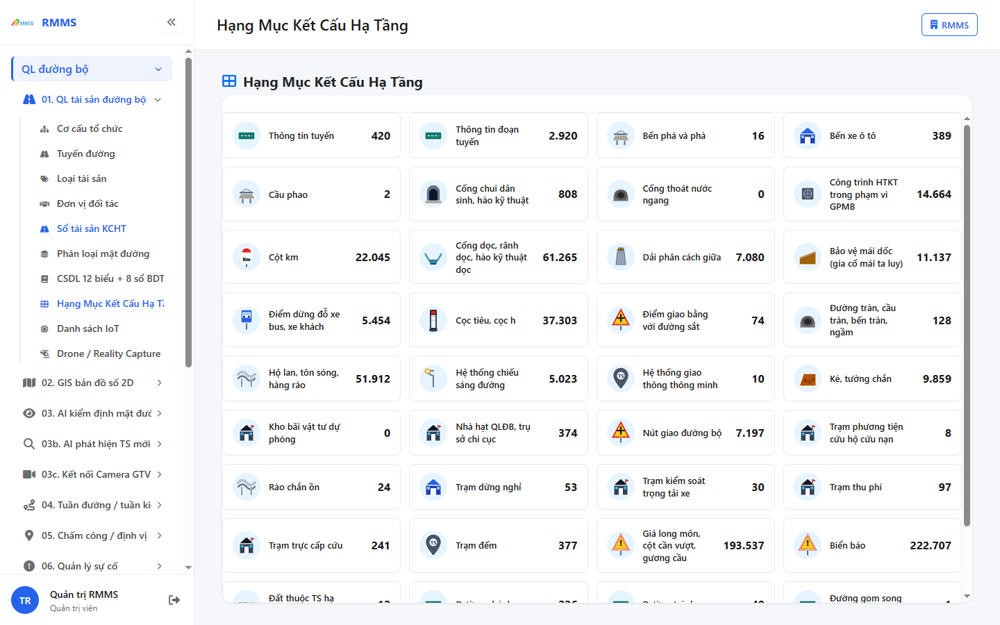
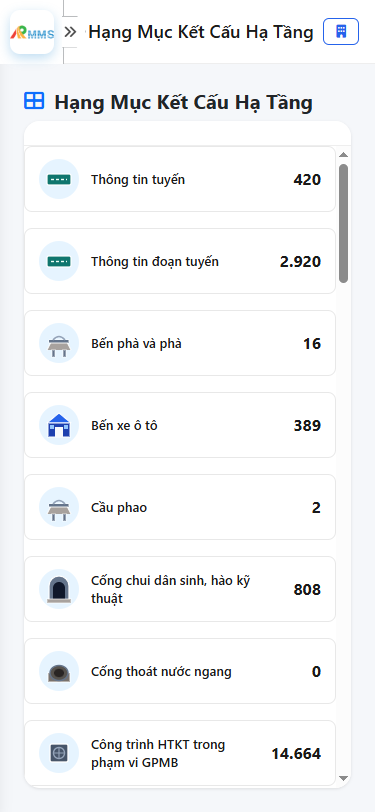

# Hướng dẫn sử dụng — Hạng Mục Kết Cấu Hạ Tầng

## Phạm vi

Tài khoản được cấp quyền menu 01. QL tài sản đường bộ thao tác Hạng Mục Kết Cấu Hạ Tầng.

Đăng nhập: [Hướng dẫn đăng nhập](../../dang-nhap/huong-dan-su-dung.md).

## Hạng Mục Kết Cấu Hạ Tầng

**Mục đích:** mở và tra cứu Hạng Mục Kết Cấu Hạ Tầng.

**Cách thực hiện:**

1. Vào menu **Hạng Mục Kết Cấu Hạ Tầng**.
2. Điền điều kiện lọc nếu cần.
3. Nhấn **Tạo mới** / **Thêm** khi cần lập bản ghi, hoặc kích dòng để xem.

Hình 2. View trên mobile device(<= 375px)

