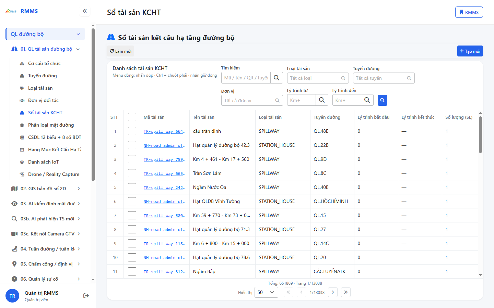
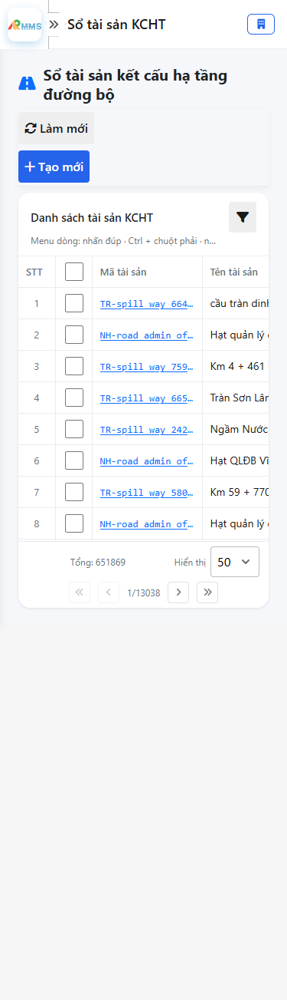
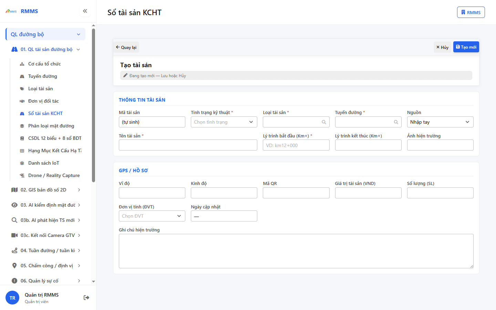
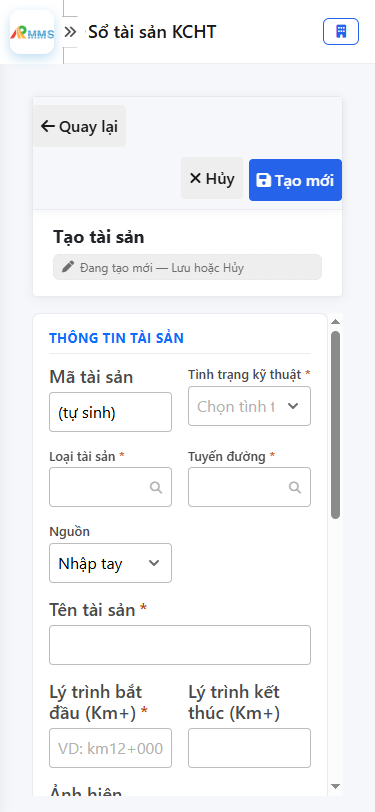

# Hướng dẫn sử dụng — Sổ tài sản KCHT

## Phạm vi

Tài khoản được cấp quyền menu 01. QL tài sản đường bộ thao tác Sổ tài sản KCHT.

Đăng nhập: [Hướng dẫn đăng nhập](../dang-nhap/huong-dan-su-dung.md).

## Sổ tài sản kết cấu hạ tầng đường bộ

**Mục đích:** mở và tra cứu Sổ tài sản KCHT.

**Cách thực hiện:**

1. Vào menu **Sổ tài sản KCHT**.
2. Điền điều kiện lọc nếu cần.
3. Nhấn **Tạo mới** / **Thêm** khi cần lập bản ghi, hoặc kích dòng để xem.

Hình 2. View trên mobile device(<= 375px)

`*` = bắt buộc khi Lưu / Gửi. Ô trống = không bắt buộc.

| Nhãn trên màn | * | Cách điền |
|---------------|---|-----------|
| Tìm kiếm |  | Được để trống |
| Loại tài sản |  | Được để trống |
| Tuyến đường |  | Được để trống |
| Đơn vị |  | Được để trống |
| Lý trình từ |  | Được để trống |
| Lý trình đến |  | Được để trống |

## Tạo mới

**Mục đích:** lập bản ghi Sổ tài sản KCHT.

**Cách thực hiện:**

1. Nhấn **Tạo mới** hoặc **Thêm**.
2. Điền các ô `*`.
3. Nhấn **Lưu** / **Gửi** / **Tạo mới** khi hoàn tất.

Hình 4. View trên mobile device(<= 375px)

`*` = bắt buộc khi Lưu / Gửi. Ô trống = không bắt buộc.

| Nhãn trên màn | * | Cách điền |
|---------------|---|-----------|
| Mã tài sản |  | Được để trống |
| Tình trạng kỹ thuật | * | Điền / chọn trước khi Lưu |
| Loại tài sản | * | Điền / chọn trước khi Lưu |
| Tuyến đường | * | Điền / chọn trước khi Lưu |
| Nguồn |  | Được để trống |
| Tên tài sản | * | Điền / chọn trước khi Lưu |
| Lý trình bắt đầu (Km+) | * | Điền / chọn trước khi Lưu |
| Lý trình kết thúc (Km+) |  | Được để trống |
| Ảnh hiện trường |  | Được để trống |
| Vĩ độ |  | Được để trống |
| Kinh độ |  | Được để trống |
| Mã QR |  | Được để trống |
| Giá trị tài sản (VND) |  | Được để trống |
| Số lượng (SL) |  | Được để trống |
| Đơn vị tính (ĐVT) |  | Được để trống |
| Ngày cập nhật |  | Được để trống |
| Ghi chú hiện trường |  | Được để trống |

