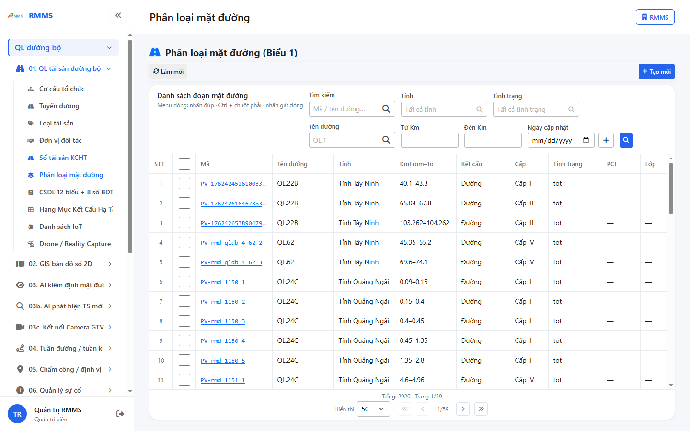
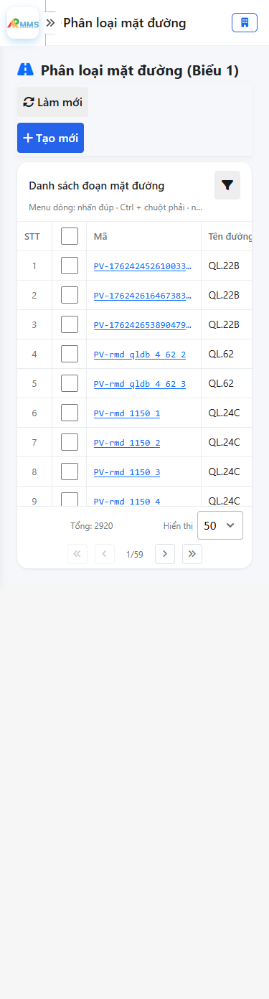
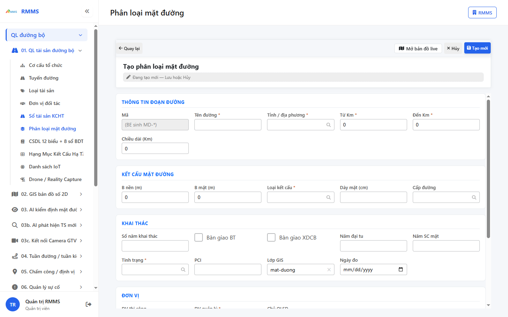
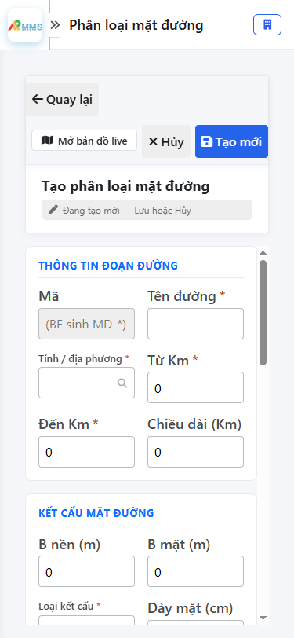

# Hướng dẫn sử dụng — Phân loại mặt đường

## Phạm vi

Tài khoản được cấp quyền menu 01. QL tài sản đường bộ thao tác Phân loại mặt đường.

Đăng nhập: [Hướng dẫn đăng nhập](../../dang-nhap/huong-dan-su-dung.md).

## Phân loại mặt đường (Biểu 1)

**Mục đích:** mở và tra cứu Phân loại mặt đường.

**Cách thực hiện:**

1. Vào menu **Phân loại mặt đường**.
2. Điền điều kiện lọc nếu cần.
3. Nhấn **Tạo mới** / **Thêm** khi cần lập bản ghi, hoặc kích dòng để xem.

Hình 2. View trên mobile device(<= 375px)

`*` = bắt buộc khi Lưu / Gửi. Ô trống = không bắt buộc.

| Nhãn trên màn | * | Cách điền |
|---------------|---|-----------|
| Tìm kiếm |  | Được để trống |
| Tỉnh |  | Được để trống |
| Tình trạng |  | Được để trống |
| Tên đường |  | Được để trống |
| Từ Km |  | Được để trống |
| Đến Km |  | Được để trống |

## Tạo mới

**Mục đích:** lập bản ghi Phân loại mặt đường.

**Cách thực hiện:**

1. Nhấn **Tạo mới** hoặc **Thêm**.
2. Điền các ô `*`.
3. Nhấn **Lưu** / **Gửi** / **Tạo mới** khi hoàn tất.

Hình 4. View trên mobile device(<= 375px)

`*` = bắt buộc khi Lưu / Gửi. Ô trống = không bắt buộc.

| Nhãn trên màn | * | Cách điền |
|---------------|---|-----------|
| Mã |  | Được để trống |
| Tên đường | * | Điền / chọn trước khi Lưu |
| Tỉnh / địa phương | * | Điền / chọn trước khi Lưu |
| Từ Km | * | Điền / chọn trước khi Lưu |
| Đến Km | * | Điền / chọn trước khi Lưu |
| Chiều dài (Km) |  | Được để trống |
| B nền (m) |  | Được để trống |
| B mặt (m) |  | Được để trống |
| Loại kết cấu | * | Điền / chọn trước khi Lưu |
| Dày mặt (cm) |  | Được để trống |
| Cấp đường |  | Được để trống |
| Số năm khai thác |  | Được để trống |
| Bàn giao BT |  | Được để trống |
| Bàn giao XDCB |  | Được để trống |
| Năm đại tu |  | Được để trống |
| Năm SC mặt |  | Được để trống |
| Tình trạng | * | Điền / chọn trước khi Lưu |
| PCI |  | Được để trống |
| Lớp GIS |  | Được để trống |
| Ngày đo |  | Được để trống |
| ĐV thi công |  | Được để trống |
| ĐV quản lý | * | Điền / chọn trước khi Lưu |
| Chủ QLSD |  | Được để trống |
| Ngày cập nhật |  | Được để trống |
| Người cập nhật |  | Được để trống |
| Ghi chú |  | Được để trống |

