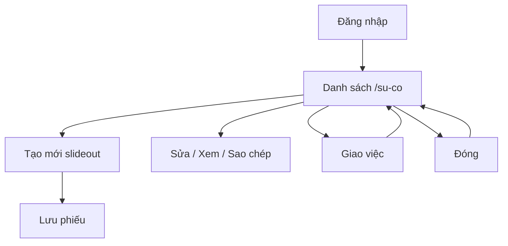

# Hướng dẫn — Quản lý sự cố (`incident`)

**Phiên bản:** 1.0  
**Ngày cập nhật:** 29/08/2026  
**Phân hệ:** `Linm.Web.RMMS.Field` · menu Sự cố / Vấn đề  
**Người dùng:** Tuần đường, tuần kiểm, Hạt, Ban QLDA  
**Status:** `written` · capture headed `ok` · verified `no`

---

**Bản xem / in (sơ đồ vẽ + từng màn + bảng field):** [preview.html](preview.html)

## Mục lục

- [1. Tổng quan](#1-tổng-quan)
- [2. Workflow](#2-workflow)
- [3. Walkthrough](#3-walkthrough)
- [4. FAQ](#4-faq)

---

## 1. Tổng quan

### 1.1 Mục đích

Ghi nhận sự cố / vấn đề hiện trường trên web **Sự cố / Vấn đề**: danh sách, lập phiếu, giao việc, đóng. Không lẫn Cổng người dân.

### 1.2 Vai trò

| Vai trò | Việc trên màn |
|---------|----------------|
| Tuần đường / tuần kiểm | Tạo, sửa, xem phiếu |
| Hạt / Ban QLDA | Lọc, giao việc, đóng |

### 1.3 Điều kiện tiên quyết

- Tài khoản đã được cấp và còn hiệu lực.
- Đã [đăng nhập](../dang-nhap/preview.html).

### 1.4 Vị trí truy cập

```
Sự cố / Vấn đề
└── Danh sách              → /su-co
    └── Thêm               → /su-co?form=create
```

**URL localRoot:** `http://localhost:9100/su-co`

HĐ PL01 mục 06 · P1-900.

---

## 2. Workflow

| Luồng | Mô tả | Bắt đầu | Kết thúc | Người thực hiện |
|--------|-------|---------|----------|-----------------|
| Tạo mới | Slideout thêm sự cố | Danh sách | Phiếu Mới | Tuần đường |
| Sửa / xem | Slideout từ dòng | Danh sách | Phiếu cập nhật | Tuần đường · Hạt |
| Giao việc | Menu dòng | Dòng chọn | Người xử lý | Hạt / Ban QLDA |
| Đóng | Menu dòng | Dòng chọn | Đã đóng | Hạt / Ban QLDA |



SLA đầy đủ và bản đồ live — chưa thuộc bản P1 này.

---

## 3. Walkthrough

Chi tiết field + ảnh: [usecase.md](usecase.md) · [huong-dan-su-dung.md](huong-dan-su-dung.md) · [preview.html](preview.html)

| Bước | Màn | Ảnh |
|------|-----|-----|
| 1 | Đăng nhập | [../dang-nhap/captures/01-login.png](../dang-nhap/captures/01-login.png) |
| 2 | Danh sách | [captures/02-su-co.png](captures/02-su-co.png) |
| 3 | Thêm | [captures/03-su-co-form-create.png](captures/03-su-co-form-create.png) |

**Ví dụ:** phát hiện ổ gà trên đoạn đang tuần — vào Sự cố / Vấn đề → Tạo mới → điền tiêu đề, đoạn, loại Ổ gà, trạng thái Mới, ngày yêu cầu → Lưu.

---

## 4. FAQ

| Câu hỏi | Trả lời |
|---------|---------|
| Không thấy bản đồ? | Bản đồ live chưa thuộc bản này. |
| Lẫn Cổng dân? | Không — tiêu đề list ghi ≠ Cổng người dân. |
| Mã phiếu? | Hệ thống sinh khi lưu. |
