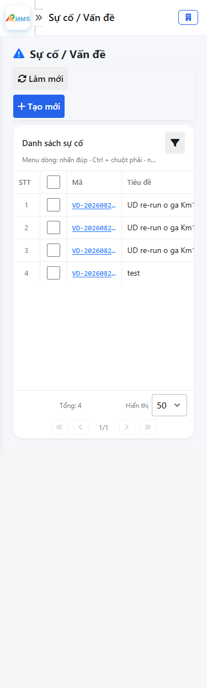
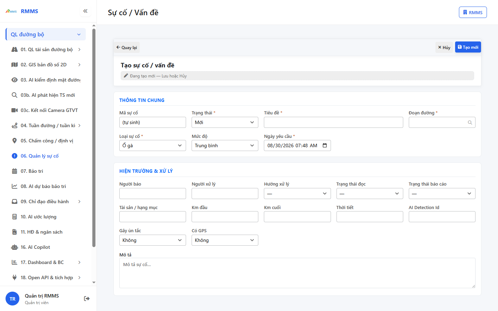
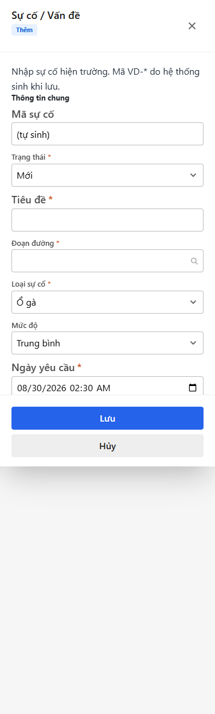

# Hướng dẫn sử dụng — Sự cố / Vấn đề

## Phạm vi

Tài khoản được cấp quyền menu 06. Quản lý sự cố thao tác Sự cố / Vấn đề.

Đăng nhập: [Hướng dẫn đăng nhập](../dang-nhap/huong-dan-su-dung.md).

## Sự cố / Vấn đề

**Mục đích:** mở và tra cứu Sự cố / Vấn đề.

**Cách thực hiện:**

1. Vào menu **Sự cố / Vấn đề**.
2. Điền điều kiện lọc nếu cần.
3. Nhấn **Tạo mới** / **Thêm** khi cần lập bản ghi, hoặc kích dòng để xem.

Hình 2. View trên mobile device(<= 375px)

`*` = bắt buộc khi Lưu / Gửi. Ô trống = không bắt buộc.

| Nhãn trên màn | * | Cách điền |
|---------------|---|-----------|
| Tìm kiếm |  | Được để trống |
| Trạng thái |  | Được để trống |
| Mức độ |  | Được để trống |
| Đoạn đường |  | Được để trống |
| Loại sự cố |  | Được để trống |

## Tạo mới

**Mục đích:** lập bản ghi Sự cố / Vấn đề.

**Cách thực hiện:**

1. Nhấn **Tạo mới** hoặc **Thêm**.
2. Điền các ô `*`.
3. Nhấn **Lưu** / **Gửi** / **Tạo mới** khi hoàn tất.

Hình 4. View trên mobile device(<= 375px)

`*` = bắt buộc khi Lưu / Gửi. Ô trống = không bắt buộc.

| Nhãn trên màn | * | Cách điền |
|---------------|---|-----------|
| Tìm kiếm |  | Được để trống |
| Trạng thái |  | Được để trống |
| Mức độ |  | Được để trống |
| Đoạn đường |  | Được để trống |
| Loại sự cố |  | Được để trống |
| Mã sự cố |  | Được để trống |
| Trạng thái | * | Điền / chọn trước khi Lưu |
| Tiêu đề | * | Điền / chọn trước khi Lưu |
| Đoạn đường | * | Điền / chọn trước khi Lưu |
| Loại sự cố | * | Điền / chọn trước khi Lưu |
| Mức độ |  | Được để trống |
| Ngày yêu cầu | * | Điền / chọn trước khi Lưu |
| Người báo |  | Được để trống |
| Người xử lý |  | Được để trống |
| Hướng xử lý |  | Được để trống |
| Trạng thái đọc |  | Được để trống |
| Trạng thái báo cáo |  | Được để trống |
| Tài sản / hạng mục |  | Được để trống |
| Km đầu |  | Được để trống |
| Km cuối |  | Được để trống |
| Thời tiết |  | Được để trống |
| AI Detection Id |  | Được để trống |
| Gây ùn tắc |  | Được để trống |
| Có GPS |  | Được để trống |
| Mô tả |  | Được để trống |

