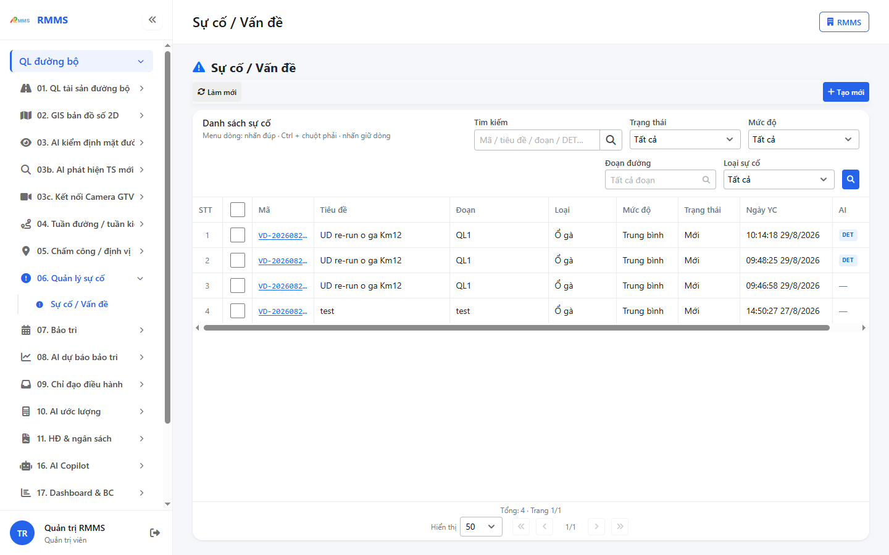
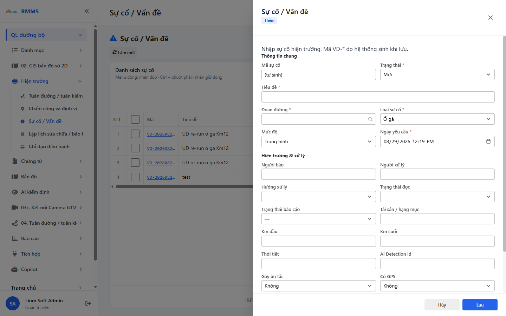

# Usecase — Quản lý sự cố (`incident`)

> **Status:** `captured` · `not_verified` · headed 2026-08-29  
> **URL run:** `http://localhost:9100/su-co`  
> Capture: `ok` — `02-su-co.png` · `03-su-co-form-create.png` · login: [dang-nhap](../dang-nhap/preview.html)

Persona: Tuần đường · tuần kiểm · Hạt · Ban QLDA.  
**≠** Cổng người dân.

---

Điều kiện: đã [đăng nhập](../dang-nhap/preview.html).

## Danh sách sự cố

**Mục đích:** xem catalog sự cố / vấn đề, lọc, mở slideout.

**URL:** `http://localhost:9100/su-co`

**Cách thực hiện:**

1. Vào menu **Sự cố / Vấn đề**.
2. Điền ô tìm.
3. Chọn **Tất cả trạng thái** / **Tất cả mức độ** khi cần lọc.
4. Nhấn Làm mới trên toolbar khi cần tải lại.
5. Kích menu dòng để Xem · Sửa · Sao chép · Xóa · Giao việc · Đóng.

### Cột lưới

| Cột |
|-----|
| STT |
| Mã |
| Tiêu đề |
| Đoạn |
| Loại |
| Mức độ |
| Trạng thái |
| Ngày YC |
| AI |
| ⋯ |

---

## Thêm sự cố (slideout)

**Mục đích:** tạo phiếu sự cố mới.

**URL:** `http://localhost:9100/su-co?form=create`

**Cách thực hiện:**

1. Nhấn **+ Tạo mới**.
2. Điền các trường `*`.
3. Capture dừng trước **Lưu**.

| Nhãn trên màn | * | Cách điền |
|---------------|---|-----------|
| Mã sự cố | | Hệ thống sinh `VD-*` khi lưu |
| Trạng thái | * | Mới / Đang XL / Đã đóng |
| Tiêu đề | * | Mô tả ngắn |
| Đoạn đường | * | Chọn / điền đoạn |
| Loại sự cố | * | Ổ gà · Sạt taluy · Biển báo · Khác |
| Mức độ | | Thấp · Trung bình · Cao · Critical |
| Ngày yêu cầu | * | Ngày giờ trên form |
| Người báo | | Tên người báo |
| Người xử lý | | Người nhận xử lý |
| Hướng xử lý | | Hướng xử lý |
| Trạng thái đọc | | |
| Trạng thái báo cáo | | |
| Tài sản / hạng mục | | |
| Km đầu | | |
| Km cuối | | |
| Thời tiết | | |
| AI Detection Id | | DET-* khi có |
| Gây ùn tắc | | Có / Không |
| Có GPS | | Có / Không |
| Mô tả | | |

---

## Sửa / Xem / Sao chép

**Mục đích:** mở slideout từ dòng. **Ảnh:** chưa capture (`?form=edit` · `view` · `copy`).

---

## Giao việc · Đóng

**Mục đích:** menu dòng **Giao việc** / **Đóng**. Capture dừng trước submit. **Ảnh:** chưa capture.

---

## Ngoài phạm vi

Bản đồ live · xuất Excel · comment entity — DEFER. Thanh nút theo từng trạng thái — ảnh chưa capture (`HDSD-P2-02`).
