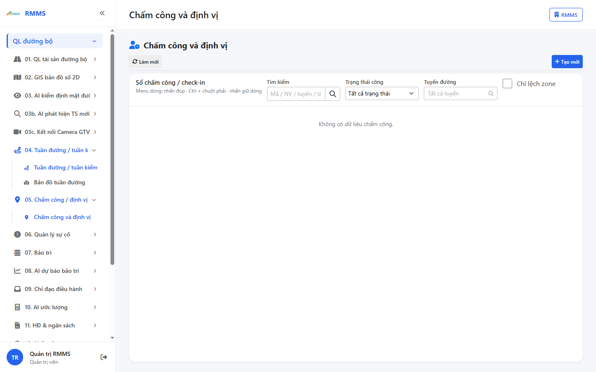
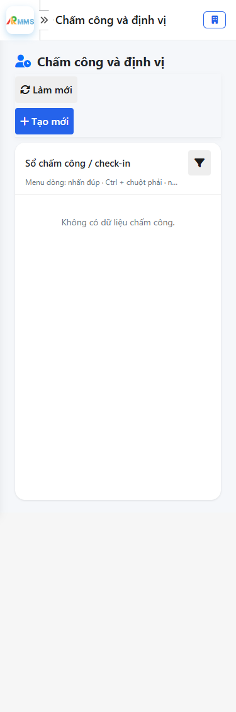
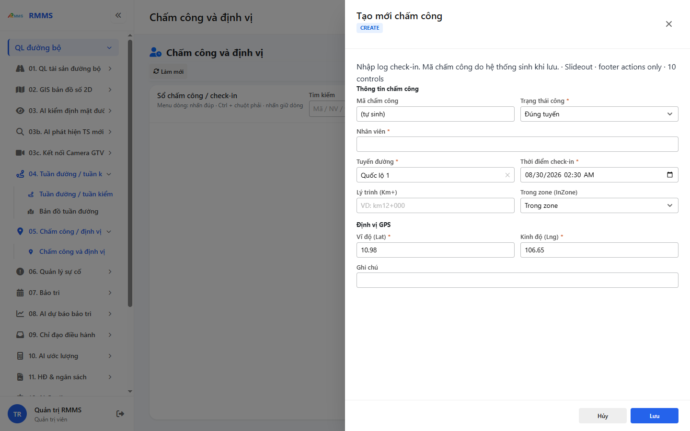
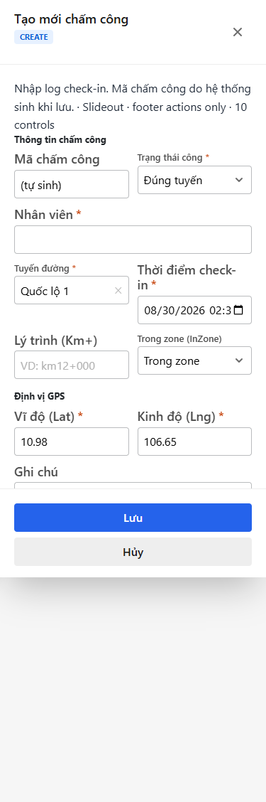

# Hướng dẫn sử dụng — Chấm công và định vị

## Phạm vi

Tài khoản được cấp quyền menu 05. Chấm công / định vị thao tác Chấm công và định vị.

Đăng nhập: [Hướng dẫn đăng nhập](../../dang-nhap/huong-dan-su-dung.md).

## Chấm công và định vị

**Mục đích:** mở và tra cứu Chấm công và định vị.

**Cách thực hiện:**

1. Vào menu **Chấm công và định vị**.
2. Điền điều kiện lọc nếu cần.
3. Nhấn **Tạo mới** / **Thêm** khi cần lập bản ghi, hoặc kích dòng để xem.

Hình 2. View trên mobile device(<= 375px)

`*` = bắt buộc khi Lưu / Gửi. Ô trống = không bắt buộc.

| Nhãn trên màn | * | Cách điền |
|---------------|---|-----------|
| Tìm kiếm |  | Được để trống |
| Trạng thái công |  | Được để trống |
| Tuyến đường |  | Được để trống |
| Chỉ lệch zone |  | Được để trống |

## Tạo mới

**Mục đích:** lập bản ghi Chấm công và định vị.

**Cách thực hiện:**

1. Nhấn **Tạo mới** hoặc **Thêm**.
2. Điền các ô `*`.
3. Nhấn **Lưu** / **Gửi** / **Tạo mới** khi hoàn tất.

Hình 4. View trên mobile device(<= 375px)

`*` = bắt buộc khi Lưu / Gửi. Ô trống = không bắt buộc.

| Nhãn trên màn | * | Cách điền |
|---------------|---|-----------|
| Tìm kiếm |  | Được để trống |
| Trạng thái công |  | Được để trống |
| Tuyến đường |  | Được để trống |
| Chỉ lệch zone |  | Được để trống |
| Mã chấm công |  | Được để trống |
| Trạng thái công | * | Điền / chọn trước khi Lưu |
| Nhân viên | * | Điền / chọn trước khi Lưu |
| Tuyến đường | * | Điền / chọn trước khi Lưu |
| Thời điểm check-in | * | Điền / chọn trước khi Lưu |
| Lý trình (Km+) |  | Được để trống |
| Trong zone (InZone) |  | Được để trống |
| Vĩ độ (Lat) | * | Điền / chọn trước khi Lưu |
| Kinh độ (Lng) | * | Điền / chọn trước khi Lưu |
| Ghi chú |  | Được để trống |

