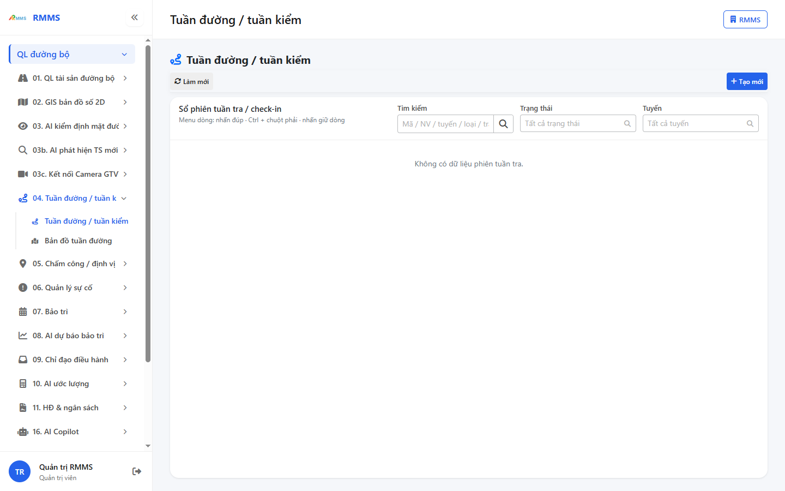
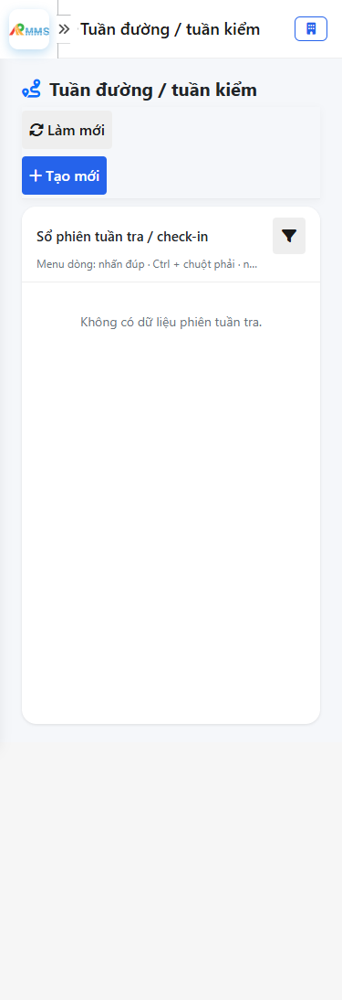
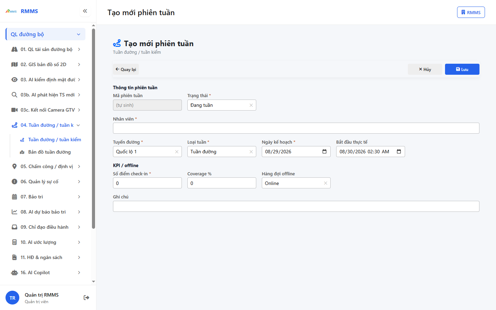
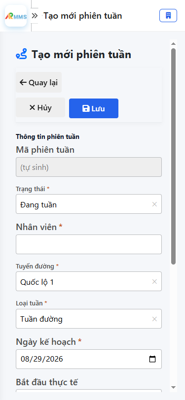

# Hướng dẫn sử dụng — Tuần đường / tuần kiểm

## Phạm vi

Tài khoản được cấp quyền menu 04. Tuần đường / tuần kiểm thao tác Tuần đường / tuần kiểm.

Đăng nhập: [Hướng dẫn đăng nhập](../dang-nhap/huong-dan-su-dung.md).

## Tuần đường / tuần kiểm

**Mục đích:** mở và tra cứu Tuần đường / tuần kiểm.

**Cách thực hiện:**

1. Vào menu **Tuần đường / tuần kiểm**.
2. Điền điều kiện lọc nếu cần.
3. Nhấn **Tạo mới** / **Thêm** khi cần lập bản ghi, hoặc kích dòng để xem.

Hình 2. View trên mobile device(<= 375px)

`*` = bắt buộc khi Lưu / Gửi. Ô trống = không bắt buộc.

| Nhãn trên màn | * | Cách điền |
|---------------|---|-----------|
| Tìm kiếm |  | Được để trống |
| Trạng thái |  | Được để trống |
| Tuyến |  | Được để trống |

## Tạo mới

**Mục đích:** lập bản ghi Tuần đường / tuần kiểm.

**Cách thực hiện:**

1. Nhấn **Tạo mới** hoặc **Thêm**.
2. Điền các ô `*`.
3. Nhấn **Lưu** / **Gửi** / **Tạo mới** khi hoàn tất.

Hình 4. View trên mobile device(<= 375px)

`*` = bắt buộc khi Lưu / Gửi. Ô trống = không bắt buộc.

| Nhãn trên màn | * | Cách điền |
|---------------|---|-----------|
| Mã phiên tuần |  | Được để trống |
| Trạng thái | * | Điền / chọn trước khi Lưu |
| Nhân viên | * | Điền / chọn trước khi Lưu |
| Tuyến đường | * | Điền / chọn trước khi Lưu |
| Loại tuần | * | Điền / chọn trước khi Lưu |
| Ngày kế hoạch | * | Điền / chọn trước khi Lưu |
| Bắt đầu thực tế |  | Được để trống |
| Số điểm check-in | * | Điền / chọn trước khi Lưu |
| Coverage % |  | Được để trống |
| Hàng đợi offline |  | Được để trống |
| Ghi chú |  | Được để trống |

