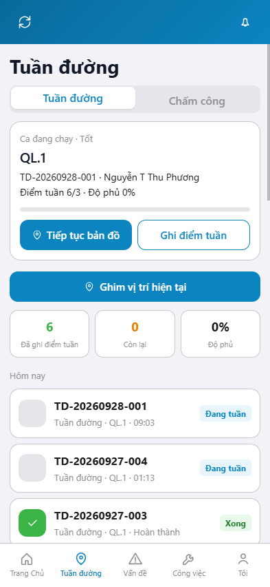
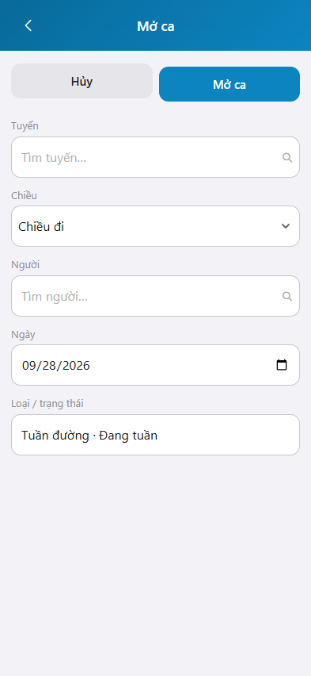
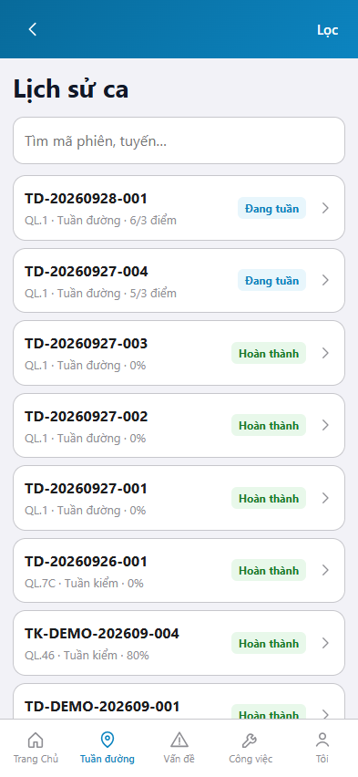

# Hướng dẫn sử dụng — Tuần đường

## Phạm vi

Tuần đường là việc của đơn vị bảo dưỡng thường xuyên: mở ca trên tuyến, ghi điểm tuần, xem ca đang chạy và lịch sử ca.

Đăng nhập: [Hướng dẫn đăng nhập](../dang-nhap/huong-dan-su-dung.md).

Ảnh chụp trên https://rmms.vn/m , khung iPhone 15 (393 x 852).

## Tuần đường

**Mục đích:** xem ca đang chạy, số điểm tuần đã ghi và các thao tác trong ca.

**Cách thực hiện:**

1. Sau đăng nhập, vào tab **Tuần đường**.
2. Xem khối **Ca đang chạy**: tuyến, mã ca, người tuần, điểm tuần, độ phủ.
3. Nhấn **Ghi điểm tuần** để ghi nhận điểm trên tuyến, hoặc **Tiếp tục bản đồ** để xem hành trình.
4. Nhấn một dòng trong **Hôm nay** để mở chi tiết ca. Nhãn **Đang tuần** là ca còn mở. Nhãn **Xong** là ca đã hoàn thành.

## Mở ca

**Mục đích:** lập ca tuần đường mới trên một tuyến, một chiều, một người.

**Cách thực hiện:**

1. Khi chưa có ca đang chạy, trên màn Tuần đường nhấn **Mở ca**. Nút này ẩn lúc đã có ca **Đang tuần**.
2. Chọn **Tuyến** và **Người**. **Chiều** mặc định Chiều đi. **Ngày** mặc định ngày hiện tại.
3. **Loại / trạng thái** cố định: Tuần đường, Đang tuần.
4. Nhấn **Mở ca**. Nhấn **Hủy** để quay lại, không lập ca.

Nếu người đó đang có ca tuần đường trên cùng tuyến, phần mềm chuyển tới ca hiện tại, không tạo ca trùng.

`*` = bắt buộc khi Mở ca. Ô trống = không bắt buộc.

| Nhãn trên màn | * | Cách điền |
|---------------|---|-----------|
| Tuyến | * | Chọn tuyến trong danh mục. Gõ để tìm. |
| Chiều | | Chiều đi, Chiều về hoặc Hai chiều. |
| Người | * | Chọn người tuần trong danh mục. |
| Ngày | | Ngày kế hoạch. Mặc định hôm nay. |
| Loại / trạng thái | | Chỉ đọc: Tuần đường, Đang tuần. |

## Lịch sử ca

**Mục đích:** tra cứu ca tuần đường và ca tuần kiểm đã ghi.

**Cách thực hiện:**

1. Trên màn Tuần đường, mở **Lịch sử phiên**.
2. Nhấn **Lọc** khi cần thu hẹp danh sách.
3. Kích một dòng để xem chi tiết ca. Dòng ghi mã ca, tuyến, loại tuần và trạng thái.

| Nhãn trên màn | * | Cách điền |
|---------------|---|-----------|
| Lọc | | Được để trống. Dùng khi cần thu hẹp danh sách. |
