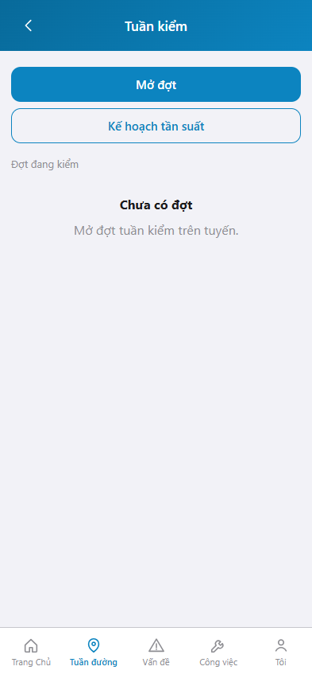
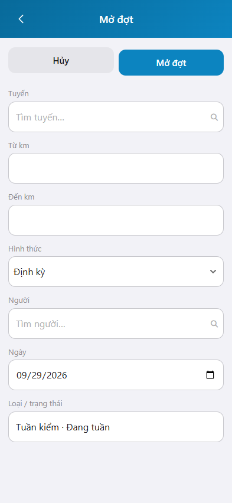

# Hướng dẫn sử dụng — Tuần kiểm

## Phạm vi

Tuần kiểm là việc của người quản lý, sử dụng đường bộ: mở đợt kiểm tra nhà thầu và việc tuần đường trên một đoạn tuyến, theo dõi đợt đang kiểm.

Đăng nhập: [Hướng dẫn đăng nhập](../dang-nhap/huong-dan-su-dung.md).

Ảnh chụp trên https://rmms.vn/m , khung iPhone 15 (393 x 852).

## Tuần kiểm

**Mục đích:** xem đợt tuần kiểm đang mở và vào lập đợt mới.

**Cách thực hiện:**

1. Vào màn **Tuần kiểm**.
2. Nhấn **Mở đợt** để lập đợt mới.
3. Nhấn **Kế hoạch tần suất** khi cần xem kế hoạch tần suất kiểm tra.
4. Khối **Đợt đang kiểm** liệt kê đợt còn mở. Khi chưa có đợt, màn hiện **Chưa có đợt**.

## Mở đợt

**Mục đích:** lập đợt tuần kiểm trên một tuyến, từ km đến km, theo hình thức định kỳ hoặc đột xuất.

**Cách thực hiện:**

1. Trên màn Tuần kiểm, nhấn **Mở đợt**.
2. Chọn **Tuyến** và **Người**. Nhập **Từ km**, **Đến km**.
3. Chọn **Hình thức**: Định kỳ hoặc Đột xuất. Khi chọn Đột xuất, điền **Lý do đột xuất**.
4. **Loại / trạng thái** cố định: Tuần kiểm, Đang tuần.
5. Nhấn **Mở đợt**. Nhấn **Hủy** để quay lại, không lập đợt.

Nếu người đó đang có đợt tuần kiểm trên cùng tuyến, phần mềm giữ đợt hiện tại, không tạo đợt trùng.

`*` = bắt buộc khi Mở đợt. Ô trống = không bắt buộc.

| Nhãn trên màn | * | Cách điền |
|---------------|---|-----------|
| Tuyến | * | Chọn tuyến trong danh mục. Gõ để tìm. |
| Từ km | | Km đầu đoạn kiểm. |
| Đến km | | Km cuối đoạn kiểm. |
| Hình thức | | Định kỳ hoặc Đột xuất. |
| Lý do đột xuất | * | Chỉ hiện khi Hình thức là Đột xuất. |
| Người | * | Chọn người kiểm trong danh mục. |
| Ngày | | Ngày kế hoạch. Mặc định hôm nay. |
| Loại / trạng thái | | Chỉ đọc: Tuần kiểm, Đang tuần. |
