# Hướng dẫn sử dụng — QLBD / RMMS — AI kiểm định và ITS

**Phân hệ:** AI kiểm định mặt đường, phát hiện tài sản, ước lượng sửa chữa, dự báo bảo trì, ITS biển báo / cọc tiêu, ITS ANPR

---

## Mục lục

1. Phạm vi
2. Luồng xử lý
3. Đăng nhập
4. Thao tác chung
5. AI kiểm định mặt đường
6. Tạo mới detection
7. Phát hiện tài sản / thiết bị mới
8. Tạo candidate tài sản
9. Ước lượng sửa chữa
10. Tạo từ sự cố
11. AI dự báo bảo trì
12. Thêm đoạn dự báo
13. ITS phát hiện biển báo / cọc tiêu
14. Tạo candidate biển báo / cọc tiêu
15. ITS ANPR · Quá tải / tốc độ
16. Tạo sự kiện ANPR
17. Thao tác theo trạng thái
18. Câu hỏi thường gặp

---

## Phạm vi

Tài khoản được cấp quyền menu nhóm AI kiểm định và Kết nối Camera GTVT thao tác: danh sách phát hiện mặt đường, phát hiện tài sản / thiết bị mới, ước lượng sửa chữa, dự báo bảo trì, ITS biển báo / cọc tiêu, ITS ANPR quá tải / tốc độ.

---

## Luồng xử lý

| Luồng | Mô tả | Bắt đầu | Kết thúc | Người thực hiện |
|-------|--------|---------|----------|-----------------|
| Đăng nhập | Vào phần mềm | Màn đăng nhập | Bảng điều khiển | Tài khoản được cấp |
| Kiểm định mặt đường | Tra cứu / thêm phát hiện hư hỏng | Menu AI kiểm định mặt đường | Lưu phiếu | Cán bộ kỹ thuật |
| Phát hiện tài sản | Ghi candidate thiết bị mới | Menu Phát hiện tài sản / thiết bị mới | Lưu candidate | Cán bộ hiện trường |
| Ước lượng | Tạo phiếu ước lượng từ sự cố hoặc detections | Menu Ước lượng sửa chữa | Lưu / xác nhận | Cán bộ kỹ thuật |
| Dự báo bảo trì | Thêm đoạn, chạy dự báo, ghi chú | Menu AI dự báo bảo trì | Lưu ghi chú / gắn kế hoạch | Cán bộ kế hoạch |
| ITS biển báo | Ghi candidate biển báo / cọc tiêu | Menu ITS biển báo / cọc tiêu | Lưu candidate | Cán bộ ITS |
| ITS ANPR | Ghi sự kiện quá tải / tốc độ | Menu ITS ANPR · Quá tải / tốc độ | Lưu sự kiện | Cán bộ ITS |

---

## Đăng nhập

**Mục đích:** xác thực tài khoản để sử dụng phần mềm.

**Cách thực hiện:**

1. Mở địa chỉ phần mềm.
2. Điền tên đăng nhập (ô tài khoản / số điện thoại).
3. Điền mật khẩu.
4. Nhấn **Đăng nhập**.

Hình 1. Đăng nhập

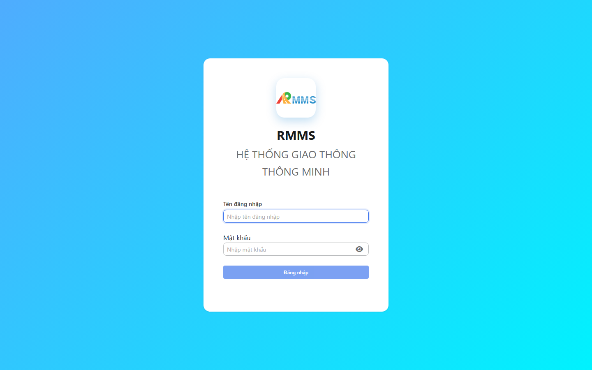

Hình 2. View trên mobile device(<= 375px)

---

## Thao tác chung

- `*` = bắt buộc khi Lưu / Tạo. Ô trống = không bắt buộc.
- Thanh công cụ danh sách: **Làm mới** trái · **Tạo mới** phải (khi màn có nút tạo).
- Menu dòng: **Xem** / **Sửa** / **Xóa** / **Lịch sử** (Ctrl+click hoặc click phải trên lưới).
- Form trang đầy đủ: **Quay lại** trái · **Lưu** phải. Tiêu đề nằm dưới thanh nút.
- Form trượt: header **✕** · chân trang **Hủy** / **Lưu**.
- Nhấn **Lưu** / **Gửi** / **Tạo** khi hoàn tất.
- Tuyến: gõ mã hoặc tên (không dấu được).

---

## AI kiểm định mặt đường

**Mục đích:** tra cứu phát hiện hư hỏng mặt đường và mở phiếu chi tiết.

**Cách thực hiện:**

1. Vào menu **AI kiểm định mặt đường**.
2. Điền ô tìm hoặc chọn Đoạn, Loại hư hỏng, Mức độ, Trạng thái, Engine.
3. Nhấn **Tìm**.
4. Nhấn **Làm mới** khi cần tải lại.
5. Nhấn **Tạo mới** hoặc kích mã để mở xem.

Hình 3. AI kiểm định mặt đường

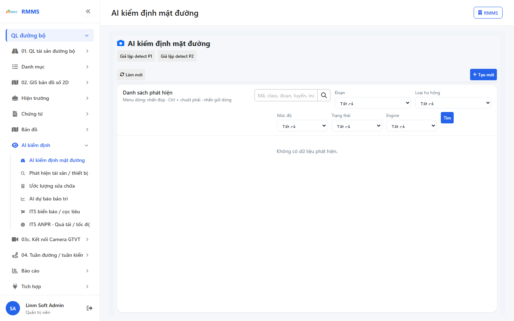

Tiêu đề: **AI kiểm định mặt đường**. Thanh phụ: **Giả lập detect P1** · **Giả lập detect P2**.

| Cột | Ý nghĩa |
|-----|---------|
| Mã | Mã phát hiện |
| Class | Loại hư hỏng |
| Score | Độ tin cậy |
| Severity | Mức độ |
| Section | Đoạn |
| Route | Tuyến |
| Status | Trạng thái |
| Engine | Nguồn nhận dạng |
| Incident | Mã sự cố gắn (nếu có) |

| Nhãn trên màn | * | Cách điền |
|---------------|---|-----------|
| Tìm | | Mã, class, đoạn, tuyến, incident |
| Đoạn | | Chọn hoặc Tất cả |
| Loại hư hỏng | | Chọn hoặc Tất cả |
| Mức độ | | Chọn hoặc Tất cả |
| Trạng thái | | Chọn hoặc Tất cả |
| Engine | | Chọn hoặc Tất cả |

---

## Tạo mới detection

**Mục đích:** ghi phiếu phát hiện hư hỏng mặt đường.

**Cách thực hiện:**

1. Trên danh sách, nhấn **Tạo mới**.
2. Điền các ô `*`.
3. Nhấn **Lưu**.

Hình 4. Tạo mới detection

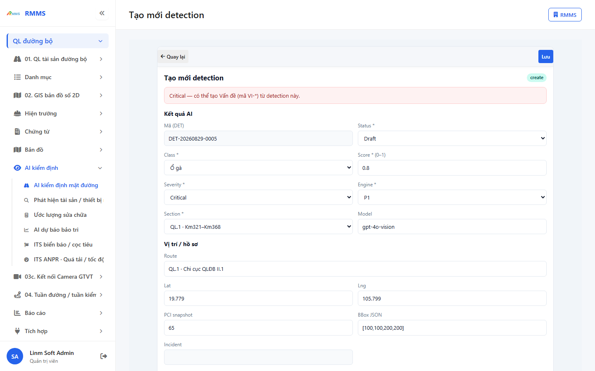

Hình 5. View trên mobile device(<= 375px)

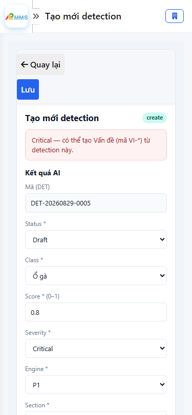

`*` = bắt buộc khi Lưu.

| Nhãn trên màn | * | Cách điền |
|---------------|---|-----------|
| Mã (DET) | | Hệ thống sinh, chỉ đọc |
| Status | * | Chọn trạng thái |
| Class | * | Chọn loại hư hỏng |
| Score (0–1) | * | Số từ 0 đến 1 |
| Severity | * | Chọn mức độ |
| Engine | * | Chọn nguồn nhận dạng |
| Section | * | Chọn đoạn |
| Model | | Phiên bản mô hình |
| Route | | Tên tuyến |
| Lat | | Vĩ độ |
| Lng | | Kinh độ |
| PCI snapshot | | Chỉ số PCI |
| BBox JSON | | Khung nhận dạng |
| Incident | | Mã sự cố, chỉ đọc |
| Ghi chú | | Văn bản |

**Kết quả**

| Case | Thao tác | Kết quả |
|------|----------|---------|
| Thành công | Điền đủ ô `*` · Nhấn **Lưu** | Phiếu ghi · danh sách cập nhật |
| Thiếu `*` | Để trống ≥1 ô `*` · Nhấn **Lưu** | Không ghi · ô `*` báo lỗi · banner «Vui lòng nhập đủ các trường bắt buộc» |
| Dữ liệu không hợp lệ | Score ngoài 0–1 · Nhấn **Lưu** | Không ghi · ô Score báo lỗi |

---

## Phát hiện tài sản / thiết bị mới

**Mục đích:** tra cứu candidate tài sản / thiết bị mới trên tuyến.

**Cách thực hiện:**

1. Vào menu **Phát hiện tài sản / thiết bị mới**.
2. Điền ô tìm hoặc chọn tuyến, loại, trạng thái.
3. Nhấn **Tìm** khi có nút Tìm.
4. Nhấn **Tạo mới** hoặc kích mã để mở xem.

Hình 6. Phát hiện tài sản / thiết bị mới

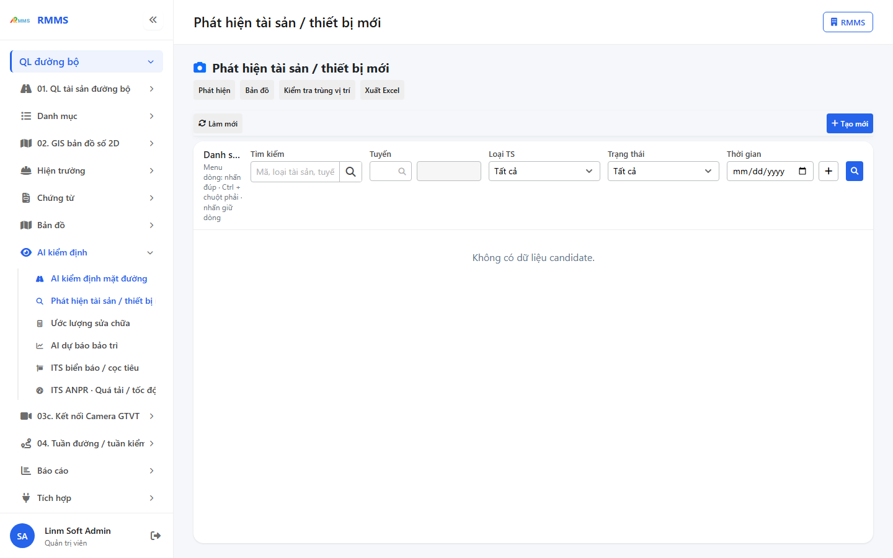

| Cột | Ý nghĩa |
|-----|---------|
| Mã | Mã candidate |
| Loại TS | Loại tài sản |
| Độ tin cậy (%) | Điểm nhận dạng |
| Tọa độ | Vĩ độ / kinh độ |
| Tuyến | Tuyến gắn |
| Trạng thái | Trạng thái xử lý |
| Nguồn | Nguồn nhận dạng |
| Trùng vị trí | Cảnh báo trùng |
| Phát hiện | Thời điểm |
| Mã Asset | Mã tài sản sau xác nhận |

---

## Tạo candidate tài sản

**Mục đích:** ghi candidate phát hiện tài sản / thiết bị mới.

**Cách thực hiện:**

1. Nhấn **Tạo mới**.
2. Chọn ảnh khung hình khi cần, rồi **Chạy phát hiện**.
3. Điền các ô `*`.
4. Nhấn **Lưu**.

Hình 7. Tạo candidate tài sản

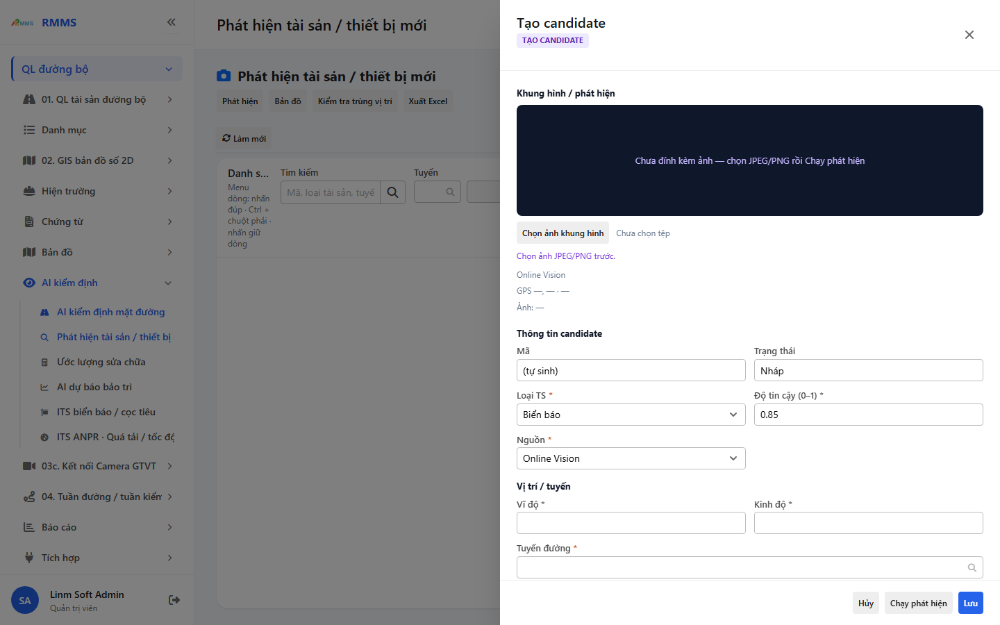

Hình 8. View trên mobile device(<= 375px)

`*` = bắt buộc khi Lưu.

| Nhãn trên màn | * | Cách điền |
|---------------|---|-----------|
| Mã | | Hệ thống sinh, chỉ đọc |
| Trạng thái | | Chỉ đọc |
| Loại TS | * | Chọn loại |
| Độ tin cậy (0–1) | * | Số từ 0 đến 1 |
| Nguồn | * | Chọn nguồn |
| Vĩ độ | * | Số |
| Kinh độ | * | Số |
| Tuyến đường | * | Tra cứu tuyến |
| Đoạn | | Mã đoạn |
| Chuyến tuần đường | | Mã chuyến |
| Bbox [x1, y1, x2, y2] | | Khung nhận dạng |
| Ghi chú | | Văn bản |

**Kết quả**

| Case | Thao tác | Kết quả |
|------|----------|---------|
| Thành công | Điền đủ ô `*` · Nhấn **Lưu** | Candidate ghi · danh sách cập nhật |
| Thiếu `*` | Để trống ≥1 ô `*` · Nhấn **Lưu** | Không ghi · banner «Vui lòng nhập đủ trường bắt buộc (*)» |
| Dữ liệu không hợp lệ | Ảnh vượt dung lượng cho phép · chọn tệp | Không nhận tệp · thông báo trên form |

---

## Ước lượng sửa chữa

**Mục đích:** tra cứu phiếu ước lượng chi phí sửa chữa.

**Cách thực hiện:**

1. Vào menu **Ước lượng sửa chữa**.
2. Điền ô tìm, khoảng ngày, trạng thái, nguồn.
3. Nhấn **Tìm**.
4. Nhấn **Tạo từ sự cố** hoặc **Tạo từ detections**.
5. Kích mã để mở xem.

Hình 9. Ước lượng sửa chữa

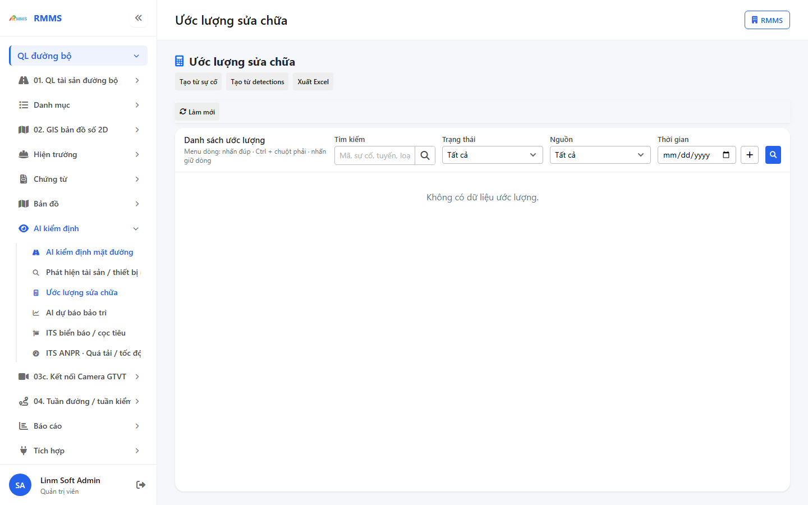

| Cột | Ý nghĩa |
|-----|---------|
| Mã | Mã ước lượng |
| Sự cố | Sự cố / vấn đề nguồn |
| Tuyến / đoạn | Vị trí |
| Loại hư hỏng | Loại hư hỏng |
| Mức độ | Mức độ |
| Trạng thái | Trạng thái phiếu |
| Tổng tiền | Thành tiền |
| Cập nhật | Thời điểm cập nhật |

---

## Tạo từ sự cố

**Mục đích:** tạo phiếu ước lượng gắn một sự cố / vấn đề.

**Cách thực hiện:**

1. Nhấn **Tạo từ sự cố**.
2. Tra cứu và chọn sự cố.
3. Nhấn **Tạo**.

Hình 10. Tạo từ sự cố

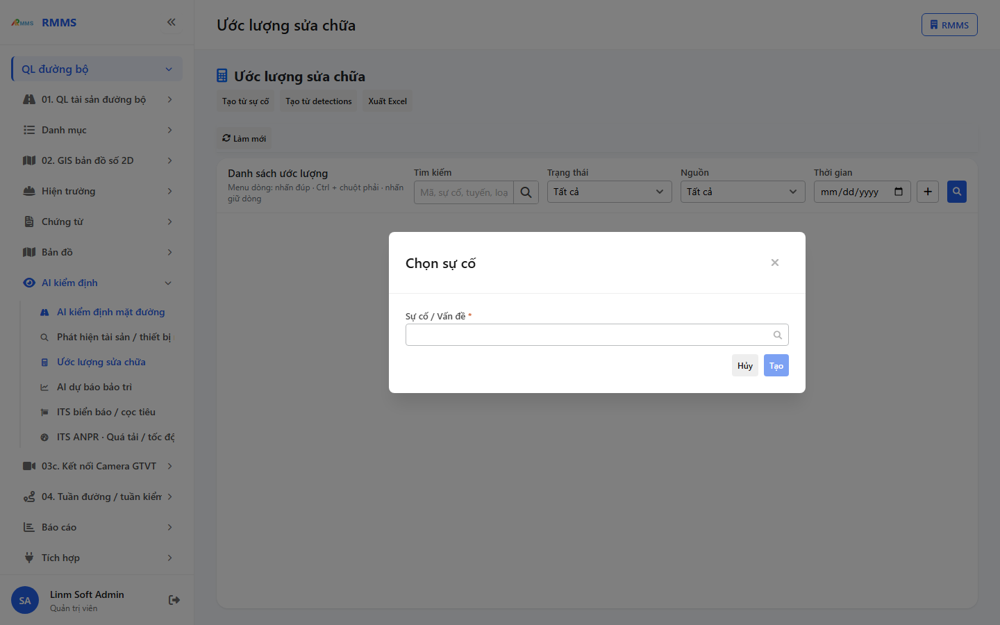

`*` = bắt buộc khi Tạo.

| Nhãn trên màn | * | Cách điền |
|---------------|---|-----------|
| Sự cố / Vấn đề | * | Tra cứu mã hoặc tên |

Trên phiếu ước lượng (sau khi mở):

| Nhãn trên màn | * | Cách điền |
|---------------|---|-----------|
| Mã ước lượng | | Chỉ đọc |
| Sự cố / Vấn đề | * | Bắt buộc khi nguồn từ sự cố |
| Nguồn | * | Chọn nguồn |
| Detection IDs | | Danh sách mã phát hiện |
| Tuyến / đoạn | | Văn bản |
| Loại hư hỏng | * | Chọn |
| Diện tích (m²) | * | Số |
| Mức độ | * | Chọn |
| Nguồn ước lượng | | Chỉ đọc |
| Trạng thái | | Chỉ đọc |
| Giờ nhân công | | Số |
| Thiết bị | | Văn bản |
| Thời gian thi công (ngày) | | Số |
| Dòng chi phí | * | Ít nhất một dòng khi Lưu |

**Kết quả**

| Case | Thao tác | Kết quả |
|------|----------|---------|
| Thành công | Chọn sự cố · Nhấn **Tạo** · điền đủ `*` · Nhấn **Lưu** | Phiếu ghi · danh sách cập nhật |
| Thiếu `*` | Không chọn sự cố · Nhấn **Tạo** | Không tạo · thông báo chọn sự cố |
| Dữ liệu không hợp lệ | Lưu phiếu không có dòng chi phí | Không ghi · banner yêu cầu ít nhất một dòng chi phí |

---

## AI dự báo bảo trì

**Mục đích:** xem thứ hạng đoạn đường cần bảo trì và mở chi tiết dự báo.

**Cách thực hiện:**

1. Vào menu **AI dự báo bảo trì**.
2. Chọn tuyến, horizon, Top N, điểm tối thiểu.
3. Nhấn **Áp dụng**.
4. Nhấn **Thêm đoạn** hoặc kích mã đoạn để xem.
5. Nhấn **Chạy dự báo hàng loạt** khi cần chạy lại nhiều đoạn.

Hình 11. AI dự báo bảo trì

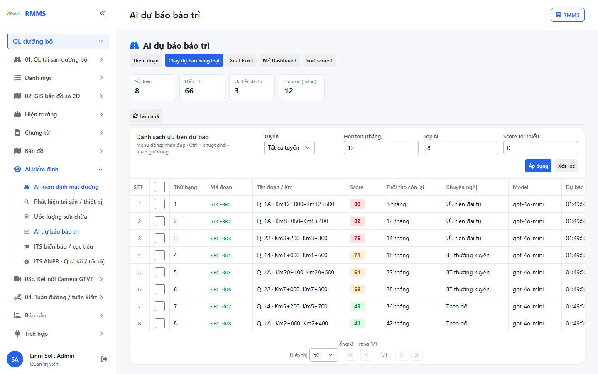

| Cột | Ý nghĩa |
|-----|---------|
| Thứ hạng | Thứ tự ưu tiên |
| Mã đoạn | Mã đoạn |
| Tên đoạn / Km | Tên / lý trình |
| Score | Điểm dự báo |
| Tuổi thọ còn lại | Tháng còn lại |
| Khuyến nghị | Khuyến nghị bảo trì |
| Model | Mô hình |
| Dự báo lúc | Thời điểm chạy |

---

## Thêm đoạn dự báo

**Mục đích:** thêm đoạn vào danh sách dự báo.

**Cách thực hiện:**

1. Nhấn **Thêm đoạn**.
2. Chọn tuyến, điền tên đoạn / Km.
3. Nhấn **Tạo**.

Hình 12. Thêm đoạn dự báo

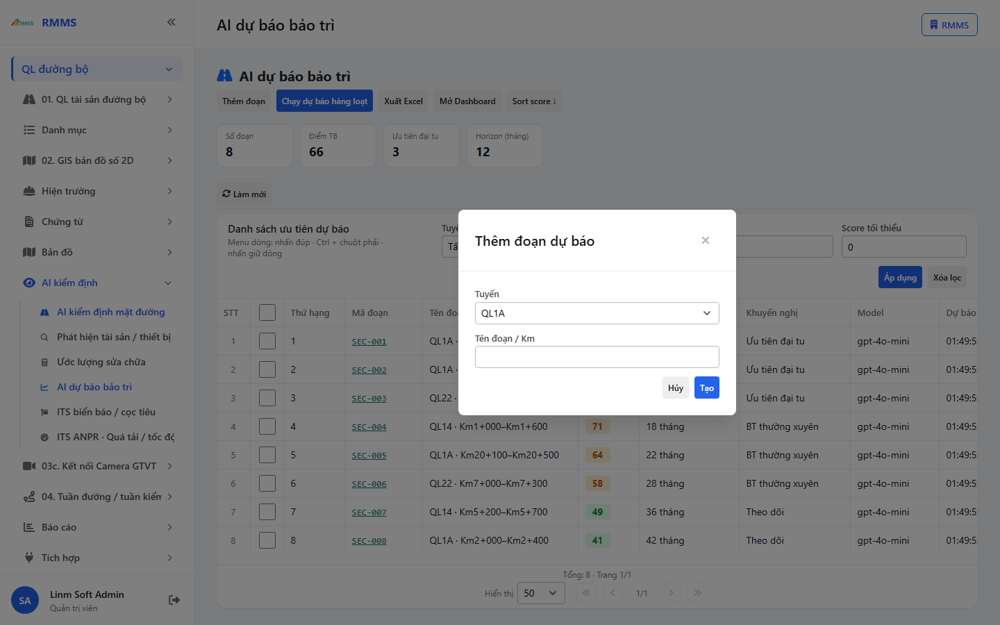

`*` = bắt buộc khi Tạo.

| Nhãn trên màn | * | Cách điền |
|---------------|---|-----------|
| Tuyến | * | Chọn tuyến (không chọn Tất cả) |
| Tên đoạn / Km | | Tên hoặc lý trình |

**Kết quả**

| Case | Thao tác | Kết quả |
|------|----------|---------|
| Thành công | Chọn tuyến · Nhấn **Tạo** | Đoạn thêm · danh sách cập nhật |
| Thiếu `*` | Chưa chọn tuyến · nút **Tạo** | Không tạo |
| Dữ liệu không hợp lệ | Trùng đoạn trên cùng tuyến | Không ghi · thông báo lỗi |

Chi tiết đoạn (Xem / Sửa ghi chú): Thông tin đoạn · Đặc trưng (PCI, Lưu lượng, Vật liệu, Tuổi CT, Thời tiết, Lịch sử SC) · Drivers · Xu hướng PCI · Ghi chú khuyến nghị · Lịch sử dự báo. Nhấn **Lưu ghi chú** khi sửa.

---

## ITS phát hiện biển báo / cọc tiêu

**Mục đích:** tra cứu candidate biển báo / cọc tiêu.

**Cách thực hiện:**

1. Vào menu **ITS biển báo / cọc tiêu**.
2. Điền ô tìm hoặc chọn tuyến, loại, nguồn, trạng thái, engine.
3. Nhấn **Tìm**.
4. Nhấn **Tạo mới** hoặc kích mã để mở xem.

Hình 13. ITS phát hiện biển báo / cọc tiêu

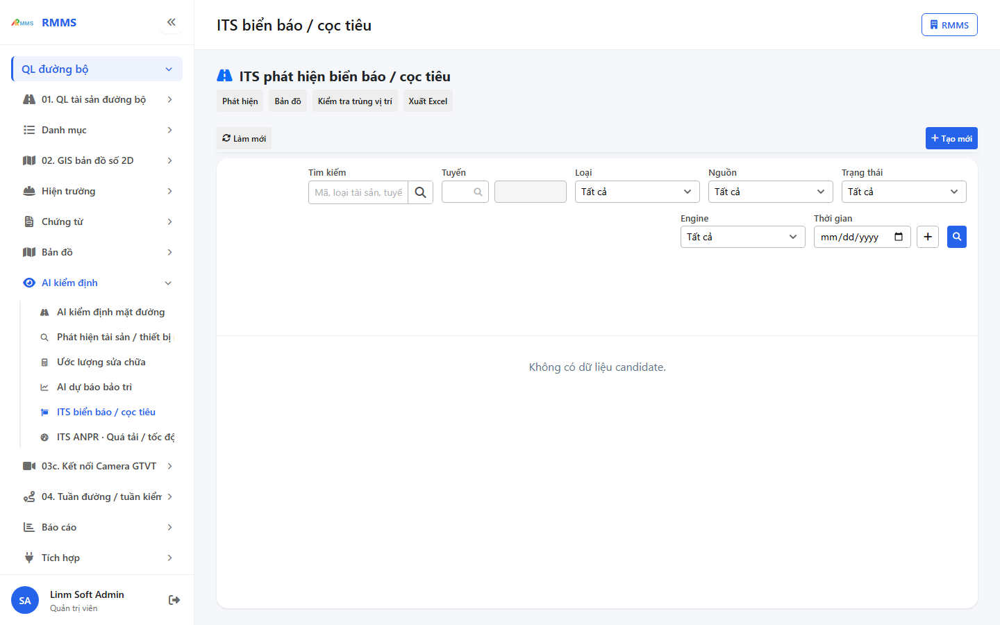

| Cột | Ý nghĩa |
|-----|---------|
| Mã | Mã candidate |
| Loại | Loại đối tượng |
| Score(%) | Độ tin cậy |
| Tọa độ | Vĩ độ / kinh độ |
| Tuyến | Tuyến |
| Nguồn | Nguồn ảnh |
| TT | Trạng thái |
| Engine | Nguồn nhận dạng |
| Nearby | Trùng vị trí |
| Quan sát | Thời điểm |
| Mã Asset | Mã sau xác nhận |

---

## Tạo candidate biển báo / cọc tiêu

**Mục đích:** ghi candidate ITS biển báo / cọc tiêu.

**Cách thực hiện:**

1. Nhấn **Tạo mới**.
2. Chọn ảnh khung hình khi cần, rồi **Chạy phát hiện**.
3. Điền các ô `*`.
4. Nhấn **Lưu**.

Hình 14. Tạo candidate biển báo / cọc tiêu

Hình 15. View trên mobile device(<= 375px)

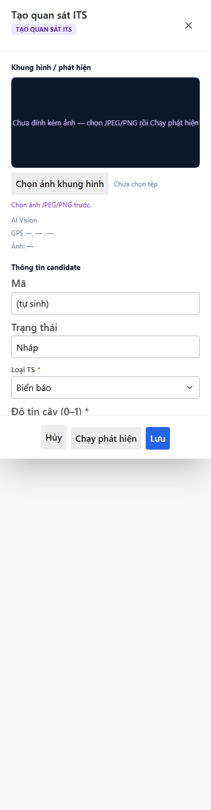

`*` = bắt buộc khi Lưu.

| Nhãn trên màn | * | Cách điền |
|---------------|---|-----------|
| Mã | | Chỉ đọc |
| Trạng thái | | Chỉ đọc |
| Loại TS | * | Chọn loại |
| Độ tin cậy (0–1) | * | Số 0–1 |
| Engine | * | Chọn nguồn nhận dạng |
| Vĩ độ | * | Số |
| Kinh độ | * | Số |
| Tuyến đường | * | Tra cứu tuyến |
| Nguồn | * | Mobile / Dashcam / CCTV |
| Chuyến tuần đường | | Mã thiết bị / chuyến |
| Bbox [x1, y1, x2, y2] | | Khung nhận dạng |
| Ghi chú | | Văn bản |

**Kết quả**

| Case | Thao tác | Kết quả |
|------|----------|---------|
| Thành công | Điền đủ ô `*` · Nhấn **Lưu** | Candidate ghi · danh sách cập nhật |
| Thiếu `*` | Để trống ≥1 ô `*` · Nhấn **Lưu** | Không ghi · banner trường bắt buộc |
| Dữ liệu không hợp lệ | Ảnh vượt dung lượng cho phép | Không nhận tệp · thông báo trên form |

---

## ITS ANPR · Quá tải / tốc độ

**Mục đích:** tra cứu sự kiện nhận dạng biển số, quá tốc độ / quá tải.

**Cách thực hiện:**

1. Vào menu **ITS ANPR · Quá tải / tốc độ**.
2. Điền tìm biển số, chọn camera, trạng thái.
3. Nhấn **Tìm**.
4. Nhấn **+ Tạo** hoặc kích mã để mở xem.
5. **Mô phỏng bắt mới** / **Tra cứu** khi cần.

Hình 16. ITS ANPR · Quá tải / tốc độ

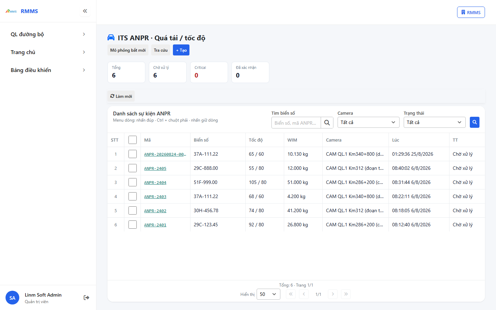

| Cột | Ý nghĩa |
|-----|---------|
| Mã | Mã sự kiện |
| Biển số | Biển số nhận dạng |
| Tốc độ | Tốc độ / giới hạn |
| WIM | Tải trọng |
| Camera | Camera nguồn |
| Lúc | Thời điểm |
| TT | Trạng thái |
| Mức lỗi | Mức vi phạm |

---

## Tạo sự kiện ANPR

**Mục đích:** ghi sự kiện ANPR quá tải / tốc độ.

**Cách thực hiện:**

1. Nhấn **+ Tạo**.
2. Điền các ô `*`.
3. Nhấn **Lưu**.

Hình 17. Tạo sự kiện ANPR

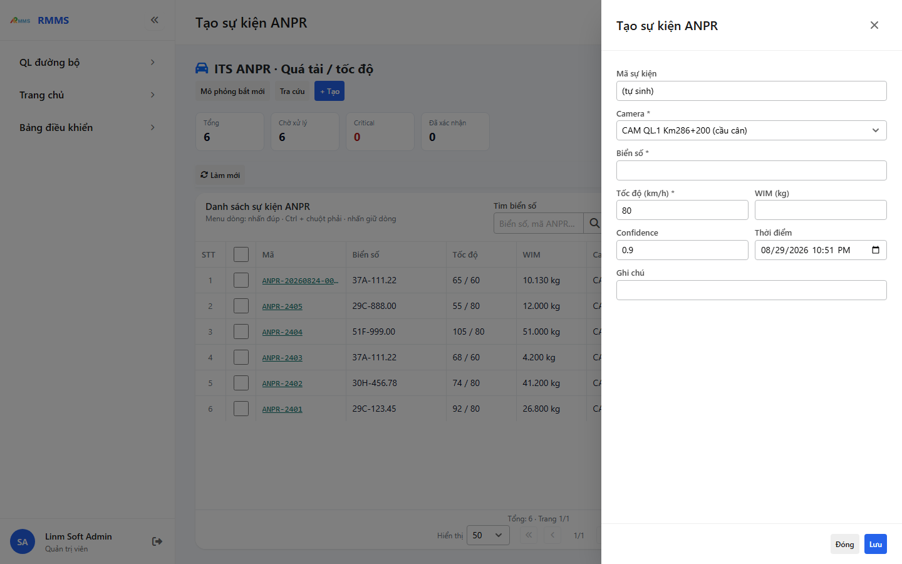

Hình 18. View trên mobile device(<= 375px)

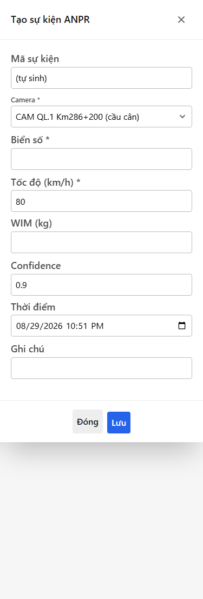

`*` = bắt buộc khi Lưu.

| Nhãn trên màn | * | Cách điền |
|---------------|---|-----------|
| Mã sự kiện | | Chỉ đọc |
| Camera | * | Chọn camera |
| Biển số | * | Gõ biển số |
| Tốc độ (km/h) | * | Số |
| WIM (kg) | | Số |
| Confidence | | Độ tin cậy |
| Thời điểm | | Ngày giờ |
| Ghi chú | | Văn bản |

**Kết quả**

| Case | Thao tác | Kết quả |
|------|----------|---------|
| Thành công | Điền đủ ô `*` · Nhấn **Lưu** | Sự kiện ghi · danh sách cập nhật |
| Thiếu `*` | Để trống Camera / Biển số / Tốc độ · Nhấn **Lưu** | Không ghi · banner trường bắt buộc |
| Dữ liệu không hợp lệ | Tốc độ hoặc WIM không phải số | Không ghi · thông báo lỗi |

---

## Thao tác theo trạng thái

| Màn | Trạng thái | Nút |
|-----|------------|-----|
| AI kiểm định | Draft + Critical | **Tạo Vấn đề** (xem phiếu) |
| Phát hiện TS / ITS biển báo | Candidate mở | **Xác nhận thành tài sản** · **Bỏ qua** (menu dòng) |
| Ước lượng | Draft | **Sửa** · **Xóa** · **Xác nhận** (menu dòng) |
| Dự báo | Đã có đoạn | **Sửa ghi chú** · **Lưu ghi chú** · **Gắn kế hoạch BT** · **Ưu tiên đại tu** · **Chạy lại** |
| ANPR | Pending | **Sửa** · **Xác nhận** · **Bỏ qua** · **Tra cứu** |

---

## Câu hỏi thường gặp

**Không thấy nút Tạo mới?** Tài khoản thiếu quyền tạo trên menu đó.

**Lưu báo thiếu trường?** Điền đủ ô `*` rồi nhấn Lưu lại.

**Tìm không ra dòng?** Xóa lọc, nhấn Làm mới hoặc Tìm lại.

**Ước lượng không có Tạo mới trên thanh phải?** Dùng **Tạo từ sự cố** hoặc **Tạo từ detections**.
