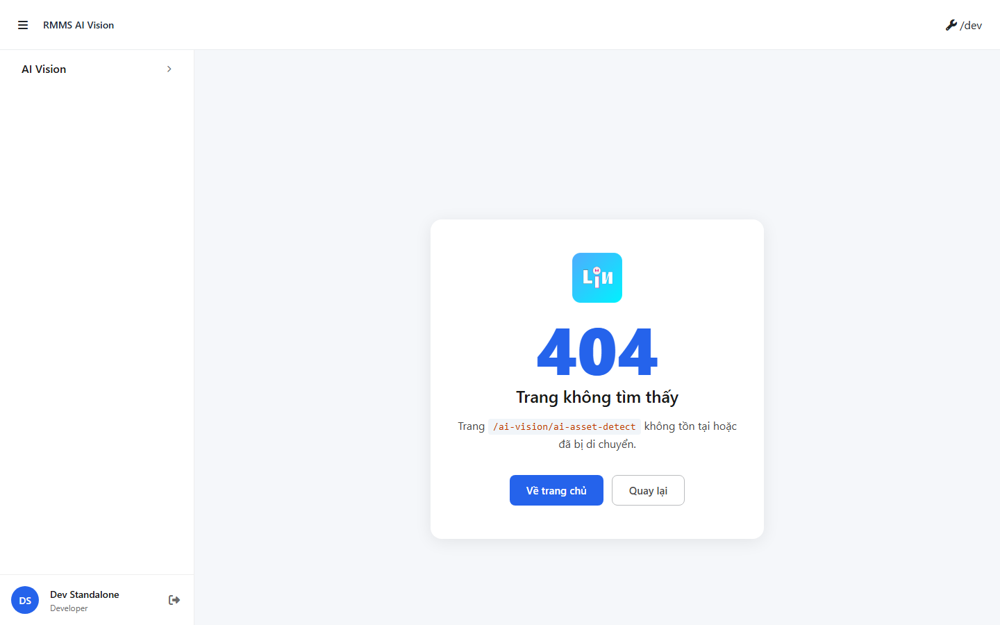
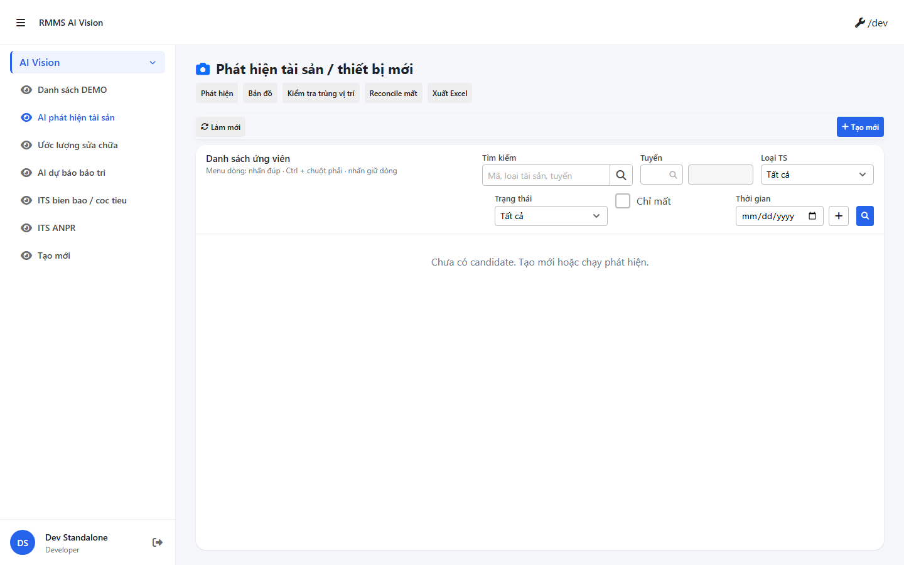

# QA — scenarios — ai-asset-detect

| Field | Value |
|-------|-------|
| feature | `ai-asset-detect` |
| status | `failed` |
| role | `qa` · `/agent-qa` |
| taskId | `task_60644689` |
| changeScope | `edit_page` |
| packKind | `list` · featureClass `ai` |
| method | `e2e runtime · yarn start:std + docker compose + playwright` |
| mfe | `D:/AI-QLBD/MFE-Source/Linm.Web.RMMS.AiVision` |
| backend | `D:/AI-QLBD/Linm.RMMS.WebService` · AiVision · **no ERP.*** |
| mfeStdRoute | `/ai-vision/ai-asset-detect` |
| mfeStdUrl | `http://localhost:9303/ai-vision/ai-asset-detect` |
| liveVnRoute | `/ai-kd/phat-hien-ts` (works) |
| testid | live `rmms-ai-asset-detect-list-page` |
| updatedAt | `2026-09-06T17:39:00.000Z` |

## Preconditions

- Docker: `linm-rmms-api` `:5111` healthy · `linm-rmms-bff` `:5201` healthy · postgres healthy
- MFE: `yarn start:std` · `:9303` listen
- Login creds: `e2e.local.json` (`rmms-admin`) · Pages `:9100` not required for std
- **Cấm** verify chỉ prototype `reviewUrl`

## E2E runtime — packet cases (mfeStdUrl)

| # | Step | Expect | Result | Evidence |
|---|------|--------|--------|----------|
| S0 | Open `mfeStdUrl` · list testid | Route mount · `rmms-ai-asset-detect-list-page` | **FAIL** |  · SimpleNotFoundPage `/ai-vision/ai-asset-detect` |
| S1 | List shell on `mfeStdUrl` | Grid + filter + map | **FAIL** |  · same 404 |
| QA-20 | Create/list ACT on `mfeStdUrl` | Toolbar + slideout reachable | **FAIL** |  · same 404 |

## Diagnostic (not packet gate)

| # | Step | Expect | Result | Evidence |
|---|------|--------|--------|----------|
| S0-vn | Open `/ai-kd/phat-hien-ts` | List testid visible · missOnly · filter bar | **PASS** |  |

`src/index.tsx` registers **only** `ai-kd/phat-hien-ts` — **no** `ai-vision/ai-asset-detect` alias → STATUS `mfeStdUrl` 404.

## T-QA-* (blocked by S0)

| ID | Focus | Result |
|----|-------|--------|
| T-QA-CRUD-01 | C/E/V/Copy/Delete · Confirm/Dismiss/Miss | **blocked** (no mount on mfeStdUrl) |
| T-QA-FORM-01 | Slideout fields · imageFileId · body | **blocked** |
| T-QA-FILTER-01 | LinErpListFilterBar · 🔍 mép phải · missOnly | **blocked** on std · VN probe shows filter + missOnly present |
| T-QA-FILTER-02 | D+T+M headed | **blocked** |
| T-QA-AI-01 | detect · HITL · map · 0 AI badge | **blocked** |

## Gaps

| ID | Severity | Note |
|----|----------|------|
| **GAP-QA-STD-01** | **P0** | `mfeStdUrl` `/ai-vision/ai-asset-detect` → 404 NotFound. Dev must add Route alias (dual path with `/ai-kd/phat-hien-ts`) or fix STATUS/shell map. |
| GAP-QA-E2E-01 | P2 | `yarn e2e-qa` `npx playwright install` failed (yarn npmrc / dirlock). Capture used AI-AutoCode `playwright` + existing `chromium-1187\chrome.exe`. PNG + manifest written. |
| GAP-QA-DEMO-NOTE-01 | P2 | VN probe sidebar shows label `Danh sách DEMO` — re-check after std route fixed (`demo-to-real-enduser`). |
| — | note | Auth container `linm-authentication-rmms` restart loop (PG DNS) — std MFE probe không phụ thuộc; không block evidence std 404. |

## Build / runtime

| Check | Result |
|-------|--------|
| docker compose up -d | API+BFF healthy (API host **5111**, not 5101) |
| yarn start:std :9303 | **PASS** listen |
| Playwright S0/S1/QA-20 @ mfeStdUrl | **FAIL** |
| Playwright S0-vn @ `/ai-kd/phat-hien-ts` | **PASS** |
| ERP.* | none observed |

## Verdict

**FAIL** · P0 **GAP-QA-STD-01** · **cấm** pass · queue **`failed`** · board **`qa_fail_rollback`** · **cấm** `phase=done` · **cấm** silent Dev fix in this role.

## Handoff → (rollback / Dev fix)

| Field | Value |
|-------|-------|
| next | `qa_fail_rollback` → Dev fix route alias / mfeStdUrl · then re-queue `/agent-qa` |
| compact | `specs/ai-asset-detect/handoff/qa-compact.md` |
| screens | `specs/ai-asset-detect/qa/screens/{S0,S1,QA-20,S0-vn}.png` + `manifest.json` |

## Version meta (REQUIRED)

| Field | Value |
|-------|-------|
| skillId | agent-qa |
| skillVersion | 2026.09.05.03 |
| schemaVersion | 2 |
| workflowVersion | 2026.09.05.03 |
| rulesVersion | 2026.09.06.1 |
| generatedAt | 2026-09-06T17:39:00.000Z |
| versionGate | ok |

---
<!-- Version meta: skillVersion=2026.09.05.03 · schemaVersion=qldb-workflow-skill-v1 · workflowVersion=2026.09.05.03 · versionGate=ok -->
