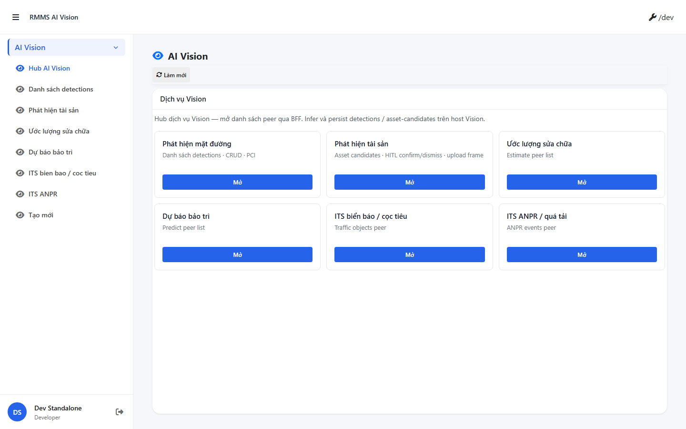
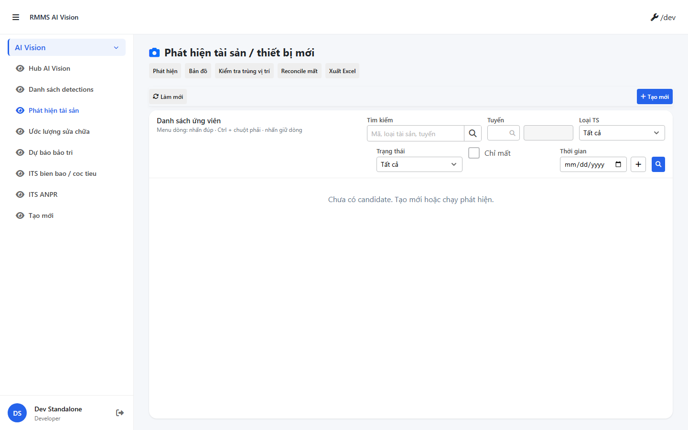
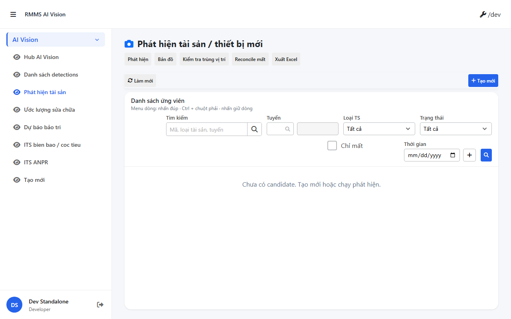
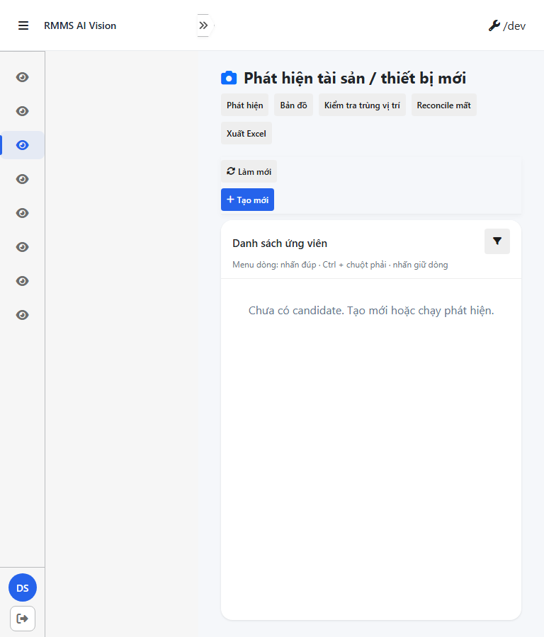
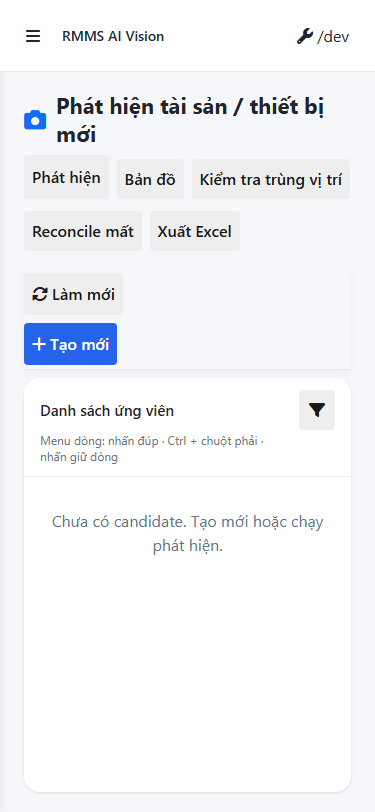
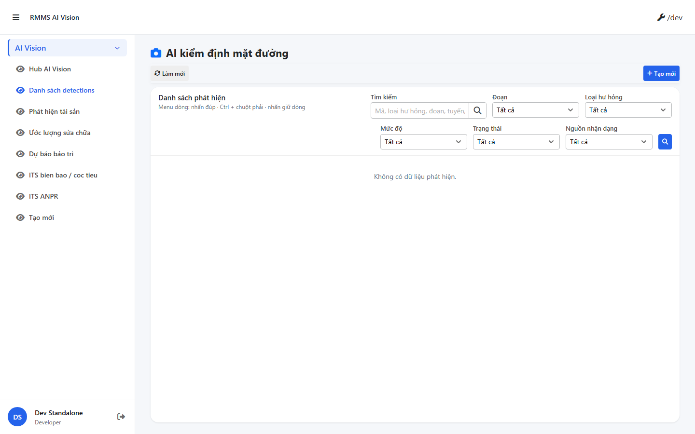
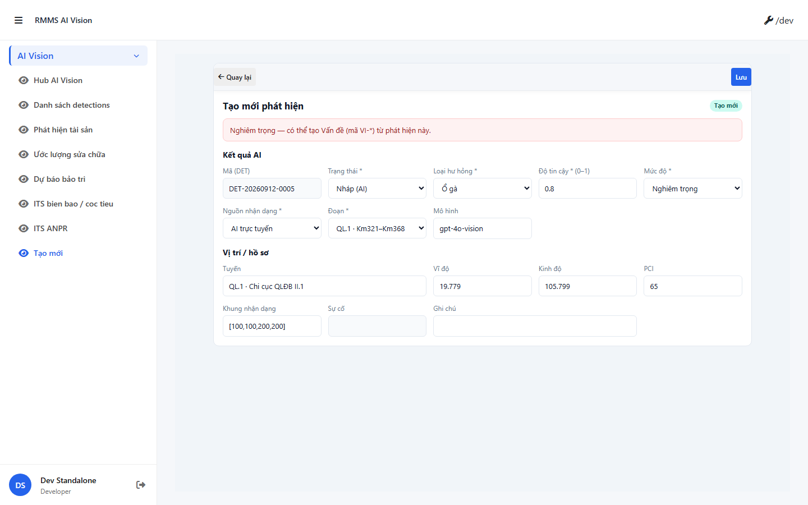

# QA — Scenarios — ai-vision-service

| | |
|--|--|
| Feature | `ai-vision-service` |
| Role | `qa` |
| Status | **FAIL** |
| packKind | `ai` |
| changeScope | `edit_page` |
| taskId | `task_fe3ee27b` |
| skillVersion | `2026.09.05.03` |
| rulesVersion | `2026.09.12.2` |
| contentHash | `sha256:90961d05e9d8c5fb4be3e151dc476d18c4c65e093aa0d9151d2a86ba6962702f` |
| writtenAt | `2026-09-12T08:20:00.000Z` |
| method | `e2e runtime · AiVision start:std :9301 + docker WebService+Vision + yarn e2e-qa (+ T-QA headed shots)` |
| mfeStdUrl | `http://localhost:9301/ai-vision-service` |
| verdict | **FAIL** · queue `failed` · `qa_fail_rollback` |

## Runtime notes

- Docker WebService: API `:5111` + BFF `:5201` healthy · Vision compose `:5311` healthy.
- Freed port `9301` PID `21904` only (GIS `webpack serve` · cmdline ≠ `run-implement`) — log **GAP-QA-E2E-KILL-01** avoidance.
- Packet `yarn e2e-qa --cases=S0,S1,QA-20 --skip-start` → `manifest.json` **ok=true**.
- Playwright: first `npx install` hung on `__dirlock` · recovered via cached zip extract · local `playwright@1.55.0` under `qa/screens` (Node 24 `npx -p` MODULE_NOT_FOUND).
- Pages `:9100` offline — standalone DevAuth; login skip after timeout (fillLogin).

## Evidence — packet cases

| Case | Assert | Result | Evidence |
|------|--------|--------|----------|
| S0 | Hub `/ai-vision-service` open · testid hub | **PASS** |  |
| S1 | Hub re-goto | **PASS** |  |
| QA-20 | Hub re-goto (packet create-slot) | **PASS** |  |

## T-QA-* (task pack)

| ID | DoD | Result | Evidence | Notes |
|----|-----|--------|----------|-------|
| T-QA-AI-01 | Hub + peer · **0** AI/P1/P2/score header badge | **PASS** (hub) |  | Hub title `AI Vision` + toolbar `Làm mới` only · no P1/P2/score chrome |
| T-QA-FILTER-01 | Filter live peer asset list V1–V5+V10 | **PASS** (layout) |  | `/ai-kd/phat-hien-ts` · Tìm/Tuyến/Loại/TT/Thời gian · 🔍 cuối hàng · Xuất Excel trên toolbar (không filter bar) |
| T-QA-FILTER-02 | D+T+M headed | **PASS** (shot) |    | M=funnel compact · 0 overflow visible |
| T-QA-CRUD-01 | C→E→V→D + row on grid | **FAIL** |  | `/ai-kd` empty «Không có dữ liệu phát hiện» · **GAP-QA-CRUD-EMPTY-01** · không evidence Tạo→Lưu→row |
| T-QA-FORM-01 | Full form field e2e · leave Modal · no CREATE chrome | **FAIL** |  | `/ai-kd/tao-moi` · badge header **«Tạo mới»** → **GAP-QA-DEMO-NOTE-01** · chưa assert body=UI submit |

## Gaps

| ID | Severity | Repro |
|----|----------|-------|
| **GAP-QA-CRUD-EMPTY-01** | block | Open `http://localhost:9301/ai-kd` · empty state only · no create→persist→grid row in QA run |
| **GAP-QA-DEMO-NOTE-01** | block | Open `http://localhost:9301/ai-kd/tao-moi` · form header shows mode badge **Tạo mới** (CREATE chrome) |
| note | info | Peer routes SSOT: `/ai-kd`, `/ai-kd/phat-hien-ts`, `/ai-kd/tao-moi` (not `/ai-asset-detect`) |

## Handoff → Review / Dev (fail)

| Field | Value |
|-------|-------|
| feature / packKind | `ai-vision-service` / `ai` |
| phase_from / phase_to | `qa` → **blocked** (fail) |
| STATUS | blocked · qa FAIL |
| T-QA-* | AI/FILTER shot PASS · CRUD/FORM **FAIL** |
| PNG | `specs/ai-vision-service/qa/screens/{caseId}.png` |
| Open questions | none |
| Next | board **`qa_fail_rollback`** · Dev `{feature}-qa-fix-plan.md` trước fix · **cấm** completed |
