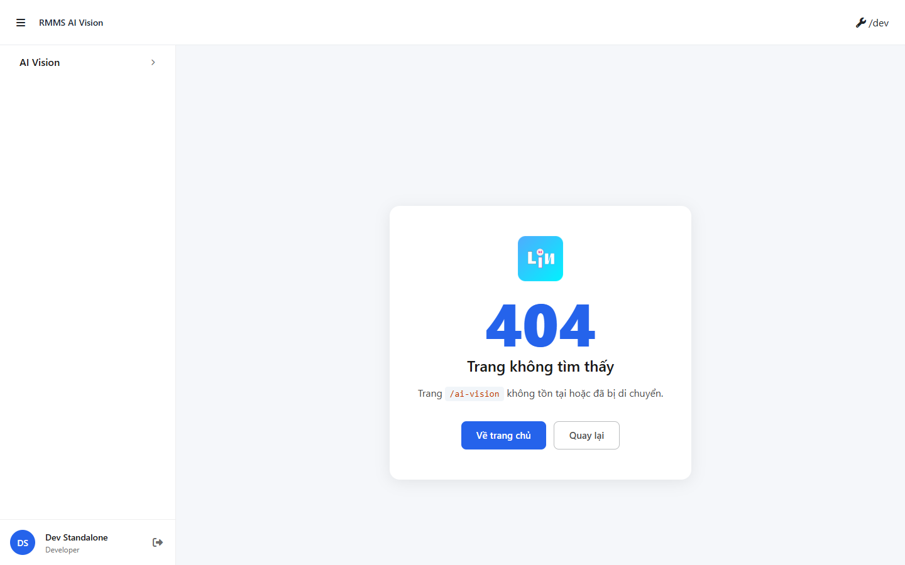
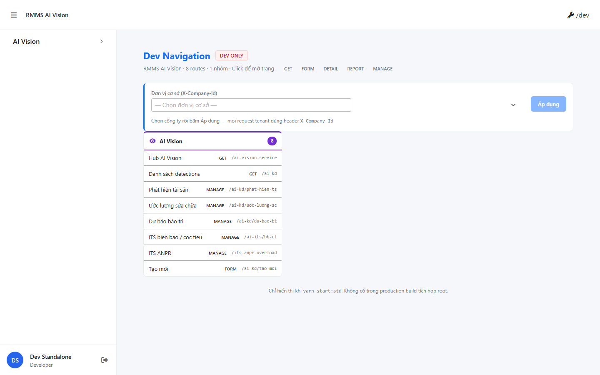
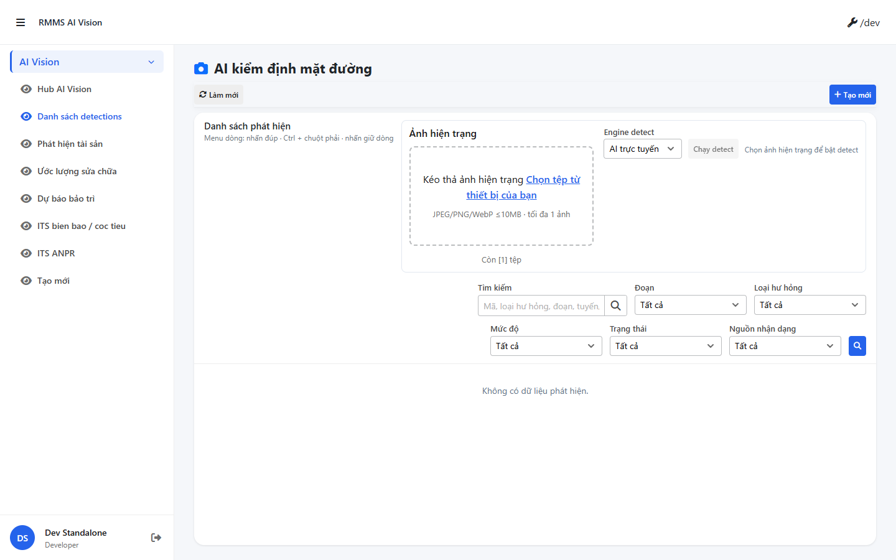

# QA — scenarios — ai-vision

| Field | Value |
|-------|-------|
| feature | `ai-vision` |
| status | `failed` |
| role | `qa` · `/agent-qa` |
| taskId | `task_b07e3518` |
| changeScope | `edit_page` |
| packKind | `ai` · featureClass `ai` · featureKind `B` |
| method | `e2e runtime · docker compose + yarn start:std :9301 + yarn e2e-qa (PW fail) → chrome channel capture` |
| mfe | `D:/AI-QLBD/MFE-Source/Linm.Web.RMMS.AiVision` |
| backend | `D:/AI-QLBD/Linm.RMMS.WebService` · `api/v1/ai-vision` · **cấm ERP.*** |
| mfeStdRoute | `/ai-vision` |
| mfeStdUrl | `http://localhost:9301/ai-vision` |
| liveVnRoute | `/ai-kd` (works · list+Zone A) |
| testid | `rmms-ai-vision-list-page` |
| skillVersion | `2026.08.09.02` |
| schemaVersion | `qldb-workflow-skill-v1` |
| workflowVersion | `2026.08.09.02` |
| versionGate | `ok` |
| contentHash | `sha256:506a7c7045dab6bd32038fe1dd6984ce12e7d01feea4b9bddcc3be35c0d66236` |
| updatedAt | `2026-09-12T08:55:00.000Z` |
| phase | `qa` · **cấm** `phase=done` |

## Preconditions

- Docker: `linm-rmms-api` healthy · `linm-rmms-bff` `:5201` healthy · postgres healthy · `docker compose up -d` OK
- MFE: `yarn start:std` · `:9301` listen (reuse · **cấm** kill worker)
- Login: `e2e.local.json` (`rmms-admin`) · std không bắt buộc Pages `:9100`
- **Cấm** verify chỉ prototype `reviewUrl`

## E2E runtime — packet cases (mfeStdUrl)

| # | Step | Expect | Result | Evidence |
|---|------|--------|--------|----------|
| S0 | Open `mfeStdUrl` · list testid | Route mount · `rmms-ai-vision-list-page` | **FAIL** |  · no list · `/ai-vision` NotFound / no Route |
| S1 | List shell on `mfeStdUrl` | Zone A detect + filter + grid | **FAIL** |  · same |
| QA-20 | Upload+detect ACT on `mfeStdUrl` | `attachFrame` + `runDetect` | **FAIL** |  · same |

`src/index.tsx` registers **`/ai-kd`** (list) · **`/ai-vision-service`** (hub) · **no** `/ai-vision` alias → STATUS `mfeStdUrl` fail.

## Diagnostic (not packet gate)

| # | Step | Expect | Result | Evidence |
|---|------|--------|--------|----------|
| S0-root | Open `/` | Standalone shell · Dev nav | **PASS** |  |
| S0-vn | Open `/ai-kd` | List testid · filters · Zone A | **PASS** |  |
| S1-vn | `/ai-kd` detect strip | `detect-zone` + `attachFrame` + `runDetect` | **PASS** |  · hasDetect/hasAttach |

## T-QA-* (packet blocked by S0)

| ID | Focus | Result |
|----|-------|--------|
| T-QA-01 | scenarios + S0/S1/QA-20 runtime | **failed** (mfeStdUrl) |
| T-QA-UPLOAD-01 | Zone A FileUpload · imageFileId · files/* | **blocked** on std · **PASS** on `/ai-kd` probe (controls present) |
| T-QA-DETECT-01 | `runDetect` · POST …/detect · disable no frame | **blocked** on std · controls present on VN |
| T-QA-FILTER-01 | sectionId · status VI · class/sev/engine | **blocked** on std · filters present on VN |
| T-QA-CRUD-01 | C/E/V/Copy · leave dirty | **blocked** (no mount on mfeStdUrl) |
| T-QA-AI-01 | Kind B · **cấm** AI chrome · GAP-F-AIV-04 OUT | **blocked** on std |

## Runtime log

| Gate | Result |
|------|--------|
| `docker compose up -d` | **PASS** · api/bff/postgres healthy |
| `yarn start:std` `:9301` | **PASS** · reuse node listen · HTML standalone |
| `yarn e2e-qa … --cases=S0,S1,QA-20` | **FAIL** · `ERR_MODULE_NOT_FOUND` playwright from `qa/screens/_capture.mjs` (**GAP-QA-E2E-PW-01**) |
| chrome capture fallback | **ran** · PNG + `manifest.json` · packet ok=false · **cấm** kill worker |
| FE build (prior Dev) | **PASS** (recorded) |
| BE Release (prior Dev) | **PASS** (recorded) |

> Note: `yarn e2e-qa` fail resolve playwright → Stop **chỉ** e2e Job · **giữ** `:9301` · capture `channel=chrome` · AI-AutoCode `node_modules/playwright` · **cấm** `taskkill`/`Stop-Process` rộng (**GAP-QA-E2E-KILL-01**).

## Gaps

| ID | Severity | Note |
|----|----------|------|
| **GAP-QA-STD-01** | **P0** | `mfeStdUrl` `/ai-vision` → no Route · NotFound / no list testid. Dev: add alias `path="ai-vision"` → `AiVisionListPage` (dual with `/ai-kd`) **or** fix STATUS/shell map to `/ai-kd`. |
| **GAP-QA-E2E-PW-01** | P2 | `yarn e2e-qa` `playwright` ERR_MODULE_NOT_FOUND · chrome fallback used |
| — | note | Auth `linm-authentication-rmms` / maps restart loop — std probe không block evidence |
| — | note | GAP-F-AIV-04 Vision host OUT · detect stub OK this pack |
| — | note | File.Api may non-2xx locally — upload route wired (Dev debt) · not re-tested on std |

## Verdict

- Packet E2E **FAIL** · DoR QA **FAIL**
- next: **`qa_fail_rollback`** · queue **`failed`** · **cấm** `completed` · **cấm** `phase=done`
- Review stays **pending** until std route fixed + re-QA

## Links

- screens: `specs/ai-vision/qa/screens/{S0,S1,QA-20,S0-root,S0-vn,S1-vn}.png` + `manifest.json`
- compact: `specs/ai-vision/handoff/qa-compact.md`
- prior: `handoff/dev-compact.md`
- STATUS: `specs/ai-vision/STATUS.md`

---
<!-- Version meta: skillVersion=2026.08.09.02 · schemaVersion=qldb-workflow-skill-v1 · workflowVersion=2026.08.09.02 · versionGate=ok · contentHash=sha256:506a7c7045dab6bd32038fe1dd6984ce12e7d01feea4b9bddcc3be35c0d66236 -->
