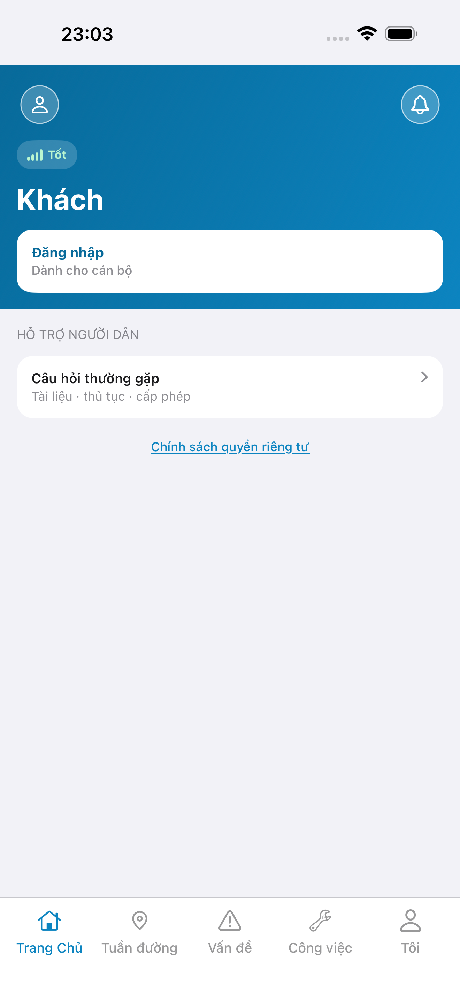
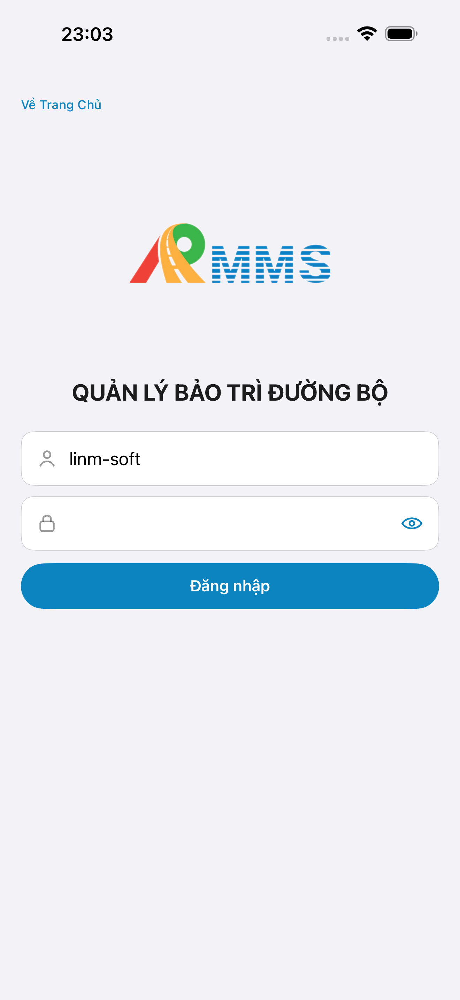

# QA — Scenarios — asset-adjust (mobile · Cập nhật / bớt)

| Field | Value |
|-------|-------|
| feature | `asset-adjust` |
| this role | `qa` · `/agent-qa-mobile` |
| status | **blocked** |
| packKind | **`screen`** |
| taskId | `task_385e599f` |
| qaFailFrom | `task_74581051` · re-QA after Dev `task_d8ada3bb` |
| e2eQa | **ON** · `yarn e2e-qa-mobile` · `ios_test_phase=phase1_iphone` (autoApprove) · **A4-IPAD DEFER** |
| store_qa | **run_store** (autoApprove=ON · e2eQa=ON) |
| e2e result | **ok:true** (CLI Maestro+px) · dest **iPhone 17 Pro Max** · emulator **Pixel 2** · **visual FAIL** |
| method | e2e runtime · yarn e2e-qa-mobile · Maestro · **cấm** GenerateImage · **cấm** yarn e2e-qa / start:std / mfeStdUrl |
| align | `/review-align-ux-ios-android` · Read A3-CORE + P6-CORE vs dual proto · **Must open** |
| API / BFF | API docker host **:5111** · Mobile.Bff **:5202** · `--skip-start` (đã listen) |
| updatedAt | `2026-09-01T16:06:00.000Z` |

**Scope:** slug `asset-adjust` · `#sc-asset-adjust` + `#md-asset-remove` only. **Cấm** AC sibling collect/AI/list/detail form as in-scope.

## Verdict

fail

## VERIFY GATE

| Gate | Result |
|------|--------|
| Mobile.Bff `:5202` healthy | **PASS** (A10-BFF) |
| API docker `:5111` | **PASS** |
| Maestro iOS → `#sc-asset-adjust` | **PASS** |
| Maestro Android → `#sc-asset-adjust` | **PASS** (screen chrome) |
| `yarn e2e-qa-mobile` CLI | **PASS** · `ok: true` |
| Real BFF list bind CORE | **FAIL** · iOS live `BB/HL/KM-QL1-NA-*` · Android **LoadFailed** empty + toast · **GAP-QA-REAL-01** |
| Visual Aligned (Read CORE) | **FAIL** · Must open |

## Device AC (slug `asset-adjust` only)

| ID | Expect | Result | Evidence |
|----|--------|--------|----------|
| QA-01 | Launch → guest home | **PASS** |  |
| QA-02 | Login demo Auth seed | **PASS** |  |
| QA-03 | Hub `#tile-adjust` → `#sc-asset-adjust` | **PASS** | Maestro dual |
| QA-04 | Title **Cập nhật / bớt** · Search · row · **Sửa** · **Bớt** | **PASS** iOS chrome · Android chrome empty | A3 / P6 |
| QA-05 | Live GET list (cấm demo-only / LoadFailed CORE) | **FAIL** Android |  live ·  LoadFailed · **GAP-QA-REAL-01** |
| QA-06 | Soft-delete modal open/cancel (không mutate) | **PASS** smoke iOS | Maestro optional |
| QA-07 | Watermark / «Phiên bản Gói» | **PASS** | A3 / P6 không watermark |
| QA-08 | Search placeholder SSOT dài | **Should** | Kit hardcode `Tìm` · **DEFER kit** |

## Store Must × feature

| Case | Store | Result | Evidence |
|------|-------|--------|----------|
| A10-BFF | A10 · P11 | **PASS** | — |
| A11-LAUNCH | A11 | **PASS** |  |
| A9-LOGIN | A9 · P10 | **PASS** |  |
| A3-CORE | A3 · A11 | **PASS** CLI · **visual live OK** |  |
| P6-CORE | P6 · P11 | **PASS** CLI · **FAIL real-data** |  |
| P6-CORE-2 | P6 | **PASS** CLI · same LoadFailed |  |
| A4-IPAD | A4 | **DEFER** Phase 1 | — |

## E2E screenshots

Viewer: `/api/qldb/artifact?id=&rel=qa/scenarios.md` rewrite `screens/{caseId}.png`.

CLI **PASS** = Maestro + PNG + store px only — **not** visual vs demo. QA **Read** A3-CORE + P6-CORE vs prototype (`/review-align-ux-ios-android`).

| Case | Store | Result | Evidence |
|------|-------|--------|----------|
| A10-BFF | A10 · P11 | **PASS** | — |
| A11-LAUNCH | A11 | **PASS** |  |
| A9-LOGIN | A9 · P10 | **PASS** |  |
| A3-CORE | A3 · A11 | **PASS** |  |
| P6-CORE | P6 · P11 | **PASS** |  |
| P6-CORE-2 | P6 | **PASS** |  |

## Gaps

| ID | Severity | Summary |
|----|----------|---------|
| GAP-QA-REAL-01 | **Must** | Android CORE **LoadFailed**: empty «Không có tài sản» + toast «Không tải được danh sách tài sản.» · iOS A3 live `BB-QL1-NA-478` / `HL-QL1-NA-468` / `KM-QL1-NA-461` · **không** còn demo `TS-20260810-*` (OfflineDemo→LoadFailed OK) · GET live vẫn FAIL |
| GAP-MOB-SEARCH-PLACEHOLDER | Should · DEFER kit | `LinmSearchField` hardcode `Tìm` · MapFile/PO SSOT dài |

## Maestro

| Flow | Path | Result |
|------|------|--------|
| iOS | `qa/e2e/ios.yaml` | **PASS** · guest→login→hub→adjust · A3 live |
| Android | `qa/e2e/android.yaml` | **PASS** Maestro chrome · P6 LoadFailed |

## Notes

- `--skip-start`: API listen **:5111** (compose không bind :5101) · BFF :5202.
- Dev `task_d8ada3bb` tenant harden: OfflineDemo removed → LoadFailed path visible — **partial**; Android GET still throws/fails vs iOS live.
- Demo HTML `#sc-asset-adjust` **không** `.row-icon` trên row — live iOS có leading cube · **không** GAP-MOB-UX-COMP-03.
- **Cấm** READY_TO_SUBMIT · **cấm** phase=review khi Must mở.
- QA **cấm** tự sửa native (roleOnly=`qa`).

## Handoff

| Field | Value |
|-------|-------|
| Verdict | **fail** |
| Next | board **`qa_fail_rollback`** → Dev `qa_fix_plan` (re-open) · diagnose Android GET throw |
| Chain this turn | **không** |
| store | `qa/store/asset-adjust/` |
| bugs | `qa/bugs/asset-adjust.md` |
| align | `ui/review/align-ux.md` |

---
<!-- Version meta: skillId=agent-qa-mobile dorGate=FAIL contentHash=sha256:asset-adjust-qa-20260901-re -->
