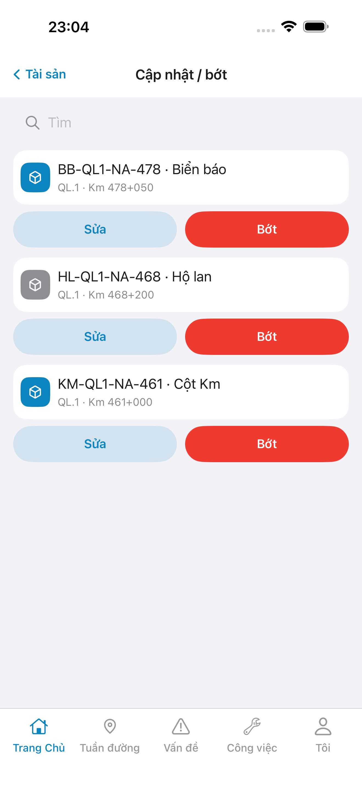
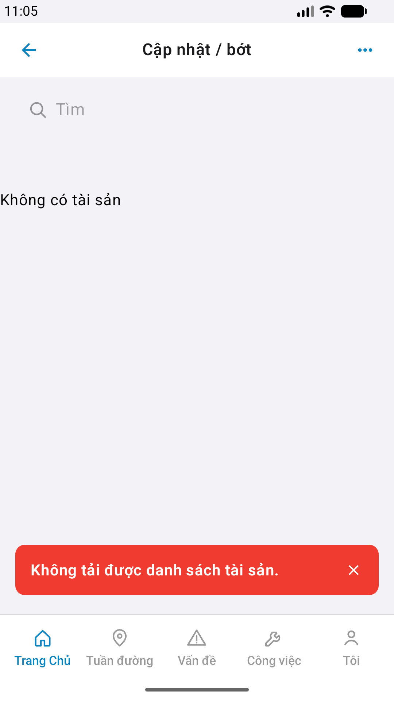

# Capture — asset-adjust

| Field | Value |
|-------|-------|
| feature | `asset-adjust` |
| method | `e2e runtime · yarn e2e-qa-mobile` |
| iosDevice | **iPhone 17 Pro Max** (6.9" · phase1) |
| android | Pixel 2 · **1080×1920** |
| iPad | **DEFER** Phase 1 |
| capturedAt | `2026-09-01T16:05:17.061Z` |
| CLI | `ok: true` · visual Must → **GAP-QA-REAL-01** |

| Case | Store | Result | Evidence |
|------|-------|--------|----------|
| A10-BFF | A10 · P11 | **PASS** | — |
| A11-LAUNCH | A11 | **PASS** |  |
| A9-LOGIN | A9 · P10 | **PASS** |  |
| A3-CORE | A3 · A11 | **PASS** CLI · live GET |  |
| P6-CORE | P6 · P11 | **PASS** CLI · **LoadFailed** |  |
| P6-CORE-2 | P6 | **PASS** CLI · **LoadFailed** |  |

CLI PASS = capture+px only. Visual = `/review-align-ux-ios-android` Read CORE vs demo HTML.

Listing official → `/store-image-capture` confirm file live (**cấm** AI vẽ).
