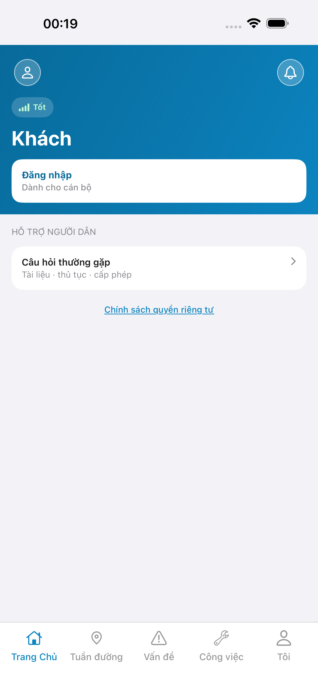
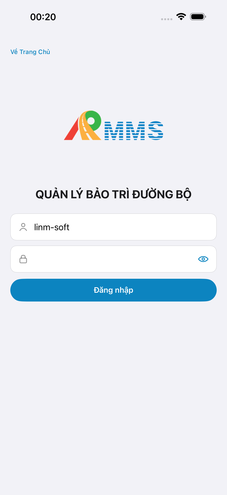
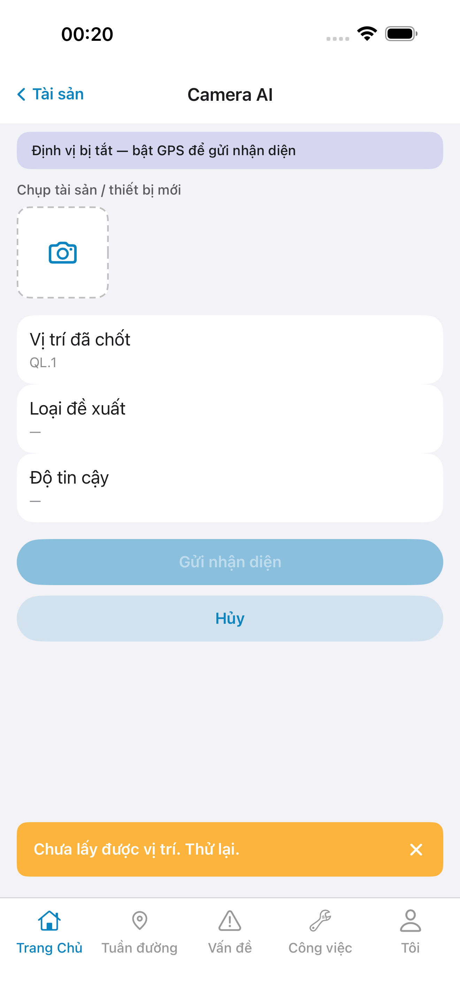
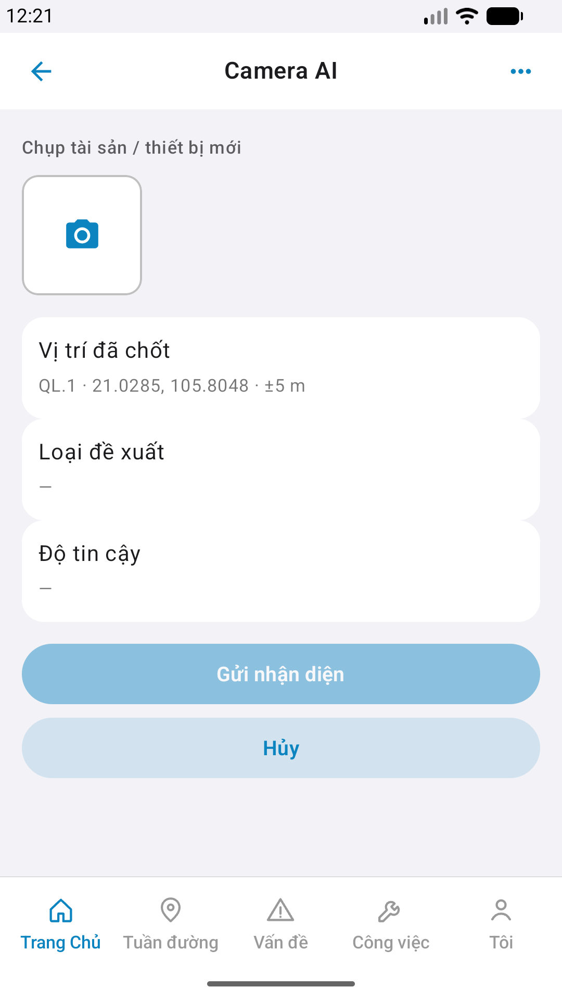

# QA — Scenarios — asset-ai

> Status: **done** · `/agent-qa-mobile` · e2eQa=ON · task `task_d1226fec`  
> method: `e2e runtime · yarn e2e-qa-mobile` · Maestro · sim **iPhone 17 Pro Max** + emulator **Pixel 2** · **cấm** `yarn e2e-qa` / `start:std` / GenerateImage

| | |
|--|--|
| Feature | `asset-ai` |
| Title | [Mobile] [Tài sản] -> Camera AI |
| Role | `qa` |
| packKind | `sheet` |
| iosPhase | `phase1_iphone` · **A4-IPAD DEFER** |
| demo | `linm-soft` / Auth docker seed |
| API / BFF | API `:5101` · Mobile.Bff `:5202` |
| e2e | **ok:true** · capturedAt `2026-09-01T17:21:56.192Z` |

## Device AC (slug `asset-ai` only)

| AC | Expect | Result | Evidence |
|----|--------|--------|----------|
| Launch | Guest `#sc-home` · 0 crash | **PASS** |  |
| BFF | Mobile.Bff listen `:5202` | **PASS** | A10-BFF |
| Login demo | guest → `#btn-home-login` · fill `#f-user`/`#f-pass` · seed Auth | **PASS** |  |
| Sheet `#sc-asset-ai` iOS | Title **Camera AI** · photo-row · rows pos/class/score · CTA Gửi+Hủy · **cấm** Confirm/Dismiss HITL | **PASS** |  |
| Sheet `#sc-asset-ai` Android | Cùng zone · Pixel **1080×1920** | **PASS** |  |
| CTA fold Android | `#btn-send` + `#btn-cancel` visible | **PASS** |  |
| Entry hub | `#tile-ai` → push `#sc-asset-ai` | **PASS** | Maestro dual |
| Empty pre-detect | class/score `—` · Gửi disabled until photo+GPS | **PASS** | A3 / P6 |
| HITL Confirm OUT | **cấm** Confirm/Dismiss trên slug | **PASS** | A3 / P6 (không HITL CTA) |
| Watermark | **cấm** «Phiên bản Gói» | **PASS** | A3 / P6 |
| Dual align | Chrome kit iOS↔Android vs demo `#sc-asset-ai` | **Aligned** | A3 ↔ P6 ↔ prototype · Must **0** |

## Store Must × feature

| Case | Store | Result | Evidence |
|------|-------|--------|----------|
| A10-BFF | A10 · P11 | **PASS** | — |
| A11-LAUNCH | A11 | **PASS** |  |
| A9-LOGIN | A9 · P10 | **PASS** |  |
| A3-CORE | A3 · A11 | **PASS** |  |
| P6-CORE | P6 · P11 | **PASS** |  |
| P6-CORE-2 | P6 | **PASS** |  |

## Visual align (`/review-align-ux-ios-android`)

CLI **PASS** ≠ visual. **Read** A3-CORE + P6-CORE vs prototype `#sc-asset-ai`:

| Zone | Demo | Live iOS | Live Android | Verdict |
|------|------|----------|--------------|---------|
| TopBar title Camera AI | ✅ | ✅ + back «Tài sản» | ✅ + arrow | **Aligned** |
| photo-row + `#i-camera` | dashed slot | ✅ | ✅ | **Aligned** |
| row-pos | Route+GPS | QL.1 (+gps banner) | QL.1 · coords · ±5 m | **Aligned** |
| row-class / row-score | — pre-detect | ✅ `—` | ✅ `—` | **Aligned** |
| btn-send / btn-cancel | Primary+Secondary | ✅ disabled Gửi | ✅ disabled Gửi | **Aligned** |
| Confirm/Dismiss HITL | OUT | absent | absent | **Aligned** |

Must **0**. Soft: iOS sim GPS toast/banner (env) · Android live GPS — **không** Must UX.

## VERIFY GATE

| Gate | Result |
|------|--------|
| iOS `xcodegen` + build dest **iPhone 17 Pro** | **PASS** (prior dev) |
| Android `assembleDebug` | **PASS** (prior dev) |
| BFF `dotnet build` | **PASS** (prior dev) |
| `yarn e2e-qa-mobile` · cases A11,A10,A9,A3,P6,P6-2 · `ios-phase=phase1_iphone` | **PASS** · `ok: true` |

## Notes

- Maestro: `qa/e2e/ios.yaml` · `qa/e2e/android.yaml` — guest → login → `#tile-asset` → `#tile-ai` → `#sc-asset-ai`.
- MEDIA/camera live DEFER — CORE = chrome empty pre-detect (cấm bắt buộc chụp E2E).
- optional dismiss `#btn-gps-deny-later` · location Allow.
- px: iOS A3 **1320×2868** RGB · Play P6 **1080×1920** RGB.
- **Cấm** READY_TO_SUBMIT ở QA — next `/agent-review-mobile`.
- A4-IPAD **DEFER** Phase 1.
- mfeStdUrl / start:std: **none**.

## Handoff → Review

| Field | Value |
|-------|-------|
| phase_to | `review` |
| Next slash | `/agent-review-mobile` |
| store | `qa/store/asset-ai/` · CAPTURE.md |
| Chain this turn | **không** (roleOnly=`qa`) |
