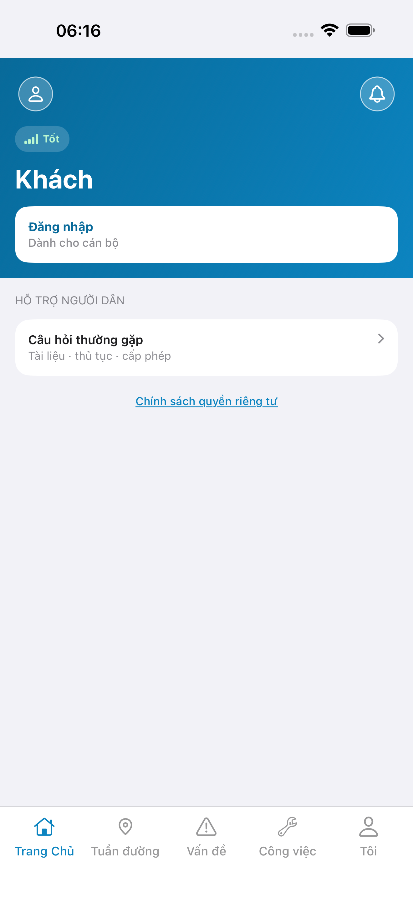
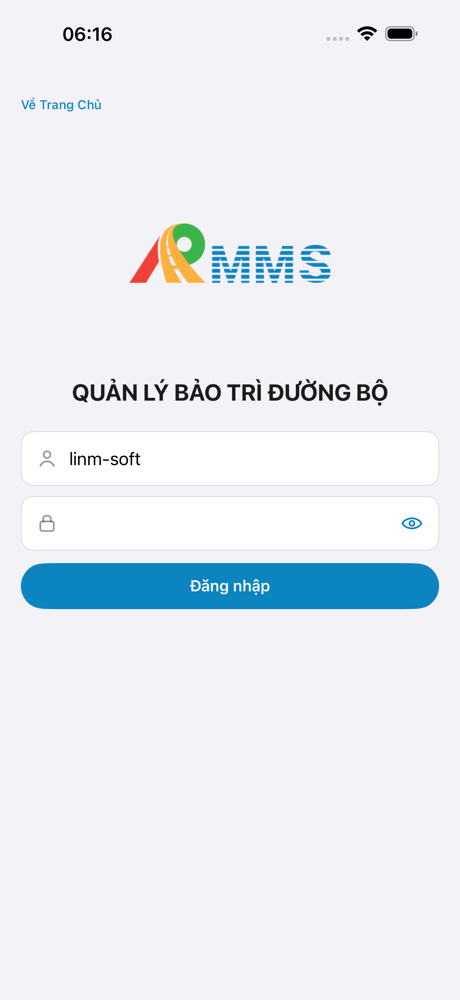
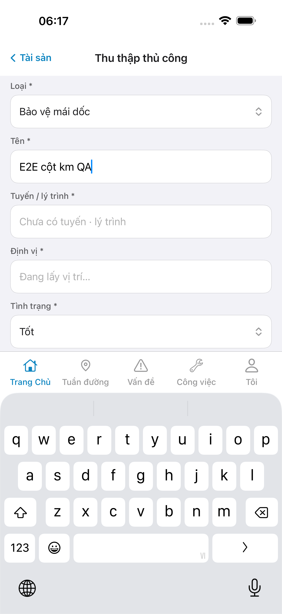
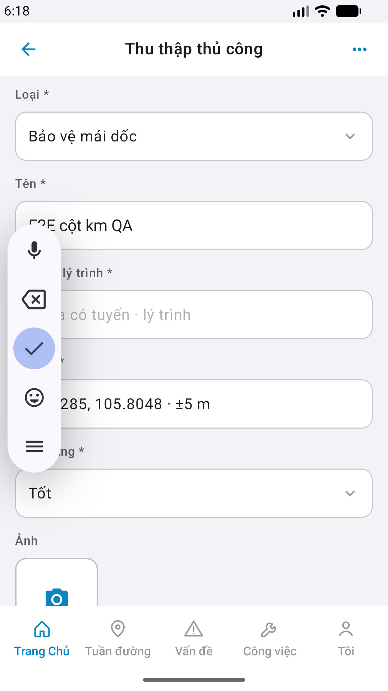
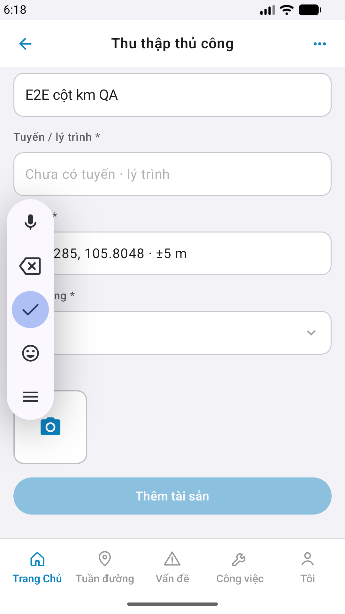

# QA — Scenarios — asset-collect

> Status: **done** · `/agent-qa-mobile` · e2eQa=ON · task `task_3388dfba`  
> method: `e2e runtime · yarn e2e-qa-mobile` · Maestro · sim **iPhone 17 Pro Max** + emulator **Pixel 2** · **cấm** `yarn e2e-qa` / `start:std` / GenerateImage

| | |
|--|--|
| Feature | `asset-collect` |
| Title | [Mobile] [Tài sản] -> Thủ công |
| Role | `qa` |
| packKind | `screen` |
| iosPhase | `phase1_iphone` · **A4-IPAD DEFER** |
| demo | `linm-soft` / Auth docker seed |
| API / BFF | WebService docker `:5111` (compose Linux) · Mobile.Bff `:5202` · `--skip-start` (đã listen) |

## Device AC (slug `asset-collect` only)

| AC | Expect | Result | Evidence |
|----|--------|--------|----------|
| Launch | App mở guest/home · 0 crash | **PASS** |  |
| BFF | Mobile.Bff listen `:5202` | **PASS** | A10-BFF |
| Login demo | Fill `#f-user`/`#f-pass` · CTA Đăng nhập · seed Auth | **PASS** |  |
| Form `#sc-asset-collect` iOS | Title **Thu thập thủ công** · Select type/status · name · route/GPS readonly · PhotoRow · CTA · hub tile **Thủ công** wire | **PASS** |  |
| Form `#sc-asset-collect` Android | Cùng zone · Pixel **1080×1920** · camera `#i-camera` | **PASS** |  |
| Fold 2 Android | Photo + CTA **Thêm tài sản** visible (scroll) | **PASS** |  |
| Entry hub | `#tile-collect` → `#sc-asset-collect` · **không** toast-only | **PASS** | Maestro assert |
| Real catalog | Type live (không hardcode 5 demo options) | **PASS** | A3/P6 «Bảo vệ mái dốc» |
| Status dual | Select **Tốt** default | **PASS** | A3 / P6 |
| GPS | Pin live / acquiring · **cấm** fake lat | **PASS** | Android coords · iOS acquiring |
| Route empty | **không** invent `QL.1` khi thiếu prefill | **PASS** | «Chưa có tuyến · lý trình» |
| MEDIA-01 | Photo local · **không** block Create · upload DEFER | **PASS** | `#i-camera` / photo-row |
| GAP-DEV-MOB-PLACEHOLDER-01 | **Cấm** watermark «Phiên bản Gói» | **PASS** | A3 / P6 |
| Dual align | Chrome kit cùng zone iOS↔Android | **PASS** | A3 ↔ P6 · See `ui/review/align-ux.md` |

## Store Must × feature

| Case | Store | Result | Evidence |
|------|-------|--------|----------|
| A10-BFF | A10 · P11 | **PASS** | — |
| A11-LAUNCH | A11 | **PASS** |  |
| A9-LOGIN | A9 · P10 | **PASS** |  |
| A3-CORE | A3 · A11 | **PASS** |  |
| P6-CORE | P6 · P11 | **PASS** |  |
| P6-CORE-2 | P6 | **PASS** |  |

## E2E screenshots

Viewer: `/api/qldb/artifact?id=&rel=qa/scenarios.md` rewrite `screens/{caseId}.png`.

CLI **PASS** = Maestro + PNG + store px only — **not** visual vs demo. QA **Read** A3-CORE + P6-CORE vs prototype (`/review-align-ux-ios-android`). Demo `.row-icon`/`#i-*` missing on live → Must **GAP-MOB-UX-COMP-03** · log `qa/bugs/`. Skip vision → **GAP-MOB-E2E-VIS-01**.

| Case | Store | Result | Evidence |
|------|-------|--------|----------|
| A10-BFF | A10 · P11 | **PASS** | — |
| A11-LAUNCH | A11 | **PASS** |  |
| A9-LOGIN | A9 · P10 | **PASS** |  |
| A3-CORE | A3 · A11 | **PASS** |  |
| P6-CORE | P6 · P11 | **PASS** |  |
| P6-CORE-2 | P6 | **PASS** |  |

## VERIFY GATE (recheck QA)

| Gate | Result |
|------|--------|
| iOS `xcodegen generate` | **PASS** |
| Android `assembleDebug` | **PASS** |
| BFF `dotnet build` | **PASS** |
| `yarn e2e-qa-mobile` · cases A11,A10,A9,A3,P6,P6-2 · `ios-phase=phase1_iphone` · `--skip-start` | **PASS** · `ok: true` |

## Notes

- Maestro flows: `qa/e2e/ios.yaml` · `qa/e2e/android.yaml` — login → `#tile-asset` → `#tile-collect` → assert `#sc-asset-collect` trước shot A3/P6.
- Android: scroll tới `#btn-add-asset` trước assert (CTA dưới fold) · **cấm** `hideKeyboard`.
- px: iOS A3 **1320×2868** RGB · Play P6 **1080×1920** RGB.
- Submit happy-path: Route empty → CTA gated (validation) · **cấm** invent Route · FORM body assert **DEFER** seed — see align-ux Should.
- Copy label live rút gọn vs design SSOT («Loại *» vs «Loại tài sản *») → Should · **không** Must COMP-03.
- **Cấm** READY_TO_SUBMIT ở QA — next `/agent-review-mobile`.
- Sibling AI/list/detail: **out of scope**.
- A4-IPAD **DEFER** Phase 1 (`GAP-SUBMIT-IMG-08`).

## Handoff → Review

| Field | Value |
|-------|-------|
| phase_to | `review` |
| Next slash | `/agent-review-mobile` |
| store | `qa/store/asset-collect/` · CAPTURE.md |
| Chain this turn | **không** (roleOnly=`qa`) |

## Version meta

| Field | Value |
|-------|-------|
| skillId | agent-qa-mobile |
| skillVersion | 2026.08.29.1 |
| schemaVersion | 1 |
| workflowVersion | 2026.08.31.2 |
| rulesVersion | 2026.08.31.2 |
| versionGate | rechecked |
| priorDesignHash | sha256:asset-collect-design-20260831 |
| priorImplementIosHash | sha256:asset-collect-implement-ios-20260831 |
| contentHash | sha256:asset-collect-qa-scenarios-20260831 |
| taskId | `task_3388dfba` |
| dorGate | PASS |

---
<!-- Version meta: skillId=agent-qa-mobile skillVersion=2026.08.29.1 schemaVersion=1 workflowVersion=2026.08.31.2 rulesVersion=2026.08.31.2 versionGate=rechecked dorGate=PASS -->
