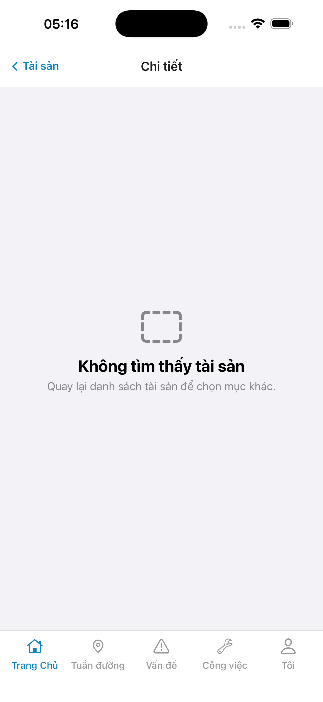

# QA — Scenarios — asset-detail (mobile · Chi tiết tài sản)

| Field | Value |
|-------|-------|
| feature | `asset-detail` |
| this role | `qa` · `/agent-qa-mobile` |
| status | **blocked** |
| packKind | **`screen`** |
| taskId | `task_cbda6a54` |
| e2eQa | **ON** · `yarn e2e-qa-mobile` · `ios_test_phase=phase1_iphone` · **A4-IPAD DEFER** |
| store_qa | **run_store** (autoApprove=ON) |
| e2e result | **ok:false** · dest **iPhone 17 Pro Max** · AVD **Pixel_2** |
| method | e2e runtime · yarn e2e-qa-mobile · Maestro + simctl/adb · **cấm** GenerateImage · **cấm** yarn start:std / mfeStdUrl |
| align | dual proto `#sc-asset-detail` · live A3/P6 **Not Aligned** · Must open |
| updatedAt | `2026-08-30T22:21:24.000Z` |

**Scope:** slug `asset-detail` screen `#sc-asset-detail` only. **Cấm** AC sibling list/collect/adjust/AI/gis-map as in-scope.

## Verdict

fail

## VERIFY GATE

| Gate | Result |
|------|--------|
| Mobile.Bff `dotnet build` / :5202 | **PASS** (healthy) |
| API docker :5111 (+ host forward :5101) | **PASS** |
| Maestro iOS | **FAIL** · `GAP-QA-STORE-01` |
| Maestro Android | **FAIL** · `GAP-QA-STORE-03` |
| `yarn e2e-qa-mobile` | **FAIL** · `ok:false` |
| Real BFF detail | **FAIL** · `GAP-QA-REAL-01` |

## Device AC

| ID | Expect | Result |
|----|--------|--------|
| QA-01 | Login → asset hub → list → row → `#sc-asset-detail` live GET by id | **FAIL** |
| QA-02 | Title iOS **Chi tiết** / Android **Chi tiết tài sản** · hero Mã TS + live Code | **FAIL** |
| QA-03 | Rows Loại · Tuyến · lý trình · Tọa độ (khi có) · CTA **Ghim trên bản đồ** | **FAIL** |
| QA-04 | Live seed `KM-QL1-NA-461` (id `c33e0001-…0001`) — **cấm** demo-only PASS | **FAIL** · `GAP-QA-REAL-01` |
| QA-05 | CTA map → toast P1 OK nếu gis-map chưa ship | **BLOCKED** (detail không bind live) |
| AC-D-14 | Cấm watermark / process text | **PASS** (shots không watermark) |

## Store Must

| Case | Store | Evidence | Result |
|------|-------|----------|--------|
| A11-LAUNCH | A11 |  | **PASS** (CLI) |
| A10-BFF | A10 · P11 | — | **PASS** |
| A9-LOGIN | A9 · P10 |  | **PASS** (CLI) |
| A3-CORE | A3 · A11 |  · evidence empty  | **FAIL** · EmptyChrome / invalid harvest |
| P6-CORE | P6 · P11 |  · list-demo  | **FAIL** · demo list / mock detail |
| P6-CORE-2 | P6 |  | **FAIL** |
| A4-IPAD | A4 | **DEFER** Phase 1 | DEFER |

## Maestro

| Flow | Path | Result |
|------|------|--------|
| iOS | `qa/e2e/ios.yaml` | **FAIL** · live list `KM-QL1-NA-461` OK → tap `row-asset-0` → `#sc-asset-detail` EmptyChrome **Không tìm thấy tài sản** |
| Android | `qa/e2e/android.yaml` | **FAIL** · list stuck demo `TS-20260810-014` · không thấy live `KM-QL1-NA-461` |

## Root cause (QA)

1. **iOS:** List GET live **PASS**. Push detail → EmptyChrome. BFF often **no** `GET …/road-assets/{id}` after list → nghi SwiftUI `navigationDestination(isPresented:)` + `assetDetailId` race (`appear("")` → `.notFound`). GET `c33e…` thiếu `X-Company-Id` → API **404**.
2. **Android:** List còn **demoRows** khi assert live · **cấm** AC PASS mock (`GAP-QA-REAL-01`).
3. CLI harvest A3/P6 sau Maestro FAIL = **không** đủ DoR store/visual.

## Gaps

| ID | Note | Block complete? |
|----|------|-----------------|
| GAP-QA-REAL-01 | Detail/list không chứng minh GET BFF live bind trên CORE shot | **yes** |
| GAP-QA-STORE-01 | Maestro iOS FAIL · EmptyChrome | **yes** |
| GAP-QA-STORE-03 | Maestro Android FAIL · không thấy live row | **yes** |
| GAP-MOB-ASSET-DET-NAV-02 | iOS push detail sau live row → EmptyChrome · nghi `assetDetailId` stale | **yes** · Dev `/edit-mobile-feature` |
| GAP-MOB-E2E-VIS-01 | CLI PASS ≠ visual · A3 harvest không phải detail live | **yes** |

## E2E screenshots

| Case | Store | Result | Evidence |
|------|-------|--------|----------|
| A10-BFF | A10 · P11 | **PASS** | — |
| A11-LAUNCH | A11 | **PASS** |  |
| A9-LOGIN | A9 · P10 | **PASS** |  |
| A3-CORE | A3 · A11 | **FAIL** |  ·  |
| P6-CORE | P6 · P11 | **FAIL** |  ·  |
| P6-CORE-2 | P6 | **FAIL** |  |

## Handoff

- **cấm** `completed` · queue **`failed`** · board **`qa_fail_rollback`**
- Dev: `implement/asset-detail-qa-fix-plan.md` + `qa_fix_plan` **trước** Write · **cấm** autoApprove skip

---
<!-- Version meta: skillId=agent-qa-mobile skillVersion=2026.08.29.1 schemaVersion=1 workflowVersion=2026.08.31.2 rulesVersion=2026.08.31.2 versionGate=rechecked -->
