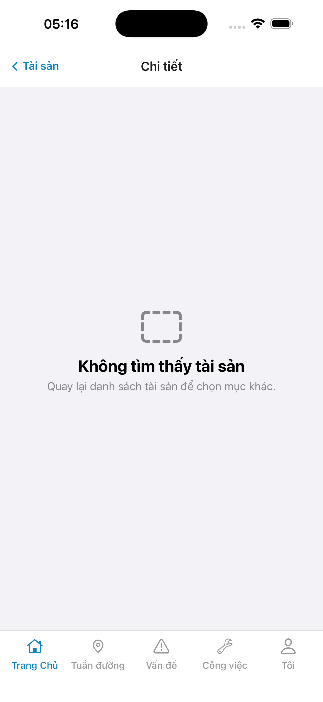
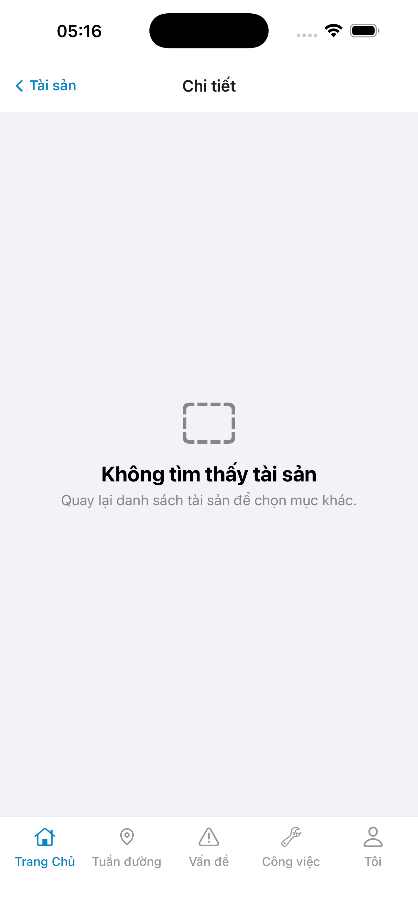
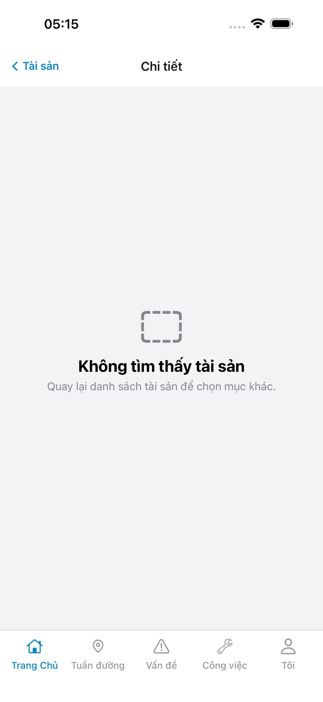
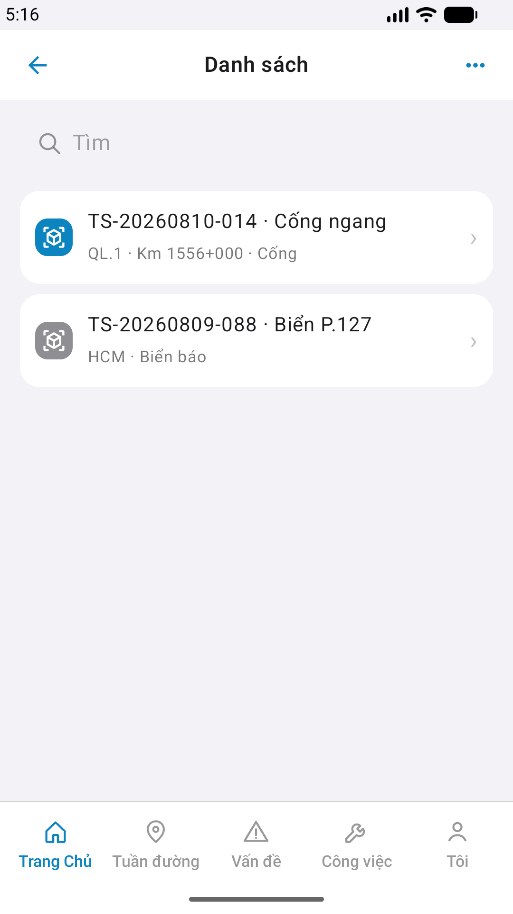

# Store capture — asset-detail

| Field | Value |
|-------|-------|
| feature | `asset-detail` |
| role | `qa` · `/review-app-submit` prep |
| status | **FAIL** · e2eQa ON · **cấm** store_skip |
| method | yarn e2e-qa-mobile · Maestro · sim 6.9" + Pixel_2 |
| ios_test_phase | phase1_iphone · **A4-IPAD DEFER** |
| updatedAt | `2026-08-30T22:21:24.000Z` |

## Slots

| File | Store | px target | Result |
|------|-------|-----------|--------|
| A11-LAUNCH.png | A11 | 6.9" | PASS file |
| A9-LOGIN.png | A9 / P10 | 6.9" | PASS file |
| A3-CORE.png | A3 / A11 | 6.9" | **FAIL** content (EmptyChrome / invalid) |
| A3-CORE-EMPTY.png | evidence | — | EmptyChrome after live row tap |
| P6-CORE.png | P6 / P11 | 1080×1920 | **FAIL** content |
| P6-CORE-2.png | P6 | 1080×1920 | **FAIL** content |
| P6-LIST-DEMO.png | evidence | — | Android demo list |

## Embed

**Cấm** READY_TO_SUBMIT — QA fail · chờ Dev fix + re-QA.
