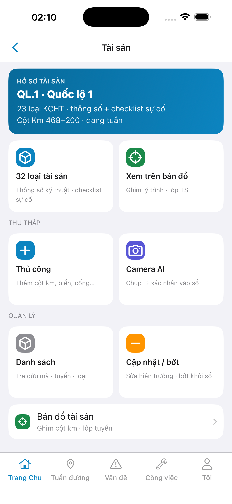
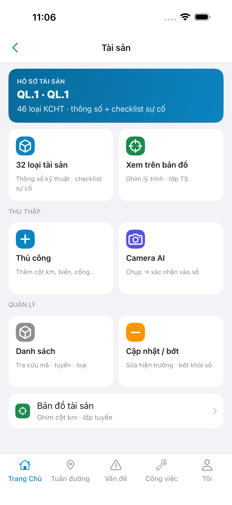
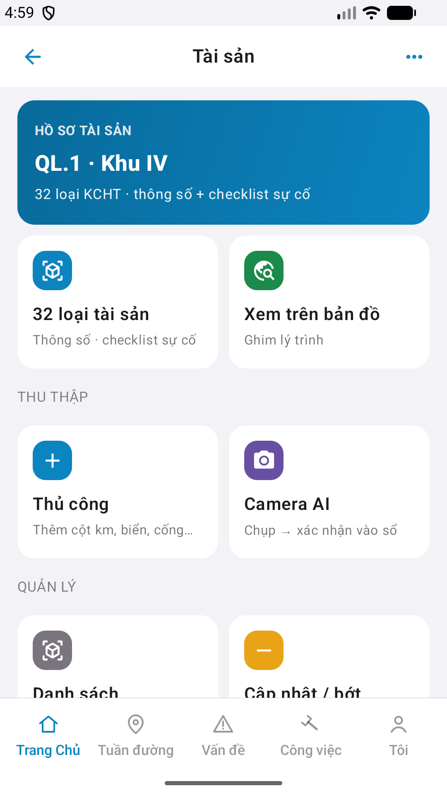
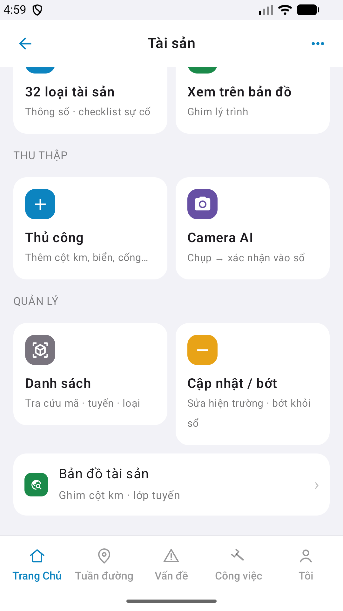

# QA — Scenarios — asset-hub

> Status: **done** · `/agent-qa-mobile` · e2eQa=ON · task `task_4e062d1e`  
> method: `e2e runtime · yarn e2e-qa-mobile` · Maestro · sim **iPhone 17 Pro Max** + emulator **Pixel 2** · **cấm** `yarn e2e-qa` / `start:std` / GenerateImage

| | |
|--|--|
| Feature | `asset-hub` |
| Title | [Mobile] Tài sản |
| Role | `qa` |
| packKind | `hub` |
| iosPhase | `phase1_iphone` · **A4-IPAD DEFER** |
| demo | `linm-soft` / Auth docker seed |
| API / BFF | API `:5111` (compose) · Mobile.Bff `:5202` |

## Device AC (slug `asset-hub` only)

| AC | Expect | Result | Evidence |
|----|--------|--------|----------|
| Launch | Guest `#sc-home` · 0 crash | **PASS** |  |
| BFF | Mobile.Bff listen `:5202` | **PASS** | A10-BFF |
| Login demo | guest → `#btn-home-login` · fill `#f-user`/`#f-pass` · seed Auth | **PASS** |  |
| Hub `#sc-asset-hub` iOS | Nav **Tài sản** · wallet live-only · hub-grid ×3 · **cấm** foot Gói · **cấm** sibling screen | **PASS** |  |
| Hub `#sc-asset-hub` Android | Cùng zone · Pixel **1080×1920** | **PASS** |  |
| Hub zone 2 Android | Quản lý + `#row-map` visible (scroll) | **PASS** |  |
| Sibling toast | Tap `#tile-types` → vẫn `#sc-asset-hub` · **không** push sibling | **PASS** | A3 (Maestro assert) |
| cleanup_mock | Wallet live route+count · **cấm** demoTitle/demoCount/patrolLine | **PASS** | A3 `QL.1 · QL.1` · `46 loại KCHT` |
| GAP-F-AHUB-01 | Wallet live · hub **không** block | **PASS** | iOS/Android live route |
| GAP-F-AHUB-02 | Tile marketing «32 loại tài sản» · subtitle count live | **PASS** | A3/P6 `46 loại KCHT` live |
| GAP-F-AHUB-03 | AI pending empty → **ẩn** section «Chờ xác nhận AI» | **PASS** | A3 / P6 (không `sec-ai`) |
| GAP-DEV-MOB-PLACEHOLDER-01 | **Cấm** watermark «Phiên bản Gói» | **PASS** | A3 / P6 |
| Dual align | Chrome kit cùng zone iOS↔Android vs demo | **Aligned** | A3 ↔ P6 ↔ prototype · Must **0** |

## Store Must × feature

| Case | Store | Result | Evidence |
|------|-------|--------|----------|
| A10-BFF | A10 · P11 | **PASS** | — |
| A11-LAUNCH | A11 | **PASS** |  |
| A9-LOGIN | A9 · P10 | **PASS** |  |
| A3-CORE | A3 · A11 | **PASS** |  |
| P6-CORE | P6 · P11 | **PASS** |  |
| P6-CORE-2 | P6 | **PASS** |  |

## Visual align (`/review-align-ux-ios-android`)

CLI **PASS** ≠ visual. **Read** A3-CORE + P6-CORE vs prototype `#sc-asset-hub`:

| Zone | Demo | Live iOS | Live Android | Verdict |
|------|------|----------|--------------|---------|
| wallet-card | gradient + route + count | ✅ glyph + live | ✅ glyph + live | **Aligned** |
| hub-tile `.hi` | colored icon boxes ×6 | ✅ | ✅ | **Aligned** |
| section-label | Thu thập / Quản lý | ✅ | ✅ | **Aligned** |
| row-map `.row-icon` | green ◎ glyph | ✅ (P6-2) | ✅ | **Aligned** |
| sec-ai | hidden when empty | ✅ absent | ✅ absent | **Aligned** |

Must **0** · debt GAP-F-AHUB-01/02 documented · **cấm** GAP-MOB-UX-COMP-03.

## VERIFY GATE (recheck QA post cleanup_mock)

| Gate | Result |
|------|--------|
| iOS `xcodegen` + `xcodebuild` dest **iPhone 17 Pro** | **PASS** (prior dev) |
| Android `assembleDebug` | **PASS** (prior dev) |
| BFF `dotnet build` | **PASS** (prior dev) |
| `yarn e2e-qa-mobile` · cases A11,A10,A9,A3,P6,P6-2 · `ios-phase=phase1_iphone` | **PASS** · `ok: true` |

## Notes

- Maestro flows: `qa/e2e/ios.yaml` · `qa/e2e/android.yaml` — guest `#sc-home` → `#btn-home-login` → `#tile-asset` → `#sc-asset-hub` (**fix flake** post `task_9c9293d2`).
- Android: **cấm** `hideKeyboard` — tap title + Enter.
- iOS: **cấm** assert `#nav-back` — assert `#sc-asset-hub` + `#wallet-asset` + `#tile-types`.
- px: iOS A3 **1320×2868** RGB · Play P6 **1080×1920** RGB.
- E2E `--skip-start` (API compose `:5111` not `:5101` on macOS).
- **Cấm** READY_TO_SUBMIT ở QA — next `/agent-review-mobile`.
- A4-IPAD **DEFER** Phase 1.

## Handoff → Review

| Field | Value |
|-------|-------|
| phase_to | `review` |
| Next slash | `/agent-review-mobile` |
| store | `qa/store/asset-hub/` · CAPTURE.md |
| Chain this turn | **không** (roleOnly=`qa`) |
