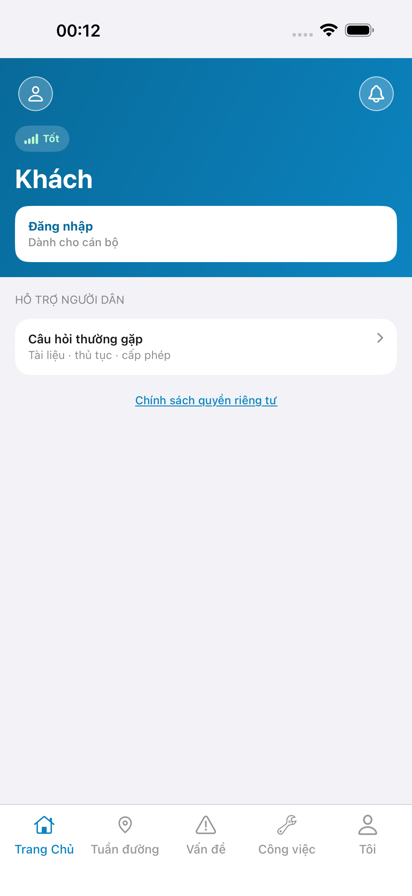
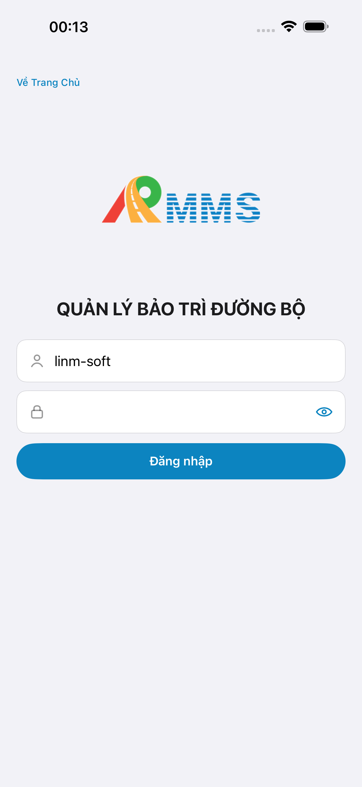
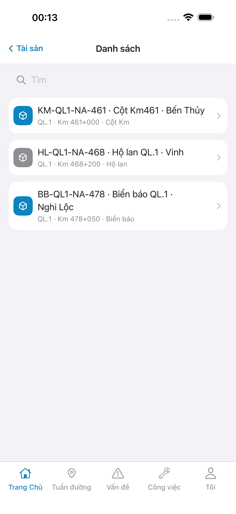

# QA — Scenarios — asset

> Status: **done** · `/agent-qa-mobile` · e2eQa=ON · task `task_edfc2374`  
> method: `e2e runtime · yarn e2e-qa-mobile` · Maestro · sim **iPhone 17 Pro Max** + emulator **Pixel 2** · **cấm** `yarn e2e-qa` / `start:std` / GenerateImage

| | |
|--|--|
| Feature | `asset` |
| Title | [Mobile] List danh mục tài sản |
| Role | `qa` |
| packKind | `list` · `#sc-asset-list` · `DES-MOB-ASSET-LIST` |
| iosPhase | `phase1_iphone` · **A4-IPAD DEFER** |
| demo | `linm-soft` / Auth docker seed |
| API / BFF | WebService docker host **:5111** · Mobile.Bff **:5202** · `--skip-start` |
| prior Dev | `task_bee51c9e` · implement **confirmed** |

## Device AC (slug `asset` only)

| AC | Expect | Result | Evidence |
|----|--------|--------|----------|
| Launch | Cold start guest `#sc-home` · 0 crash | **PASS** |  |
| BFF | Mobile.Bff listen `:5202` | **PASS** | A10-BFF |
| Login demo | `#btn-home-login` → fill `#f-user`/`#f-pass` · seed Auth | **PASS** |  |
| List `#sc-asset-list` iOS | Nav **Danh sách** · search · `LinmListRow` + cube leading · **cấm** detail push / watermark | **PASS** |  |
| List `#sc-asset-list` Android | Cùng zone · Pixel **1080×1920** | **PASS** |  |
| List fold 2 Android | Row 2 visible (`#row-asset-1`) | **PASS** |  |
| Entry path | Home `#tile-asset` → hub → `#tile-list` → list | **PASS** | Maestro assert `#sc-asset-list` |
| API / demo | GET `asset/road-assets` · empty/fail → demo 2 rows | **PASS** | iOS live 3 rows · Android demo SSOT 2 rows |
| GAP-DEV-MOB-PLACEHOLDER-01 | **Cấm** watermark «Phiên bản Gói» | **PASS** | A3 / P6 |
| Dual align | Chrome kit cùng zone iOS↔Android · cube leading | **PASS** | A3 ↔ P6 · **không** GAP-MOB-UX-COMP-03 Must |

## Store Must × feature

| Case | Store | Result | Evidence |
|------|-------|--------|----------|
| A10-BFF | A10 · P11 | **PASS** | — |
| A11-LAUNCH | A11 | **PASS** |  |
| A9-LOGIN | A9 · P10 | **PASS** |  |
| A3-CORE | A3 · A11 | **PASS** |  |
| P6-CORE | P6 · P11 | **PASS** |  |
| P6-CORE-2 | P6 | **PASS** |  |

## E2E screenshots

Viewer: `/api/qldb/artifact?id=&rel=qa/scenarios.md` rewrite `screens/{caseId}.png`.

| Case | Store | Result | Evidence |
|------|-------|--------|----------|
| A10-BFF | A10 · P11 | **PASS** | — |
| A11-LAUNCH | A11 | **PASS** |  |
| A9-LOGIN | A9 · P10 | **PASS** |  |
| A3-CORE | A3 · A11 | **PASS** |  |
| P6-CORE | P6 · P11 | **PASS** |  |
| P6-CORE-2 | P6 | **PASS** |  |

## Live vs demo (`/review-align-ux-ios-android`)

| Check | Result |
|-------|--------|
| Read `A3-CORE` + `P6-CORE` vs `#sc-asset-list` | **PASS** |
| Demo `.row-icon` / `#i-cube` → live cube leading ô màu | **Aligned** · iOS + Android |
| CLI PASS ≠ visual | Vision done · **không** GAP-MOB-E2E-VIS-01 |
| Must mở | **0** · detail `ui/review/align-ux.md` |

## VERIFY GATE (recheck QA)

| Gate | Result |
|------|--------|
| iOS `xcodegen` | **PASS** |
| Android `assembleDebug` | **PASS** |
| BFF `dotnet build` | **PASS** |
| `yarn e2e-qa-mobile` · cases A11,A10,A9,A3,P6,P6-2 · `ios-phase=phase1_iphone` · `--skip-start` | **PASS** · `ok: true` |

## Notes

- Maestro flows: `qa/e2e/ios.yaml` · `qa/e2e/android.yaml` — guest home → login → `#tile-asset` → `#tile-list` → assert `#sc-asset-list` trước shot A3/P6.
- Android: **cấm** `hideKeyboard` — tap title + Enter.
- Host API compose = **:5111** (Linux) · packet `:5101` = Win64 camera; BFF `:5202` healthy → `--skip-start`.
- px: iOS A3 **1320×2868** RGB · Play P6 **1080×1920** RGB.
- **Cấm** READY_TO_SUBMIT ở QA — next `/agent-review-mobile`.
- Sibling AC (`asset-detail` / collect / adjust): **out of scope**.
- A4-IPAD **DEFER** Phase 1.
- Should (không block): demo badge «Ghim» row1 · search placeholder kit «Tìm» vs demo dài · Android overflow `…` TopBar.

## Handoff → Review

| Field | Value |
|-------|-------|
| phase_to | `review` |
| Next slash | `/agent-review-mobile` |
| store | `qa/store/asset/` · CAPTURE.md |
| Chain this turn | **không** (roleOnly=`qa`) |

## Version meta (REQUIRED)

| Field | Value |
|-------|-------|
| skillId | agent-qa-mobile |
| skillVersion | 2026.08.29.1 |
| schemaVersion | 1 |
| workflowVersion | 2026.08.29.1 |
| rulesVersion | 2026.08.29.5 |
| generatedAt | 2026-08-29T17:15:00.000Z |
| versionGate | rechecked |
| contentHash | sha256:asset-mobile-edit-list-20260823 |
| bffContentHash | sha256:asset-mobile-list-road-assets-proxy-20260823 |
| taskId | task_edfc2374 |
| contentHashPriorDev | task_bee51c9e |

---
<!-- Version meta: skillId=agent-qa-mobile skillVersion=2026.08.29.1 schemaVersion=1 workflowVersion=2026.08.29.1 rulesVersion=2026.08.29.5 versionGate=rechecked -->
