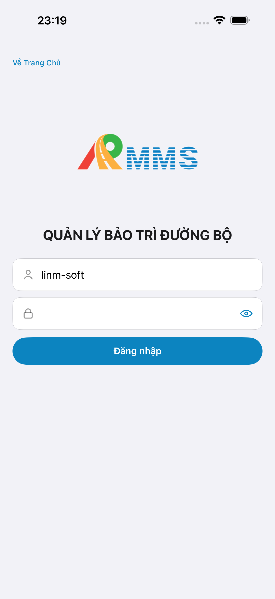
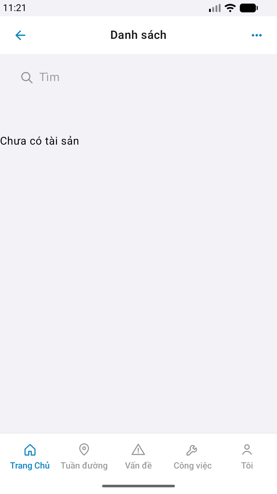

# Capture — asset

| Case | Store | Result | Evidence |
|------|-------|--------|----------|
| A10-BFF | A10 · P11 | **PASS** | — |
| MAESTRO-AND | P6 | **FAIL** | `row-asset-0` · EmptyChrome |
| A11-LAUNCH | A11 | **PASS** |  |
| A9-LOGIN | A9 · P10 | **PASS** |  |
| A3-CORE | A3 · A11 | **PASS** |  · live rows |
| P6-CORE | P6 · P11 | **PASS*** |  · *CLI · visual empty |
| P6-CORE-2 | P6 | **PASS*** |  |

iOS device: iPhone 17 Pro Max  
iPad device: DEFER Phase 1  
method: e2e runtime · yarn e2e-qa-mobile · Maestro ON  
taskId: `task_0aaf071e` · generatedAt: `2026-09-01T16:22:00.000Z`

CLI PASS = capture+px only. Visual = `/review-align-ux-ios-android` Read CORE vs demo HTML.  
Align: A3 **Aligned** · P6 **Not aligned** (EmptyChrome vs iOS rows).

Listing official → `/store-image-capture` confirm file live (cấm AI vẽ).
