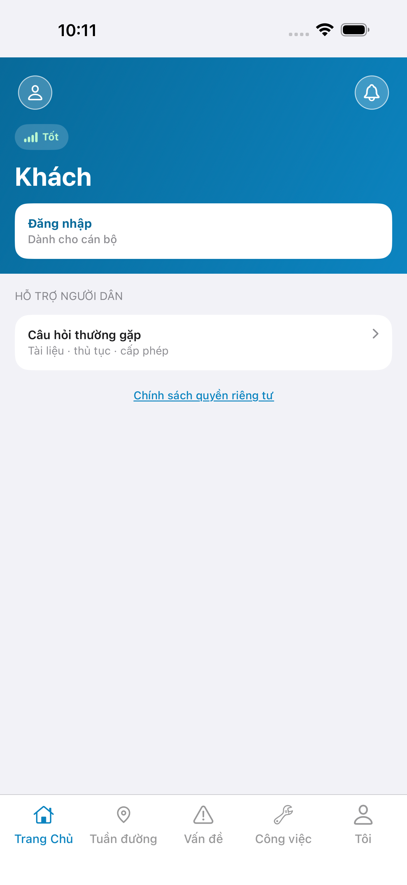
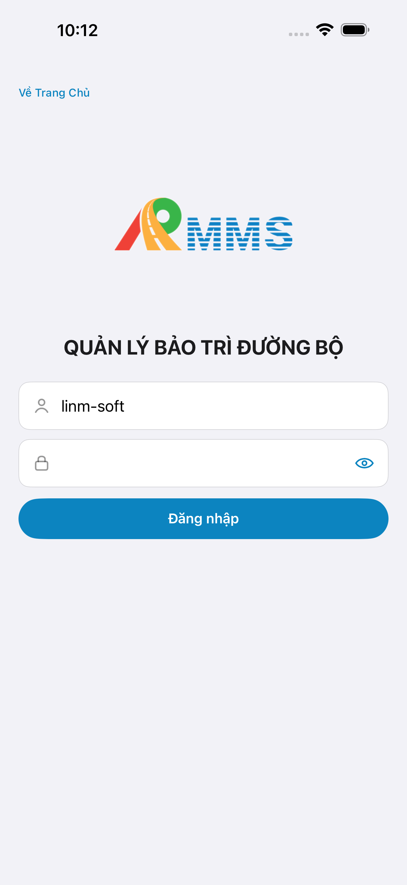
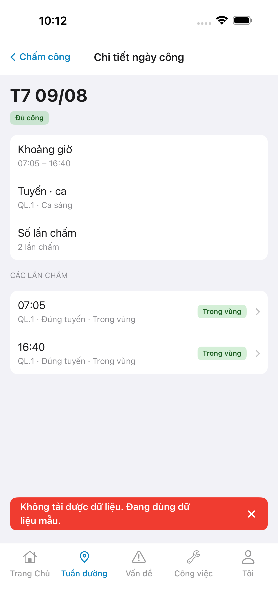
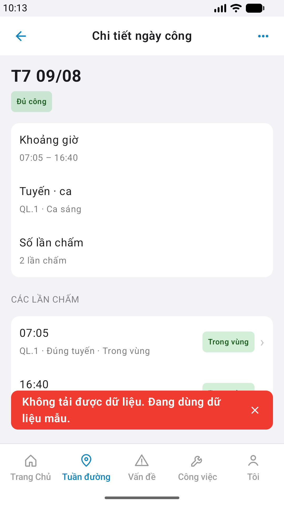

# QA — Scenarios — attendance-day (mobile · Chi tiết ngày công)

| Field | Value |
|-------|-------|
| feature | `attendance-day` |
| this role | `qa` · `/agent-qa-mobile` |
| status | **confirmed** |
| packKind | **`screen`** |
| changeScope | `new_page` |
| taskId | `task_a8beae6d` |
| e2eQa | **ON** · `yarn e2e-qa-mobile` · `ios_test_phase=phase1_iphone` · **A4-IPAD DEFER** |
| store_qa | **run_store** (autoApprove=ON) |
| e2e result | **ok:true** · `2026-08-31T03:13:37.332Z` · dest **iPhone 17 Pro Max** 1320×2868 · AVD **1080×1920** |
| method | e2e runtime · yarn e2e-qa-mobile · Maestro + simctl/adb · **cấm** GenerateImage · **cấm** yarn start:std / mfeStdUrl |
| align | dual proto `#sc-attendance-day` · live A3 ↔ P6 · **Aligned** · Must **0** |
| API / BFF | API docker host **:5111** · Mobile.Bff **:5202** · `--skip-start` (đã listen) |
| updatedAt | `2026-08-31T03:14:00.000Z` |

**Scope:** slug `attendance-day` screen `#sc-attendance-day` `DES-MOB-ATT-DAY` only. **Cấm** AC sibling hub hero/POST/report/supervise GetById (`#sc-attendance` · `#sc-attendance-report` · `#sc-supervise-detail`).

## VERIFY GATE

| Gate | Result |
|------|--------|
| iOS `xcodegen` | **PASS** (dev handoff) |
| iOS `xcodebuild` dest **iPhone 17 Pro Max** | **PASS** |
| Android `./gradlew :app:assembleDebug` | **PASS** (dev handoff) |
| Mobile.Bff `dotnet build` / :5202 | **PASS** (docker healthy) |
| API docker :5111 | **PASS** (`--skip-start`) |
| Maestro iOS + Android | **PASS** · login → tab field → Chấm công → day row → `#sc-attendance-day` |
| `yarn e2e-qa-mobile` | **PASS** · `ok:true` |

## Device AC

| ID | Expect | Result |
|----|--------|--------|
| AC-D-01 | Hub day row → push detail | **PASS** (Maestro iOS+Android) |
| AC-D-02 | GPS deny | **N/A** (readonly sub · no request) |
| AC-D-03 | Leave dirty | **N/A** (no form) |
| AC-D-04 | Cấm native alert · toast only | **PASS** (offline demo toast · shots không sheet / `UIAlert`) |
| AC-D-05 | Keyboard | **N/A** (no text field on detail) |
| AC-D-06 | Safe area TopBar + scroll rows + section | **PASS** (A3 6.9" · P6 + P6-2 fold) |
| AC-D-07 | Biometric | **N/A** |
| AC-D-08 | Signal | **N/A** (detail không hero signal) |
| AC-D-09 | Bearer BFF GET `patrol/attendance-logs` + filter dayKey | **PASS** (BFF :5202 · A10-BFF · demo SSOT khi empty) |
| AC-D-10 | Tab 5 · Tuần đường selected under push | **PASS** (A3/P6 tab shell) |
| AC-D-11 | Camera / push | **N/A** |
| AC-D-12 | Type 13 / ≥16 / hero ≥24 | **PASS** (visual + SSOT parity) |
| AC-D-13 | Dual copy VN | **PASS** (A3 ↔ P6) |
| AC-D-14 | Cấm watermark / device label | **PASS** |
| AC-F-01 | Login → hub → day row → `#sc-attendance-day` hero+rows | **PASS** (Maestro iOS+Android) |
| AC-F-02 | Back `btn-att-day-back` → pop hub | **PASS** (Maestro optional tap) |
| AC-F-03 | Appear GET list filter dayKey · demo SSOT T7 09/08 | **PASS** (hero · badge · range · route · count · logs) |
| AC-F-04 | Empty day CN 10/08 → EmptyChrome | **N/A** e2e (full-day path · code review) |
| AC-F-05 | Section **Các lần chấm** · scroll fold P6-2 | **PASS** (P6-CORE-2 · log rows visible) |
| AC-F-06 | Badge **Đủ công** · range **07:05 – 16:40** · route **QL.1 · Ca sáng** | **PASS** (A3/P6 Maestro assert) |
| AC-F-07 | Cấm watermark Gói | **PASS** |
| AC-F-08 | Tap log row → toast **Chi tiết lần chấm** · cấm supervise-detail | **N/A** e2e (toast · code review) |

## Store Must

| Case | Store | Evidence | Result |
|------|-------|----------|--------|
| A11-LAUNCH | A11 |  | **PASS** |
| A10-BFF | A10 · P11 | — | **PASS** |
| A9-LOGIN | A9 · P10 |  | **PASS** |
| A3-CORE | A3 · A11 |  | **PASS** |
| P6-CORE | P6 · P11 |  | **PASS** |
| P6-CORE-2 | P6 |  | **PASS** |
| A4-IPAD | A4 | **DEFER** Phase 1 · family `1` | DEFER |

## Maestro

| Flow | Path | Result |
|------|------|--------|
| iOS | `qa/e2e/ios.yaml` | **PASS** · guest → login → tile-patrol/Tuần đường → Chấm công → `att-day-demo-day-2` → `#sc-attendance-day` |
| Android | `qa/e2e/android.yaml` | **PASS** · guest → login → tab field → Chấm công → day row → detail · scroll logs fold |

## Visual align (`/review-align-ux-ios-android`)

Read `A3-CORE.png` + `P6-CORE.png` vs dual prototype `#sc-attendance-day`:

| Zone | Demo | Live iOS | Live Android | Verdict |
|------|------|----------|--------------|---------|
| Title | Chi tiết ngày công | ✓ | ✓ | **Aligned** |
| Back | Chấm công / chevron | text+chevron | icon-only | **platform-OK** |
| Hero | T7 09/08 28/24 | ✓ | ✓ | **Aligned** |
| Badge | Đủ công | ✓ | ✓ | **Aligned** |
| rowRange | Khoảng giờ · 07:05 – 16:40 | LinmListRow | LinmListRow | **Aligned** |
| rowRoute | Tuyến · ca · QL.1 · Ca sáng | ✓ | ✓ | **Aligned** |
| rowCount | Số lần chấm · 2 lần chấm | ✓ | ✓ | **Aligned** |
| sectionLogs | Các lần chấm | LinmSectionLabel | LinmSectionLabel | **Aligned** |
| log rows | 07:05 · 16:40 · QL.1 · Trong vùng | LinmListRow + badge | LinmListRow + badge | **Aligned** |
| Tab shell | Tuần đường selected | ✓ | ✓ | **Aligned** |
| Watermark / device label | cấm | none | none | **PASS** |

**Must gaps:** **0** · `ui/review/demo-parity.md`

## Gaps

| ID | Note | Block complete? |
|----|------|-----------------|
| GAP-QA-ATT-DAY-IOS-TAB-01 | iOS LinmTabBar không expose `tab-field` — Maestro dùng `tile-patrol` + text «Tuần đường» | **No** (closed · ios.yaml fix) |
| GAP-QA-ATT-DAY-API-PORT-01 | macOS API host **:5111** (không :5101) — e2e `--skip-start` khi docker đã up | **No** (closed) |
| GAP-QA-ATT-DAY-DEMO-01 | BFF empty DB → offline demo SSOT T7 09/08 · iOS/Android aligned | **No** |

## E2E screenshots

CLI **PASS** = Maestro + PNG + store px only — **not** visual vs demo. QA **Read** A3-CORE + P6-CORE vs prototype (`/review-align-ux-ios-android`).

| Case | Store | Result | Evidence |
|------|-------|--------|----------|
| A10-BFF | A10 · P11 | **PASS** | — |
| A11-LAUNCH | A11 | **PASS** |  |
| A9-LOGIN | A9 · P10 | **PASS** |  |
| A3-CORE | A3 · A11 | **PASS** |  |
| P6-CORE | P6 · P11 | **PASS** |  |
| P6-CORE-2 | P6 | **PASS** |  |
