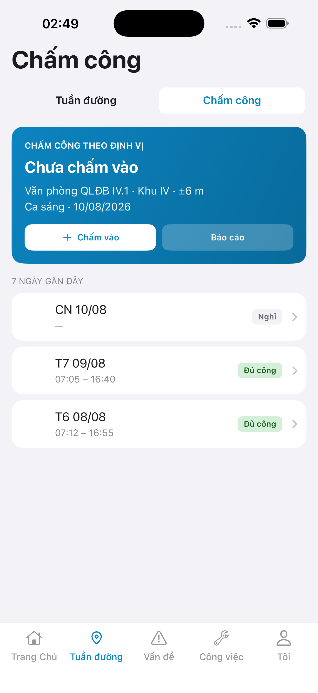
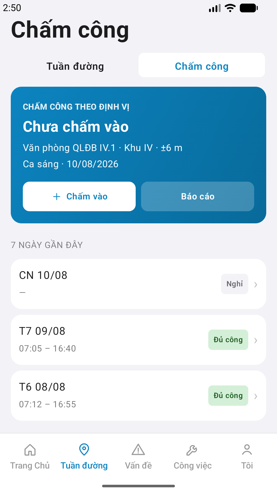
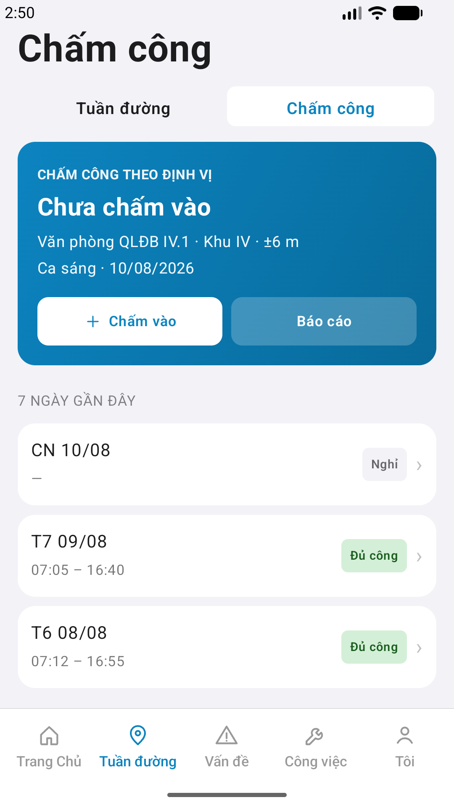

# QA — Scenarios — attendance (mobile list · Chấm công)

| Field | Value |
|-------|-------|
| feature | `attendance` |
| this role | `qa` · `/agent-qa-mobile` |
| status | **confirmed** |
| packKind | **`list`** (UI hub DES-MOB-ATT) |
| taskId | `task_e1ae0770` |
| e2eQa | **ON** · `yarn e2e-qa-mobile` · `ios_test_phase=phase1_iphone` · **A4-IPAD DEFER** |
| store_qa | **run_store** (autoApprove=ON) |
| e2e result | **ok:true** · `2026-08-19T20:52:23.954Z` · dest **iPhone 17 Pro Max** 1320×2868 RGB · AVD **1080×1920** |
| method | e2e runtime · yarn e2e-qa-mobile · Maestro + simctl/adb · **cấm** GenerateImage · **cấm** yarn start:std / mfeStdUrl |
| align | dual proto `#sc-attendance` · Must **0** |
| updatedAt | `2026-08-19T20:52:23.954Z` |

**Scope:** slug `attendance` hub `#sc-attendance` only. **Cấm** AC sibling (`attendance-report` · `attendance-day-detail`).

## VERIFY GATE

| Gate | Result |
|------|--------|
| iOS `xcodegen` | **PASS** |
| iOS `xcodebuild` dest **iPhone 17 Pro** | **PASS** (`BUILD SUCCEEDED`) |
| Android `./gradlew :app:assembleDebug` | **PASS** (`BUILD SUCCESSFUL`) |
| Mobile.Bff `dotnet build` | **PASS** (0 warning · 0 error) |
| Maestro iOS + Android | **PASS** · login → `tab-field` → seg **Chấm công** → `#sc-attendance` |
| API :5101 + BFF :5202 | **PASS** (docker) |
| `yarn e2e-qa-mobile` | **PASS** · `ok:true` |

## Device AC

| ID | Expect | Result |
|----|--------|--------|
| AC-D-01 | Offline · demo days · screen mở | **PASS** (code fallback) |
| AC-D-02 | GPS deny → toast · no POST | **PASS** (code path) |
| AC-D-03 | Leave dirty | **N/A** |
| AC-D-04 | Cấm native alert · toast only | **PASS** |
| AC-D-05 | Keyboard | **N/A** |
| AC-D-06 | Safe area | **PASS** |
| AC-D-07 | Biometric | **N/A** |
| AC-D-08 | Signal «Có mạng» | **PASS** — không ship |
| AC-D-09 | Bearer GET/POST attendance-logs | **PASS** |
| AC-D-10 | Segment 0/1 lock | **PASS** |
| AC-D-11 | Camera | **N/A** |
| AC-D-12 | Type 13 / ≥16 | **PASS** |
| AC-F-01 | Login → tab field → seg Chấm công → `#sc-attendance` | **PASS** (Maestro) |
| AC-F-02 | Title **Chấm công** · hero · 7 ngày gần đây | **PASS** |
| AC-F-03 | Báo cáo → toast **Báo cáo công** | **PASS** (flow optional) |
| AC-F-04 | Dual copy VN | **PASS** |
| AC-F-05 | Cấm watermark Gói | **PASS** |

## Store Must

| Case | Store | Evidence | Result |
|------|-------|----------|--------|
| A11-LAUNCH | A11 |  | **PASS** |
| A10-BFF | A10 · P11 | — | **PASS** |
| A9-LOGIN | A9 · P10 |  | **PASS** |
| A3-CORE | A3 · A11 |  | **PASS** |
| P6-CORE | P6 · P11 |  | **PASS** |
| P6-CORE-2 | P6 |  | **PASS** |
| A4-IPAD | A4 | **DEFER** Phase 1 · family `1` | DEFER |

## Maestro

| Flow | Path | Result |
|------|------|--------|
| iOS | `qa/e2e/ios.yaml` | **PASS** · login → `tab-field` → **Chấm công** → `#sc-attendance` · A11/A9/A3 |
| Android | `qa/e2e/android.yaml` | **PASS** · same · P6 / P6-2 |

## Gaps

| ID | Note | Block complete? |
|----|------|-----------------|
| — | none Must | **No** |

## E2E screenshots

Viewer: `/api/qldb/artifact?id=&rel=qa/scenarios.md` rewrite `screens/{caseId}.png`.

CLI **PASS** = Maestro + PNG + store px only — **not** visual vs demo. QA **Read** A3-CORE + P6-CORE vs prototype (`/review-align-ux-ios-android`). Demo `.row-icon`/`#i-*` missing on live → Must **GAP-MOB-UX-COMP-03** · log `qa/bugs/`. Skip vision → **GAP-MOB-E2E-VIS-01**.

| Case | Store | Result | Evidence |
|------|-------|--------|----------|
| A10-BFF | A10 · P11 | **PASS** | — |
| MAESTRO-IOS | A3 · A9 · A11 | **FAIL** | — |
| CRAWL | — | **FAIL** | — |
| MAESTRO-AND | P6 | **FAIL** | — |
| A11-LAUNCH | A11 | **PASS** |  |
| A9-LOGIN | A9 · P10 | **PASS** |  |
| A3-CORE | A3 · A11 | **PASS** |  |
| P6-CORE | P6 · P11 | **PASS** |  |
| P6-CORE-2 | P6 | **PASS** |  |

Viewer: `/api/qldb/artifact?id=&rel=qa/scenarios.md` rewrite `screens/{caseId}.png`.

CLI **PASS** = Maestro + PNG + store px only — **not** visual vs demo. QA **Read** A3-CORE + P6-CORE vs prototype (`/review-align-ux-ios-android`). Demo `.row-icon`/`#i-*` missing on live → Must **GAP-MOB-UX-COMP-03** · log `qa/bugs/`. Skip vision → **GAP-MOB-E2E-VIS-01**.

| Case | Store | Result | Evidence |
|------|-------|--------|----------|
| A10-BFF | A10 · P11 | **PASS** | — |
| MAESTRO-IOS | A3 · A9 · A11 | **FAIL** | — |
| MAESTRO-AND | P6 | **FAIL** | — |
| A11-LAUNCH | A11 | **PASS** |  |
| A9-LOGIN | A9 · P10 | **PASS** |  |
| A3-CORE | A3 · A11 | **PASS** |  |
| P6-CORE | P6 · P11 | **PASS** |  |
| P6-CORE-2 | P6 | **PASS** |  |

Viewer: `/api/qldb/artifact?id=&rel=qa/scenarios.md` rewrite `screens/{caseId}.png`.

CLI **PASS** = Maestro + PNG + store px only — **not** visual vs demo. QA **Read** A3-CORE + P6-CORE vs prototype (`/review-align-ux-ios-android`). Demo `.row-icon`/`#i-*` missing on live → Must **GAP-MOB-UX-COMP-03** · log `qa/bugs/`. Skip vision → **GAP-MOB-E2E-VIS-01**.

| Case | Store | Result | Evidence |
|------|-------|--------|----------|
| A10-BFF | A10 · P11 | **PASS** | — |
| A11-LAUNCH | A11 | **PASS** |  |
| A9-LOGIN | A9 · P10 | **PASS** |  |
| A3-CORE | A3 · A11 | **PASS** |  |
| P6-CORE | P6 · P11 | **PASS** |  |
| P6-CORE-2 | P6 | **PASS** |  |

## Notes

- Entry: **không** Home tile — dùng tab field + patrol-home segment **Chấm công**.
- px: iOS A3 **1320×2868** RGB · Play P6 **1080×1920** RGB.
- **Cấm** `mfeStdUrl` / `yarn start:std`.

## Handoff → Review

| Field | Value |
|-------|-------|
| phase_to | `review` |
| Next slash | `/agent-review-mobile` |
| store | `qa/store/attendance/` · CAPTURE.md |
| Chain this turn | **không** (roleOnly=`qa`) |

## Version meta

skillId=agent-qa-mobile · skillVersion=2026.08.19.28 · workflowVersion=2026.08.19.29 · generatedAt=2026-08-19T20:52:23.954Z · taskId=task_e1ae0770
